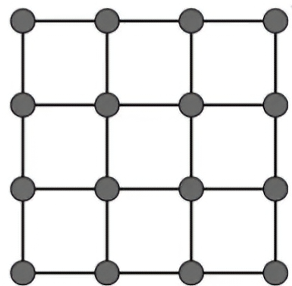
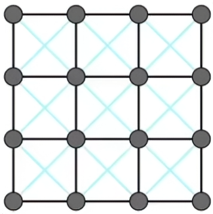
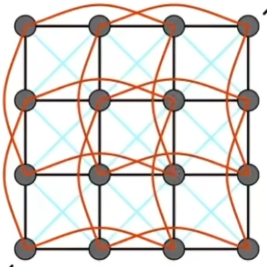
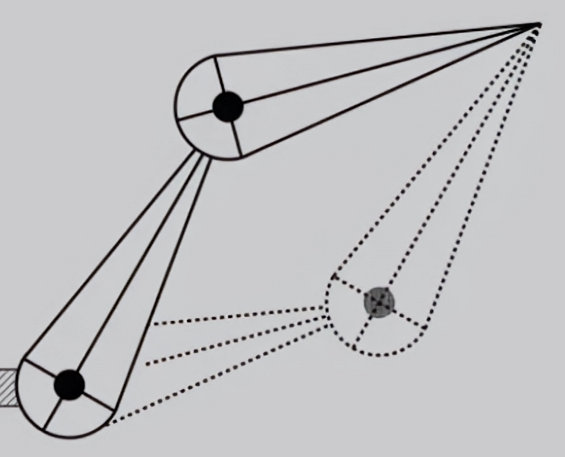

+++
date = '2025-05-20T16:54:44+08:00'
draft = false
title = '计算机图形学-动画'
categories = ['Sub Sections']
math = true
+++

动画，Animation。

## 计算机动画的历史
早期动画是手绘的，也不关心是否符合物理规律。在计算机图形学中，我们把动画看成是建模的扩展，把模型扩展到时间维度。我们想要得到的是一系列图片，利用人眼的视觉暂留效应，让人感觉将画面动起来。

## Keyframe Animation(关键帧动画)
就是首先定义出关键的帧，比如某时刻物体的状态。然后再创造过渡的动画。如果中间的过程不太复杂，就能使用计算机自动生成。其实这就是插值，这中间的过程不一定是线性的，可以是任意的函数。

## Physical Simulation(物理仿真)
物理仿真值关心模型如何运动，不关心如何渲染。也就是说，实际上是先物理仿真了再渲染。

包括粒子的运动与碰撞、布料的模拟、流体的模拟等等。

物理仿真是对真实世界的建模，一般是有所简化的。简化到什么程度，要看计算机的算力，以及真实程度的要求了。

### Mass Spring System(质点-弹簧系统)
建模是: 一系列的质点，通过弹簧连在一起。这个弹簧不一定实际存在，也不一定遵循固定的物理规律，只是表示质点之间的力的作用而已。可以更抽象地表示绳子、毛发、布料等等。

最基础的单元是，一个弹簧左右连接着两个质点，a, b.

质点 a 受到的力:

$$\Large {\bf F}_a = k_s \frac{{\bf b} - {\bf a}}{\mid \mid {\bf b} - {\bf a} \mid \mid} (\mid \mid {\bf b} - {\bf a} \mid \mid - ~ l)$$

> 其中 $k_s$ 是劲度系数， $\bf a$ 是质点 a 的坐标， $\bf b$ 是质点 b 的坐标， $l$ 是弹簧松弛的长度。

质点 b 受到的力: ${\bf F}_b = -{\bf F}_a$ 。

显然，质点 a 和质点 b 会一直运动下去，所以要加入摩擦力。

> 微积分记号:
> 
> $\bf x$ 是质点的位置向量，那么我们使用以下记号来表示其导数:
> 
> $$\dot{\bf x} = {\bf v}$$
> 
> $$\ddot{\bf x} = {\bf a}$$

damping force: ${\bf f} = -k_d {\bf a}$

但是 damping force 不能表示系统内部的能量损耗。比如质点 a 和质点 b 一起运动，加入 damping force 会导致运动直接停下。所以质点 b 的 damping force 应该为:

$$\Large {\bf f} = -k_d \cdot \underbrace{\frac{{\bf b} - {\bf a}}{\mid \mid {\bf b} - {\bf a} \mid \mid} \cdot (\dot{\bf b} - \dot{\bf a})}_{\text {a 和 b 的相对速度，} \text{在 a 和 b 的相对位置上的投影}} \cdot \frac{{\bf b} - {\bf a}}{\mid \mid {\bf b} - {\bf a} \mid \mid}$$

#### 使用 Mass Spring System 来对布料建模
首先，朴素的想法是:

但是，我们对布料有两个要求:

1. 抗剪切能力，也就是说，如果我们对布料的对角线拉伸，布料不会形变得太多。
2. 抗弯折(out-of-plane bending)能力。也就是不能像纸一样，能完全对折。

显然上面的模型不能满足两个要求。

于是我们在网格的对角线加上弹簧:

不过第二个要求还没满足。于是我们加上 steep connection:

就是节点隔一个也相连。

当然，如果使用 steep connection ，那么对角线的连接也可以不需要。

这个 steep connection 是比较弱的，他只需要在比较近的时候提供较大ad斥力就行了。（我认为 steep connection 的力的大小可以和距离的高次成正比。）

### Finite Element Method(有限元方法)
有限元方法的特点是，可以表示力的传导。比如一辆车，撞向一堵墙，车子的尾部也会变形。

原理略。

### Particle System(粒子系统)
定义一些粒子，粒子间的作用力，以及外部的力。可以用于制作雾气、魔法效果、甚至是流体。

粒子之间的力，有碰撞，引力，电磁力，粘滞力等等。这个方法的难点在于，多个粒子之间的作用，计算量是巨大的。

粒子系统还可以拓展地理解。只要我们在考虑某个群体，那么我们就可以使用粒子系统。比如说鸟群的运动，鱼群的运动，分子运动，人群等等。

## Forward Kinematics(FK, 正运动学)
正运动学就是考虑怎么做动画。比如我们考虑人的动作，首先就是对人的骨骼建立一个简单模型。有以下几种连接方式，来构造整个人体骨骼模型:

1. Pin(一维的旋转，类似于手臂)
2. Ball(二维的旋转，类似于球形关节)
3. Prismatic Joint (可以伸长的连接)

举个例子，有两个 Pin 关节，它们连在一起，就像一个[双摆](https://zh.wikipedia.org/wiki/双摆)一样。给定两个角的角度等信息，计算出整个系统的各个部位在那(比如尖端)。进一步地，我们可以计算人体各种动作，比如走路。这就是 FK 要做的工作。

## Inverse Kinematics(IK, 逆运动学)
还是上面那个例子，有两个 Pin 关节，它们连在一起，就像一个[双摆](https://zh.wikipedia.org/wiki/双摆)一样。在一定的条件下，给定尖端的位置，计算机科可以自动地调整中间关节的位置和角度。

这样的难点在于，其本身的计算就比较复杂，而且有时解并不唯一，或者并不存在。

现在人们已经提出了数值计算的算法，比如牛顿法、梯度下降反向转播法(先随机设一个 $\theta_1,\theta_2$ ，计算到目标的距离，然后优化巴拉巴拉)。

关于 IK ，可以去看看这个视频: [楼梯是如何成为游戏界难题的？拆解鸣潮和绝区零的解决方案](https://www.bilibili.com/video/BV1rQ1xYAEtD)

### Rigging
给一个物体一些控制点，通过改变这些控制点，来改变物体的形状。类似贝塞尔曲线的感觉。其实这是 IK 的一个应用。具体来说，可以同于控制人物的动作，表情等等。

那么具体的，这些控制点的位置要如何，这是艺术家要做的事情。

如果结合关键帧动画的思想，我们可以定义多套控制点的位置，然后通过插值来计算两套控制点的中间位置，在渲染为动画。这被称为 Blend Shapes.

## Motion Capture(动作捕捉)
根据 Rigging 的概念，如果我们给真人戴上传感器，作为控制点，记录下传感器的位置，这样就直接得到一套动作了。使用这种方法，就不需要艺术家来制作 Rigging 了，就是需要动作演员。

当然了，动作捕捉也有一些难题。比如说，服装比较难穿、捕捉的准确度、可用度等等。

动作捕捉的设备大概分为三种，光学的、电磁的、机械的。