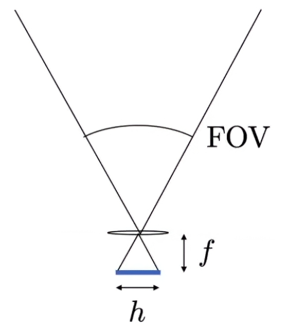
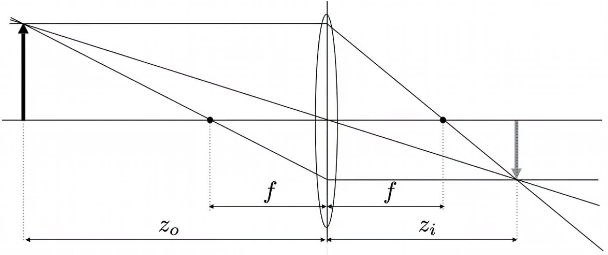
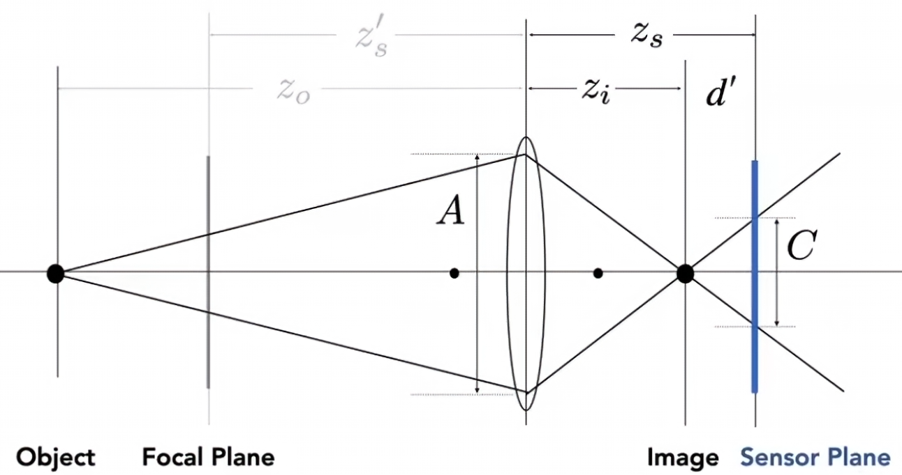

+++
date = '2025-05-20T16:56:35+08:00'
draft = false
title = '计算机图形学-相机，透镜和光场'
categories = ['Sub Sections']
math = true
+++

## 相机的类型
根据成像原理的不同，分为针孔相机(利用小孔成像原理)和透镜相机(利用凸透镜聚焦)。

## 相机的结构
1. 快门(Shutter): 控制光在若干秒内进入相机。
2. 传感器(Sensor): 记录 Irradiance 。

## 成像结果
针孔相机的成像结果，是没有景深的，也就是说，任何地方都是锐利的，没有地方是模糊的。在使用光栅化和光线追踪渲染时，所谓的相机是针孔相机，也就是说渲染的结果也没有景深。

## 视场(Field of View, FOV)
一般来说是只垂直的视角。

${\rm FOV} = 2 \arctan{\frac{h}{2f}}$

容易看出，视场的大小，不但与焦距有关，还与传感器大小有关。所以现在对于视角的定义，是默认传感器大小是 36 x 24 mm.

## Exposure(曝光)
Exposure, 曝光度，使用字母 $H$ 表示。定义: $H = tE$ ，时间乘以 Irradiance 。时间由快门决定。 Irradiance 由外界光和相机光圈(Aperture)大小决定。

还可以在后期处理一下， ISO 增益。

### ISO 增益
又叫感光度。

比如得到某个 Irradiance 只之后，对数值进行一些处理(线性相乘)。这个过程可以发生在硬件上，也可以发生在软件上。但是简单放大信号会同时放大噪声。

### F-stop
又叫 F-Number, FN, F/N.

光圈的大小是由 F-stop 来控制的，设计的灵感来自于人的瞳孔。举个例子: F32.

光圈的中间是透光的，周围是不透光的。

F 后面的数字，与光圈透光的直径的倒数成正比。也就是说， F16 和 F32 相比，透光面积大了 4 倍。

### 快门
举个例子: 1/250

如果一个物体在运动，而且快门时间过长了，就会出现运动模糊。

不过运动模糊也不全是坏事。运动模糊起到了反走样的作用。因为拍照就是在时间上对物体的位置进行采样，剩下的自己细品。

有些快门时机械结构的，那么快门从完全不打开到完全打开就需要一定的时间。如果拍摄高速物体，会出现物体扭曲的照片。

### 总结
曝光度会受到 ISO, FN, 快门的影响。在 ISO 不变的前提下， F32, 1/30 和 F16, 1/120 的曝光度是一样的。但是的得到照片还是有所区别，比如景深不同、动态模糊不同。

> 动态模糊可以在更低的帧率下，给人感觉更动态的效果。比如一般的拍摄视频是 30 帧，看起来还可以。但是游戏画面 30 帧，感觉略卡。这就是因为，游戏渲染出来的每一帧画面是很精确的，不模糊的。

所谓高速摄影，就是快门时间极短，使用其他两个参数，以维持在正常曝光度的摄影。

所谓低速摄影，就是快门时间极长，使用其他两个参数，以维持在正常曝光度的摄影。

## Thin Lens Approximation(薄透镜近似)
其实，现代的相机的镜头，不是由一个透镜构成的，而是由多个透镜构成的。

### Ideal Thin Lens(理想的薄透镜)
理想的薄透镜，厚度无限小，有严格的焦点(Focal Point, 平行光穿过透镜后汇聚到的点)。焦距可以自由改变。

理想的薄透镜具有以下性质:

$$\frac{1}{f} = \frac{1}{z_i} + \frac{1}{z_o}$$

左边箭头所在平面叫 Focal Plane, 右边箭头所在平面叫 Sensor Plane.

### Defocus Blur(散焦模糊)
#### Circle of Confusion(CoC)

$$\frac{C}{A} = \frac{d'}{z_i} = \frac{\mid z_s - z_i \mid}{z_i}$$

如上图，如果一个物体不在 Focal Plane 上，那么光线汇聚的地方也就不在 Sensor Plane 上，这会形成模糊。

我们可以看出， CoC 的大小与透镜大小 $A$ 有关。在相机中，就是与光圈大小有关。

所以， FN 的准确定义是，焦距除以光圈的直径。

### Ray Tracing Ideal Thin Lenses(理想的薄透镜的光线追踪)
在传统的光线追踪中，摄像机是采用小孔成像模型的。 们也可以薄透镜的原理，渲染出有焦距的图像。

如上图所示，对于 Sensor Plane 上的任意一点 $x'$ ，可以算出 $x'''$ 。首先，过透镜中心和 $x'$ 连一条线；然后过 $x'$ 和焦点连一条线，这条线过透镜之后会折射为平行线。根据这两条线的交点，可以得到 $x'''$ 。

发射 eye ray 时，在光圈范围内任意一点 $x''$ ，连接 $x'$ 和 $x'''$ ，这样就打出了一根 eye ray 。发射出多根 eye ray ，进行蒙特卡洛积分。

### Depth of Field(景深)
景深是指在 Focal Plane 附近一小段范围的长度。在这个范围内，得到的 CoC 是比较小的(比像素小)，能接受的，看起来是锐利的，清晰的。

## Light Field / Lumigraph(光场)
我们是如何看到世界的? 假设一个场景: 你坐在房间里，看到房间内的各个物品、窗外的大树。那么如果你坐在另一个房间里，房间里只有一个屏幕，这个屏幕可以显示任何东西。如果屏幕显示刚刚第一个房间的景色，那么你是否分得清这两个房间呢?

所以重点在于，往什么角度观察，看到了什么。

### The Plenoptic Function(全光函数)
#### Grayscale snapshot(灰度快照)
$$P(\theta, \phi)$$

该函数返回一个灰度值。

#### Color snapshot
我们可以对 Grayscale snapshot 进行改进:

$$P(\theta, \phi, \lambda)$$

> 其中 $\lambda$ 是波长。

#### A movie
我们可以对 Color snapshot 进行改进:

$$P(\theta, \phi, \lambda, t)$$

> 其中 $t$ 是时间。

#### Holographic movie(全息电影) / Plenoptic Function(全光函数)
我们可以对 A movie 进行改进:

$$P(\theta, \phi, \lambda, t, x, y, z)$$

> 其中 $x, y, z$ 是摄像机坐标。

整个世界就这么表示出来了。

### 光场
光场是全光函数的一部分。光场是在物体表面的某位置(二维)，往某方向(二维)，发出某强度的光的函数。

可以这么理解: 假设我们知道了某物体的光场，摄像机在观察这个物体的时候，首先发出 eye ray ， 然后根据物体的光场，可以得出光强是多少。

也可以这么理解: 假设我们有一个盒子，我们知道盒子表面的光场。我们就可以不关心盒子里面有什么了，因为我们知道盒子表面的光场。

也可以这么理解: 假设我们有相互平行的两个平面，我们可以通过这两个平面的坐标 $(u, v)$ 和 $(s, t)$ 来描述光场。因为两点确定一条直线，也就是一根光线。

也可以这么理解: 假设我们在 uv 平面，选取一点，看向另一个平面的任意一点。

也可以这么理解: 假设我们在 st 平面，选取一点，在 vu 平面以不同的角度看 st 平面的某点。

### Light Field Camera(光场摄像机)
光场摄像机与普通相机的重要区别是，光场摄像机可以后期重新调整焦距等相机参数。

与普通照相机相比，光场摄像机在感光元件之前加了一个透镜阵列。这个透镜阵列的每一个透镜，对应了普通相机的一个像素。在普通相机中，一个像素记录了一个 Irradiance ， Irradiance 没有方向。而在光场相机中，借助透镜，把 Irradiance 分开为各个方向的 Radiance 。

使用光场相机拍照后，会得到一张特殊的照片。对这个照片，指定一个像素，一个方向，就能得到在普通照片意义的，该像素的值。其实就是光场相机记录了整个光场。

所以，如果要把光场相机的照片变为普通照片，为每一个像素选一个光线的方向即可。而这个操作，从另一个角度来说，就像是在移动普通相机一样。

#### 光场摄像机的问题
1. 对感光元件的分辨率要求很高，因为一个透镜就是代表了一个特殊像素，而这个特殊像素，需要多个基本像素组成。
1. 透镜阵列的制作难度，制作成本很高。因为透镜阵列的每一个透镜是很小的，还有一些其他的问题。
1. 方向和空间的清晰度不能兼得。如果要记录更细腻的方向 Radiance ，那么普通图像的分辨率会低。

## See also
[【硬核科普】相机ISO，从CMOS结构到双增益技术原理](https://www.bilibili.com/video/BV1CK7pzbEpM/)
