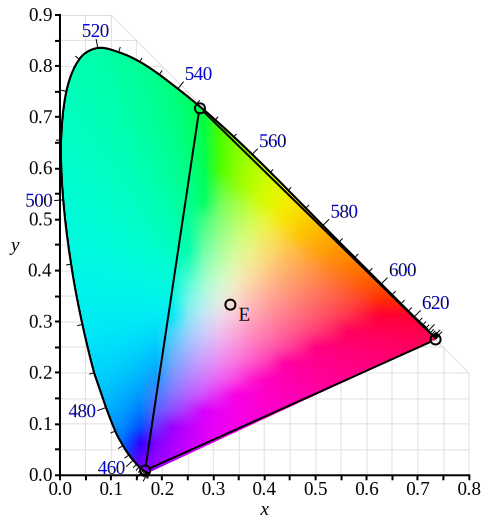

+++
date = '2025-05-20T16:57:20+08:00'
draft = false
title = '计算机图形学-颜色与感知'
categories = ['Sub Sections']
math = true
+++

## Physical Basis of Color
光是电磁波，可见光的波长范围在360 - 400 nm ~ 760 - 830nm.

光谱，又叫普功率密度(Spectral Power Distribution, SPD)，表示了光在不同波长的功率密度。

SPD 具有线性性质。即，两束光混合后的 SPD 等于两束光的 SPD 之和。(波动光学 out)

## Biological Basis of Color
人的视网膜上有感光细胞。感光细胞分为两种:

视杆细胞(rod cell): 用于感受光强。

视锥细胞(cone cell): 用于感受颜色。又分为三种: S-Cone, M-Cone, L-Cone. 不同的人，这三种细胞的数量分布不同，个体差异极大。

三种视锥细胞有不同的响应曲线，对光的不同波长有不同的反应。

当外界光线进入眼睛时，会与三种视锥细胞作用，得到三个值: $S, M, L$ ，称为刺激值。

## 同色异谱(Metamerism)
不同光谱的光线，经过三种视锥细胞的作用后，得到的三个刺激值是一样的。同色异谱是颜色匹配(Color Matching)的重要理论依据。颜色匹配就是人为地调颜色。

## 颜色匹配(Color Matching)和颜色空间(Color Space)
### Color Matching Functions(颜色匹配函数)
预先定义三个 SPD ，试图通过这三个 SPD ，合成某一波长的颜色。

> 上图是 CIE 1931 RGB Color Matching Functions, 它们是通过使用标准波长为 700 nm(红色)、 546.1 nm(绿色)和 435.8 nm(蓝色)的三种单色原色获得的。

如上图，比如说，想要合成波长为 500 nm 的光的颜色，就需要大概 -0.08 的红光、 0.05 的绿光、 0.05 的蓝光。

如果我们知道了一个光的 SPD $s(\lambda)$ ，需要合成它的颜色，那么只要:

$$\Large R_{\rm CIE ~ RGB} = \int_\lambda s(\lambda) \overline{r}(\lambda) ~{\rm d}\lambda$$

$$\Large G_{\rm CIE ~ RGB} = \int_\lambda s(\lambda) \overline{g}(\lambda) ~{\rm d}\lambda$$

$$\Large B_{\rm CIE ~ RGB} = \int_\lambda s(\lambda) \overline{b}(\lambda) ~{\rm d}\lambda$$

### 色度(Chromaticity)
对于三色刺激值，我们希望可以可视化出来。由于三色刺激值有三个值，是三维的，不好可视化。于是我们把三个值归一化:

$$x = \frac{X}{X + Y + Z}$$

$$y = \frac{Y}{X + Y + Z}$$

$$z = \frac{Z}{X + Y + Z}$$

于是有:

$$x + y + z = 1$$

于是我们只需在平面图画出 $x, y$ 坐标，因为只需要知道 $x, y$ 就能知道 $z$ 了。

> 上图是 CIE RGB 原色的色域和原色在 CIE 1931 xy 色度图上的位置。

### Color Space
颜色空间，又叫色域。不同的色彩空间，使用不同的颜色匹配函数来合成颜色。

#### Standardized RGB(sRGB)
在各种成像设备应用广泛。色域有限。

#### CIE XYZ

#### HSV

#### CIE LAB

#### Additive Color Space(加色系统)
颜色越混合越白。

比如 sRGB 。

### Subtractive Color Space(减色系统)
颜色越混合越黑。

比如 CMYK 。 CMYK 指的是 Cyan(蓝绿色), Magenta(品红色), Yellow(黄色), and Key(黑色)。常用于印刷系统中。至于为什么有黑色，因为如果要印刷黑色，就要三种颜色墨水混合。而三种颜色的墨水成本较高，不如直接使用黑色墨水。

## 参考资料
[CIE 1931色彩空间 - 维基百科，自由的百科全书](https://zh.wikipedia.org/wiki/CIE_1931%E8%89%B2%E5%BD%A9%E7%A9%BA%E9%97%B4)