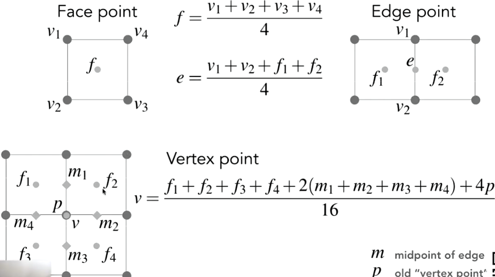

+++
date = '2025-05-20T16:50:00+08:00'
draft = false
title = '计算机图形学-几何'
categories = ['Sub Sections']
math = true
+++

计算机图形学的几何(Geometry)，分为两种: Implicit Geometry(隐式的几何) 和 Explicit Geometry(显式的几何) 。

## Implicit Geometry
就是告诉你，点满足什么样的关系，并不给出实际的点；或者说，给定一个点，可以判断该点是否在曲面上。比如，已知一个三维单位球: $x^2 + y^2 + z^2 = 1$ ，只要给一个点的坐标，可以判断该点是否在球面上。

更一般地，给出表达式 $f(x, y, z) = 0$ ，找到全部满足 $f$ 的点，就可以把曲面画出。

好处是，判断一个点是否在模型内外比较容易。但是如果要画出曲面，就比较困难。

## Explicit Geometry
直接给出一系列的点。也可以通过参数映射(Parameter Mapping)的方法给出点(和纹理映射差不多)($\Bbb{R}^2 \to \Bbb{R}^3$)。

比如，给一些点 $(u, v)$ ，结合参数映射:

$$f(u, v) = ((2 + \cos{u}) \cos{v}, (2 + \cos{u}) \sin{v}, \sin{u})$$

就可以把曲面画出。

好处是，如果要画出曲面，比较容易。但是要判断一个点是否在模型内外就比较困难。

## Implicit Geometry(2)
使用数学公式来描述一些简单的图形，还是简单的。但是如果要描述一些比较复杂的模型，比如一辆汽车，那就比较困难了。虽然我听说可以使用傅里叶变换。

### Constructive Solid Geometry(CSG)
于是我们可以使用 Constructive Solid Geometry(CSG) 来描述复杂的模型。 CSG 是使用一些基本的几何模型，通过逻辑运算来组合为复杂的模型。包括交、并、差。

### Distance Functions(距离函数)
定义空间中任意一点到"某个表面"的距离，"某个表面"不一定是真的表面，它可以是一些抽象的东西。可以用于模型变形的过渡。

### Fractals(分型)
一个形状的一部分和它自己是相似的。由于它的精度，在渲染的时候容易产生剧烈的走样问题。

## Explicit Geometry(2)
### Point Cloud
一堆空间中的点。可以轻松地表示任何三维模型。但是要求点的密度比较大(>> 1 point / pixel)。一般通过原始的扫描获得。实际操作中，往往会把它转换为 Polygon Mesh 。

### Polygon Mesh(多边形网格)
存储顶点和多边形(往往是三角形和四边形)，更容易地进行处理，模拟，自适应采样。数据结构更加复杂。这个方法在图形学中的采用最为广泛。

#### Wavefront Object File(.obj) 格式的文件
这是一个文本文件，可以使用 `#` 注释。它存储了模型空间的顶点信息(v 开头的)、纹理空间的顶点信息(vt 开头的)、法线(vn 开头的)，以及面的信息(f 开头的)(即前三者的组合)。

这样就存储了一个完整的三维模型的信息。

### Bézier Curves(贝塞尔曲线)
[【Freya | 熟肉】贝塞尔曲线之美](https://www.bilibili.com/video/BV1zgztY7EJF)

用一些控制点去定义一个曲线。假设有一些点 $p_0, p_1, \cdots, p_{n-1}, p_n$ ，曲线会从 $p_0$ 开始， $
p_n$ 结束。对于其他的点，曲线不一定会经过。

性质:
* 如果要对贝塞尔曲线进行[仿射变换](../Transformation/index.md#homogeneous-coordinates-齐次坐标)，只要对控制点进行变换即可。
* 凸包性质(Convex hull property)，贝塞尔曲线一定在控制点所形成的凸包之内。凸包就是这几个点所形成的最小凸多边形。

#### de Casteljau Alorithm - 直观解释
假设有一个贝塞尔曲线，有三个输入点， $p_0, p_1, p_2$ 。这个曲线上的点，在时间 $t \in [0, 1]$ 时，的位置是 $f(t)$ 。那么设点 $p^1_0$ 在点 $p_0$ 和 $p_1$ 之间，满足:

$$\frac{\mid p_0p^1_0 \mid}{\mid p_0p_1 \mid} = t$$

还有点 $p^1_1$ :

$$\frac{\mid p_1p^1_1 \mid}{\mid p_1p_2 \mid} = t$$

然后，点 $p^2_0$ :

$$\frac{\mid p^1_0p^2_0 \mid}{\mid p^1_0p^1_1 \mid} = t$$

于是，点 $p^2_0$ 就是在时刻 $t$ ，曲线上的点的位置。只要从 $0$ 枚举到 $1$ ，就能画出曲线。

#### de Casteljau Alorithm - 数学解析
从上面的过程就能看出，这其实就是线性插值。假设有控制点 $b_0, b_1, \cdots, b_{n-1}, b_n$ ，经过一波推导，容易得到 $n$ 阶贝塞尔曲线公式:

$${\bf{b}}^n = {\bf{b}}^n_0(t) = \sum^{n}_{j = 0} {\bf{b}}_j B^n_j(t)$$

其中， $B^n_j(t)$ 称为 Bernstein 多项式，其实就是二项分布:

$$B^n_i(t) = C^i_n t^i (1 - t)^{n - i} = \frac{n!}{i!(n - i)!} \cdot t^i (1 - t)^{n - i}$$

另外，其实这个控制点也可以是三维空间中的点，这样就能描绘出三维空间中的贝塞尔曲线。

#### 贝塞尔曲线控制点的增减
某贝塞尔曲线有 $n$ 个控制点，现在我需要用 $m$ 个控制点来重新描述它，要求是和之前的效果差不多。略。

### Piecewise Bézier Curves(分段的贝塞尔曲线)
如果控制点多起来，那么就不能很直观的调整曲线的走向。于是人们提出了分段的贝塞尔曲线的概念。

一般，每四个控制点生成一段3阶贝塞尔曲线，然后多个3阶贝塞尔曲线首尾相连，形成大的贝塞尔曲线(Piecewise cubic Bézier)。这个曲线有四个控制点(0, 1, 2, 3)，一般只连接(0, 1)和(2, 3)这两组控制点的两条线段。

Piecewise cubic Bézier 的应用非常广泛，包括字体的定义、一般曲线的定义、插画等等。

#### Piecewise cubic Bézier 的连续性
如何保证 Piecewise cubic Bézier 在分段的点是光滑的呢?

首先定义连续，前分段的第 $i$ 个控制点 $a_i$ ，后分段的第 $i$ 个控制点 $b_i$ :
* $C^0 \, \text{continuity}$ : $a_n = b_0$ ，即前分段的终点和后分段的起点相同。即，连接处的0阶导数相等。
* $C^1 \, \text{continuity}$ : $\text{满足} C^0 , \quad a_{n-1} = b_1$ 。即，连接处的1阶导数和2阶导数相等。

我倒认为只要保证前分段的 $p_2p_3$ 的方向和后分段的 $p_0p_1$ 的方向相同即可。但是有人认为这两的长度也要相等，我并不这么觉得。

### Splines(样条)
通过定义一系列控制点，使得曲线经过这些控制点。至于曲线如何弯曲，略。

#### Basis Splines(B-Splines)(基函数样条)
这个东西十分复杂，就不讲解了。 B-Splines 具有贝塞尔曲线的所有性质。

##### NURBS(Non Uniform Rational B-Spline)(非均匀有理基函数样条)
略。

### Bézier Surface(贝塞尔曲面)
Bézier Surface 是 Bézier Curves 的扩展。

Bézier Surface 的原理，是和之前的双线性插值差不多的。首先需要一个点阵列，比如 4x4 的点阵列。首先在水平方向上，每四个点做一次贝塞尔曲线，这样就得到 4 条曲线。然后在竖直方向上， 4 条曲线取到 4 个点，再对这 4 个点做一次贝塞尔曲线，这样就得到贝塞尔曲面。

#### 分段贝塞尔曲面的连续性
和分段贝塞尔曲线差不多，点阵列的边界。

### Polygon Mesh(多边形网格)(2)
#### Mesh Operations: Geometry Processing
##### Mesh Subdivision
使用更多三角形描述曲面。基本思路是，先新增点，再划分曲面，再调整点的位置。

###### Loop Subdivision(作者的名字叫 Loop)
1. 连接三角形的三条边的中点，这样三角形就分成了 4 份。
2. 三角形原来的顶点称为旧点，三角形的三条边的中点称为新点。
3. 对于新点，这样子调整其位置: $\frac{3}{8}(A+B) + \frac{1}{8}(C+D)$ 。其中 $A$ 和 $B$ 是新点所在边的两端点， $C$ 和 $D$ 是新点对面的两点。
4. 对于旧点，这样子调整其位置:
$$(1 - nu) * \text{原位置} + u * \text{相邻旧点的位置之和}\,,\, n \text{是相邻旧点的数量}\,,\, u = \begin{cases} \frac{3}{16}, &\text{if $n$ = 3}\\\\ \frac{3}{8n}, &\text{if $n$ > 3} \end{cases}$$

Loop Subdivision 只适用于全部是三角形的情况。

###### Catmull-Clark Subdivision
先介绍几个概念。非四边形面(Non-quad face)，奇异点(Extraordinay vertex)(度不等于4)。

1. 增加点:
    1. 面点: 坐标是这个面的全部顶点的平均值。
    2. 边点: 各个边的中点。
2. 划分: 连接面点和边点。
3. 调整: 套公式:

##### Mesh Simplification
使用更少三角形描述曲面，在尽量减少表现损失的前提下。

###### Edge Collapsing(边坍缩)
把一条边变成一个点。那么，到底坍缩哪些边? 坍缩之后的这个点的位置如何决定?

这里先提一个概念，叫二次误差度量(Quadric Error Metrics)。这是一个优化算法的概念，意思是某些值的平方和最小(L2 distance)。在边坍缩这个场景中，就是坍缩一条边后，有一个点。移动这个点，使得它的和相关的面的距离的平方和最小。

于是一个算法思路出现了: 先求出所有边的坍缩的二次误差度量，然后坍缩二次误差度量最小的边。然后一直做下去。

但是这样有一个问题。坍缩一条边后，会引起其他边的变化，那么到时候就要再算一遍所有边(至少是受到影响的边)的二次误差度量，这样不好。于是我们需要一种数据结构来组织边的数据，优先队列或者堆。

定性分析: 在模型的比较平整的区域，边的坍缩的二次误差度量显然较小，显然会优先坍缩这些边。这是合乎道理的。

##### Mesh Regularization
重新划分，让三角形更像正三角形。
