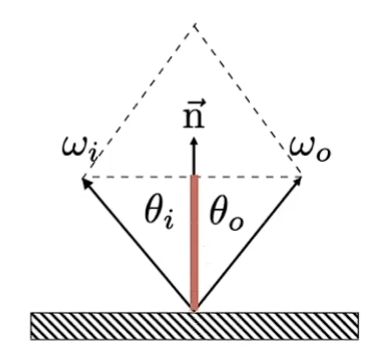
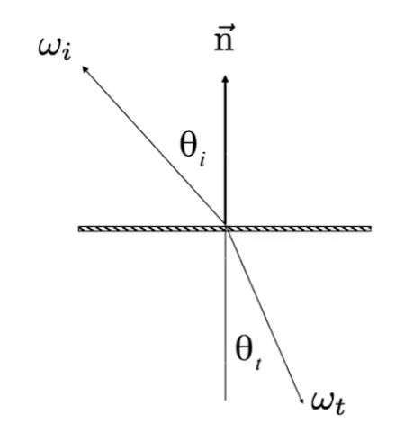

+++
date = '2025-05-20T16:56:07+08:00'
draft = false
title = '计算机图形学-材质和外观'
categories = ['Sub Sections']
math = true
+++

材质和外观，aterials and Appearance。

这材质和外观是和光线传播紧密结合的。在图形学中，材质就是 BRDF 。

## Diffuse / Lambertian Material
Diffuse Material 是漫反射材质，它既不发光，也不吸收能量，把接受的光全部均匀地反射到半球方向。我们来推导一下 Diffuse Material 的 BRDF 。

先写出反射方程:

$$L_o({\bf v}) = \int_\Omega f({\bf l}, {\bf v}) L_i({\bf l}) \cos{\theta_i} ~ {\rm d}\omega_i$$

由于 Diffuse Material 的性质， $f({\bf l}, {\bf v})$ 是常数 $f$ 。由于我们的目的是推导 Diffuse Material 的 BRDF，所以入射光 $L_i({\bf l})$ 设为常数 $L_i$ 。

于是反射方程改写为:

$$L_o({\bf v}) = f L_i \int_\Omega \cos{\theta_i} ~ {\rm d}\omega_i = \pi f L_i$$

根据能量守恒，入射的 Radiance 要等于出射的 Radiance ，所以我们得到:

$$f = \frac{1}{\pi}$$

如果我们继续定义一个反射率(albedo) $\rho, 0 \leq\rho \leq 1$ ，就有:

$$f = \frac{\rho}{\pi}$$

## Glossy Material
Glossy Material 是不完全反射材质。反射的光线集中在完全反射路径周围的一个小角度里面。对应现实中的打磨后的金属、铜镜等等。

## Ideal reflective / refractive Material
Ideal reflective / refractive Material 是反射和折射材质。对应现实中的玻璃、水等等。

对于折射材质，使用双向透射分布函数(BTDF)描述。如果把反射和折射结合起来，就是双向散射分布函数(BSDF)。

假设以着色点的法线为 $z$ 轴，类似球坐标系那样，定义两个二维的坐标系。

计算反射角:

$$\vec{\omega_o} + \vec{\omega_i} = 2 \cos{\theta_i} ~ \vec{n} = 2 (\vec{\omega_i} \cdot \vec{n}) \vec{n}$$

$$\vec{\omega_o} = 2 (\vec{\omega_i} \cdot \vec{n}) \vec{n} - \vec{\omega_i}$$

沿着着色点的法线(俯视图)看，我们就能看到类似方位角的东西。方位角加 $\pi$ ，对 $2 \pi$ 取模即可。

计算折射角:

根据 Snell's Law 计算。

$$
\begin{align}
\eta_i \sin{\theta_i} &= \eta_t \sin{\theta_t} \\
\cos{\theta_t} &= \sqrt{1 - \sin^2{\theta_t}} \\
&= \sqrt{1 - \left( \frac{\eta_i}{\eta_t} \right)^2 (1 - \cos^2{\theta_i})}
\end{align}
$$

这个式子里面包含根号，所以需要根号内部大于 $0$ 才有实际物理意义。当根号内部小于 $0$ 时，折射不会发生，这就是全反射现象。

我们容易得到，根号内部小于 $0$ ，只有 $\frac{\eta_i}{\eta_t} > 1$ 才有可能发生。

> 导体的折射率是复数，又叫复折射率、光纳。

### Fresnel Term(菲涅尔项)
在现实中，根据入射光的角度不同，反射和折射的比例也会不同。菲涅尔项就是来描述这一现象的。光的极化与偏振也对此有影响，不过现在的计算机图形学一般不考虑光的极化与偏振。偏振方向有 $s$ 方向和 $p$ 方向。如果光线的偏振矢量在**某平面**内，则称为 $p$ 偏振，如果偏振矢量垂直于该平面，则称为 $s$ 偏振。任何一种输入偏振状态都可以表示为 $s$ 和 $p$ 分量的矢量和。

> **某平面**是指上面两幅图的平面。

菲涅尔项的精确计算的计算量比较大，在计算机图图形学中，一般使用近似算法: Schlick's approximation.

$$R(\theta) = R_0 + (1 - R_0)(1 - \cos{\theta})^5$$

$$R_0 = \left( \frac{n_1 - n_2}{n_1+ n_2} \right)^2$$

可以看出， $R(0) = R_0, ~ R(\frac{\pi}{2}) = 1$ 。

## Microfacet Material(微表面材质)
详见[微表面理论](../Physically-based-shading-BRDF/index.md#微表面理论)。

这是微表面材质的 BRDF:

$$f({\bf l}, {\bf v}) = \frac{F({\bf l}, {\bf h}) G({\bf l}, {\bf v}) D({\bf h})}{4 \cos{\theta_i} \cos{\theta_o}} = \frac{F({\bf l}, {\bf h}) G({\bf l}, {\bf v}) D({\bf h})}{4 ({\bf n} \cdot {\bf l}) ({\bf n} \cdot {\bf v})}$$

> $\bf l$ 是入射方向， $\bf v$ 是出射方向， $\bf n$ 是宏观法线向量， $\bf h$ 是微表面法线向量， $F({\bf l}, {\bf h})$ 是菲涅尔项， $G({\bf l}, {\bf v})$ 是几何衰减因子(Geometrical Attenuation Factor)， $D({\bf h})$ 是法线分布函数(Normal Distribution Function, NDF)。

微表面模型十分强大，可以描述包括但并不限于 Diffuse Material 、金属、玻璃、真皮等等材质，被广泛应用到所有的基于物理渲染技术(Physically Based Rendering，PBR)中。

微表面模型是个统称， Cook-Torrance 模型是微表面模型的一种。

## Anisotropic/Isotropic Material(各向异性/各向同性材质)
材质还能分为两大类: 各向异性和各向同性。

各向异性/各向同性是源于物理学的概念，是指材料的性质与方向无关。举个例子来说，对于完全镜面反射材质，入射光和反射光的方位角的**相对角度**恒定，而且不会因为入射光方位角的变化发生变化。所以该材质就是各项同性材质。

从微表面模型的角度来说，就是微表面的法线分布函数是否具有一定的方向性。

## BRDF 的性质
### 非负性
$$f({\bf l}, {\bf v}) \geq 0$$

### 线性

### 可逆性
$$f({\bf l}, {\bf v}) = f({\bf v}, {\bf l})$$

### 如果是各向同性材质
$$f(\theta_i, \theta_r, \phi_i, \phi_r) = f(\theta_i, \theta_r, \phi_i - \phi_r)$$

根据可逆性:

$$f(\theta_i, \theta_r, \phi_i - \phi_r) = f(\theta_r, \theta_i, \phi_r - \phi_i) = f(\theta_i, \theta_r, \mid \phi_i - \phi_r \mid)$$

### 能量守恒
$$\forall {\bf v}, ~ \int_\Omega f({\bf l}, {\bf v}) \cos{\theta_i} ~ {\rm d}\omega_i \leq 1$$

## BRDF 的测量与储存
现实的情况十分复杂，我们之前提到的模型有时也不是非常准确的。如果我们采用真实世界的数据，渲染出来的效果想必十分完美。

测量方法非常简单，就是遍历所有入射方向和出射方向(有微小的角度间隔，抽样量化编码嘛)，记录数据，完事。

现实之中有一种机器，叫 gonioreflectometer ，就是用来测量 BRDF 的。

如果我们使用球坐标系来表示方向，那么 BRDF 就是一个拥有四个输入的函数，这个数据量是十分巨大的。

有以下几个方法可以优化: 利用材质的各项同性，把维度降到三维；利用 BRDF 的可逆性，把测量数量见一半；只采样部分方向的值，其余方向的值可以推测出来等等。

BRDF 的储存，涉及到各种压缩算法，略。

## 其他特殊的材质
### 非表面模型
#### 散射介质(Participating Media)
比如雾、云、丁达尔效应等等。光线进入散射介质中，会被散射介质散射到随机方向。使用 Phase Function 描述如何光线散射。一般来说，光线进入后会慢慢衰减掉。有些时候，固体也能成为散射介质，只不过光线进入不久就衰减完了。

#### 头发介质(Hair Appearance)
头发的实际结构，分为角质层(Cuticle)、皮质(Cortex, 吸收光线)和髓质(Medulla, 散射光线, 在人类头发中占比较小)。

##### Kajiya-Kay Model
把头发建模为一个普通圆柱，光线经过头发，发生散射。

##### Marschner Model
把头发建模为一个玻璃圆柱，光线经过头发，发生 R TT TRT 三种反应。(R 代表反射， T 代表折射)

#### 毛发介质(Fur Appearance)
用 Hair Appearance 来渲染人类头发，效果不错。但是渲染动物毛发，效果不好。动物毛发的实际结构，分为角质层(Cuticle)、皮质(Cortex, 吸收光线)和髓质(Medulla, 散射光线, 在动物毛发中占比较大)。 Hair Appearance 其实并没有模拟出髓质来。

##### Double Cylinder Model
在 Marschner Model 的基础上，在玻璃圆柱中直接定义髓质圆柱。光线经过头发，发生 R TT TRT TTS TRTS 五种反应。(R 代表反射， T 代表折射 ， S 代表散射)

#### Granular Material(颗粒状材料)
诸如盐、糖、香料之类。

### 表面模型
#### Translucent Material(半透明材质)
和散射介质是类似的。光线在穿过物体的过程中，不但会被渐渐吸收，还会被散射。也就是说，光线从某点进入物体，在物体内部发生多次散射，再从物体的随意一个点射出。这被称为次表面散射(Subsurface Scattering)。比如玉石、水母。

我们使用 Bidirectional Subsurface Scattering Reflectance Distribution Function(BSSRDF) 描述物体的次表面散射。 BSSRDF 是 BRDF 的扩展，定义为 $S({\bf x_i, l, x_o, v})$ ，其中， $\bf x_i$ 是入射点， $\bf l$ 是入射光方向， $\bf x_o$ 是出射点， $\bf v$ 是出射光方向。

我们使用 Scattering Function 来计算某点的 Radiance, Scattering Function 是 Rendering Equation 的扩展。在 Rendering Equation 中，我们对半球方向进行积分；在 Scattering Function 中，我们不但要对半球方向进行积分，还要对面积进行积分。

$$L({\bf x_o, v}) = \int_A \int_H S({\bf x_i, l, x_o, v}) L_i({\bf x_i, l}) \cos{\theta_i} ~{\rm d}\omega_i ~{\rm d}A$$

Scattering Function 计算量显然非常大。于是人们想到了 Dipole Approximation 来近似次表面散射。

次表面散射可以用来渲染各种玉石、人的皮肤等等。十分漂亮。

#### 布料(Cloth)
首先我们来看看现实中的布料的结构。首先是纤维(Fibers)，许多纤维缠绕为股(Ply)，几个股缠绕为纱线(Yarn)，许多纱线织成布。

一般来说，我们可以使用 BRDF 来描述布料。但是有些布料不行，比如有绒毛的布料。

所以可以把布料当成 Participating Media ，分为许多小块来描述。

当然，我们也可以暴力地渲染每一根纤维。

#### Detailed Appearance
之前提到的所有渲染方法，表现得"太过完美"。比如说车子的表面是有微小划痕的；比如说一些物体表面的高光是颗粒状的。

让我们回顾一下微表面模型的 BRDF :

$$f({\bf l}, {\bf v}) = \frac{F({\bf l}, {\bf h}) G({\bf l}, {\bf v}) D({\bf h})}{4 \cos{\theta_i} \cos{\theta_o}} = \frac{F({\bf l}, {\bf h}) G({\bf l}, {\bf v}) D({\bf h})}{4 ({\bf n} \cdot {\bf l}) ({\bf n} \cdot {\bf v})}$$

关键在于 $D({\bf h})$ 上。以前我们使用的是非常规整、非常光滑的函数。如果使用不光滑的函数，就能很好地实现"不完美"的效果。

但是，当物体的细节，也就是微表面，足够小，小到和可见光的波长差不多的时候，我们就不能使用几何光学来描述这些现象了。我们需要使用波动光学。但是波动光学的理论和计算太过复杂，目前是前沿研究领域。当然，现实中的某些现象，确实是需要波动光学来解释，如果我们想渲染出类似的现象，当然需要使用波动光学了。

### 程序性外观(Procedural appearance)
所谓程序性外观，就是实时计算出纹理。我们通常使用二维的纹理，但是有时是需要使用三维的纹理。而三维的纹理的存储成本很大，所以我们考虑使用实时计算的方式。换句话是，就是一个三维函数 $f(x, y, z)$ ，随用随取。

最常见的是 noise 函数。