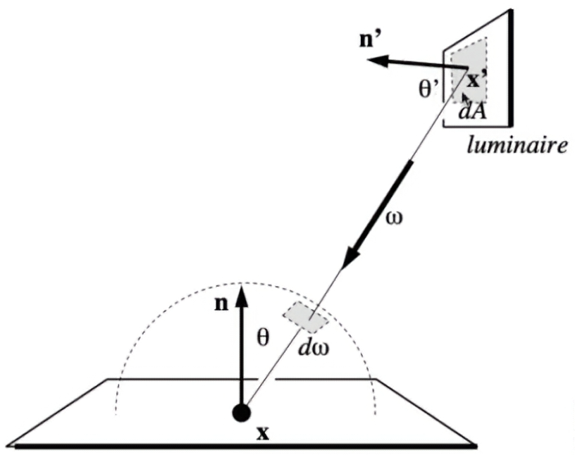

+++
date = '2025-05-20T16:53:21+08:00'
draft = false
title = '计算机图形学-Monte Carlo Path Tracing'
categories = ['Sub Sections']
math = true
+++

蒙特卡洛路径追踪，Monte Carlo Path Tracing。

## Why Monte Carlo Path Tracing?
在 Whitted-Style Ray Tracing 中，我们做的是:
1. 发射 eye ray, 碰到 specular(光滑的物体) 的时候，计算反射和折射的光线。
2. 碰到 diffuse surfaces(漫反射表面)时，停止迭代。

现在看来，在 Whitted-Style Ray Tracing 中，还是有一些不遵循物理规律的做法。比如它在渲染不完全镜面的物体时，效果不好。要渲染更高质量的、更真实的画面，需要继续改进算法。

## 求解反射方程
根据[基于物理着色：BRDF](Bibliography/基于物理着色BRDF/基于物理着色BRDF.md) ，反射方程为:

$$L_o({\bf v}) = \int_\Omega f({\bf l}, {\bf v}) L_i({\bf l}) \cos{\theta_i} ~ {\rm d}\omega_i$$

求解反射方程有两个难点:
1. 复杂的积分
2. 递归的计算(见[Radiometry(辐射度量学)](../Radiometry/index.md#use-the-rendering-equation))

我们使用蒙特卡洛积分法来求解这个积分，见 [Probability](../Probability/index.md#算法2) 。

假设 eye ray 的 primary ray 打在 p 点， secondary ray 打在 q 点。于是我们就要计算来自 q 点的能量。那就先求解 q 点的反射方程，再求解 p 点的反射方程。

但是! 以上的方法有问题，就是计算量太大。假设每个点发射 $n$ 根光线，光线反弹 $m$ 次，就需要计算 $n^m$ 次反射方程的原函数。

但是! 如果 $n = 1$ 的话，就不会指数爆炸了。这就是 **Path Tracing** 。

如果 $n \neq 1$ 的话，就是 **Distributed Ray Tracing** 。

但是! 如果 $n = 1$ 的话，得出的结果就不太准确了，怎么办呢?

我们在做渲染的时候，是针对像素进行渲染的。在一个像素的范围里面，可以打出许多 eye ray 。发射许多 eye ray ，进行平均，结果就比较准确了。

不过还存在一个问题，在真实世界中，光线的反弹次数是无限的。我们当然不能让计算机计算无限反弹的光线，换句话说，如何让递归停止? 一个自然的想法是，规定光线的反弹次数，到次数就直接返回。但是这样做，光线的能量是有损失的，会造成结果失真(局部偏暗)。

假设在某一点 p ，对某点 q 发射 eye ray ，将会得到 Radiance $L_o$ 。我们事先设定一个概率 $p$ 。有 $p$ 的概率，得到 q 点的 Radiance 为 $\frac{L_o}{p}$ ，有 $1 - p$ 的概率，得到 q 点的 Radiance 为 $0$ 。我们计算一下 q 点的 Radiance 的期望值: $E = p \frac{L_o}{p} + (1 - p) \cdot 0 = L_o$ 。

## 改进 Path Tracing 算法
首先引入一个概念: samples per pixel, SPP. 意思是每个像素发出多少根 eye ray 。

这个 **Path Tracing** 算法，在 Low SPP 的情况下，图像是有明显噪声的。在 High SPP 的情况下倒没有什么问题。那么为什么 Low SPP 会有明显噪声? 因为 eye ray 碰不碰到光源还是看运气的，特别是对于小的光源来说。

如果我们直接对光源采样，那么得到的结果就没有那么多噪声了。那么如何对光源直接采样?

首先看看反射方程:

$$L_o({\bf v}) = \int_\Omega f({\bf l}, {\bf v}) L_i({\bf l}) \cos{\theta_i} ~ {\rm d}\omega_i$$

它是对立体角进行积分的。而一般对光源的定义，是使用 Irradiance 定义的。也就是说，我们需要改写反射方程，从对立体角进行积分，改为对面积进行积分。于是我们需要寻找微分面积和微分立体角的关系。查看立体角的定义: $r^2 \omega = A$ 。

观察下图，要得到光源对应的立体角，需要把它投影到着色点的单位圆上。容易得到:

$${\rm d}\omega = \frac{{\rm d}A \cos{\theta^\prime}}{\mid \mid {\bf x^\prime} - {\bf x} \mid \mid^2}$$

改写反射方程:

$$L_o({\bf v}) = \int_S f({\bf l}, {\bf v}) L_i({\bf l}) \cos{\theta_i} ~ \frac{{\rm d}A \cos{\theta^\prime}}{\mid \mid {\bf x^\prime} - {\bf x} \mid \mid^2}$$

实际算法流程:

如果发射的 eye ray 直接遇到光源，那么不需要概率发射 eye ray 了，直接使用蒙特卡洛积分法计算改写的反射方程；如果发射的 eye ray 遇到非光源，按照老办法计算。最后把光源和非光源加起来，返回。

## Path Tracing 算法的缺点
无法计算点光源。解决方法: 定义一个面积很小的光源。

## Path Tracing 算法的优点
可以生成 photo-realistic(照片级真实感)的图像。几乎 100% 正确。

## 课后习题(doge)
1. 如何均匀地得出随机方向?
1. 蒙特卡洛积分，它的采样一定要求是均匀的吗?(重要性采样理论， importance sampling)
1. 随机数的质量?(low discrepancy sequences)
1. 把对半球的采样和对光源的采样结合起来，效果会不会更好?(multiple importance sampling, MIS)
1. 我们穿过像素，发射多个 eye ray ，一定是简单平均起来吗? 要不要加权平均?(pixel reconstruction filter)
1. 我们算出了一个像素的 Radiance ，但是 Radiance 不是颜色。如何把 Radiance 换算成颜色?(gamma correction, 伽马校正)(High Dynamic Range Imaging, HDRI or HDR, 高动态范围成像)(color space, 颜色空间)