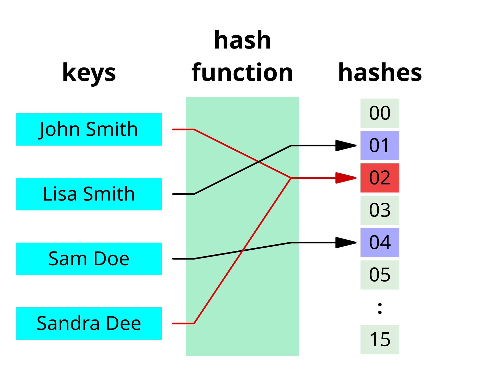
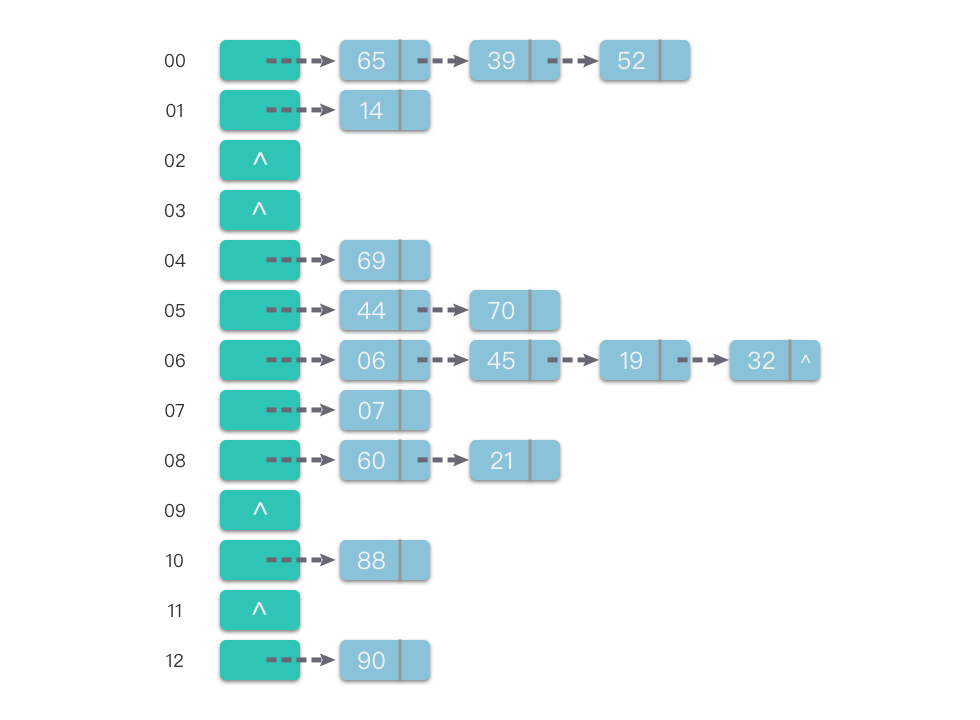

+++
date = '2025-05-20T16:13:02+08:00'
draft = false
title = '数据结构与算法-哈希表'
categories = ['Sub Sections']
math = true
+++

哈希表(Hash Table)，也叫做散列表。底层是一个数组，保存了哈希表的元素。任意的输入，通过哈希函数，得到一个整数，这个整数就是底层数组的下标。通过这个整数，可以访问哈希表的元素。

## 哈希函数
哈希函数(Hash Function)，是把任意类型的数据（包括整数，字符串，甚至对象），映射为整数的函数。

维基百科讲得好，建议查看以下资料：

1. [Hash table - Wikipedia](https://en.wikipedia.org/wiki/Hash_table)
1. [Hash function - Wikipedia](https://en.wikipedia.org/wiki/Hash_function)
1. [System.Object.GetHashCode 方法 - .NET | Microsoft Learn](https://learn.microsoft.com/zh-cn/dotnet/fundamentals/runtime-libraries/system-object-gethashcode)

## 哈希冲突
哈希冲突(Hash Collision)是指不同的关键字通过同一个哈希函数得到同一哈希值。即 $k_1 \neq k_2, H(k_1) = H(k_2)$ 。

设计再好的哈希函数也无法完全避免哈希冲突。常用的哈希冲突解决方法主要是两类：「开放地址法(Open Addressing)」 和 「链地址法(Chaining)」。

### 开放地址法
开放地址法，重新计算新的哈希值。最终哈希值的计算方式如下：

$$HO(k, i) = (H(k) + F(i)) \mod m, \quad i = 1, 2, 3, ...$$

> 其中， $i$ 是冲突次数； $F(i)$ 是冲突解决方法。

$F(i)$ 有以下几种：

1. 线性探测法： $F(i) = i$ 。
1. 二次探测法： $F(i) = (-1)^i \cdot i^2, $
1. 伪随机数法： $F(i) = 某伪随机数算法(i)$

### 链地址法
链地址法，将具有相同哈希地址的元素（或记录）存储在同一个线性链表中。

