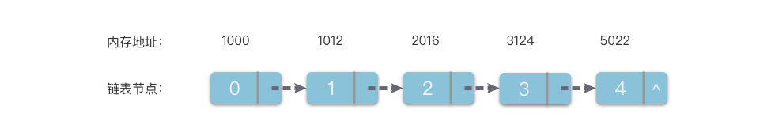
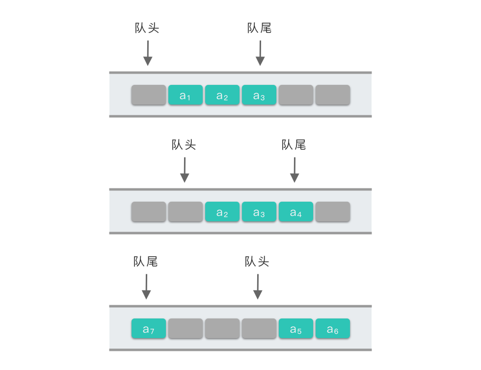

+++
date = '2025-05-20T16:13:01+08:00'
draft = false
title = '数据结构与算法-线性结构'
categories = ['Sub Sections']
math = true
+++

## 数组
数组(Array)使用一组连续的内存空间，来存储一组具有相同类型的数据。

以整数数组为例，数组的存储方式如下图所示。

数组的最大特点是能够根据下标索引，进行随机访问，即可以在 $O(1)$ 的时间复杂度中访问数组中的任意一个元素。具体请看「[数组元素的读取](#数组元素的读取)」。

### 数组的基本操作
#### 数组元素的创建
在数组第 $i$ 个位置上插入元素。

首先把数组第 $i$ 个元素及其后面的元素往后移动一格，然后把要插入的元素放在数组第 $i$ 个位置上。

在「在数组第 $i$ 个位置上插入元素」的操作中，由于移动元素的操作次数跟元素个数有关，因此，它的最坏和平均时间复杂度都是 $O(n)$ ；最佳时间复杂度是 $O(1)$ ，当「在数组尾部插入元素」时，因为不需要移动元素。然而，当数组原本的空间不足时，需要重新申请更大的空间，然后把所有的元素移动到新的空间中，这时，时间复杂度是 $O(n)$ 。

#### 数组元素的更新
更新数组的第 $i$ 个元素。

通过「寻址公式」，直接更改元素。「寻址公式」请看「[数组元素的读取](#数组元素的读取)」。

#### 数组元素的读取
读取数组的第 $i$ 个元素。

数组元素通过下标索引访问，下标索引是一个整数。

计算机给一个数组分配了一组连续的存储空间，其中第一个元素开始的地址被称为「首地址」。每个数据元素都有对应的下标索引和内存地址，计算机通过地址来访问数据元素。当计算机需要访问数组的某个元素时，会通过「寻址公式」计算出对应元素的内存地址，然后访问地址对应的数据元素。

寻址公式如下：

下标 $i$ 对应的数据元素地址 = 数据首地址 $+ \; i \; \cdot$ 单个数据元素所占内存大小。

「数组元素的读取」的操作不依赖于数组中元素个数，因此，它的时间复杂度为 $O(1)$ 。

#### 数组元素的删除
删除数组的第 $i$ 个元素。

把数组第 $i$ 个位置以后的所有元素（不包括 $i$ ）往前移动一格。

在「删除数组的第 $i$ 个元素」的操作中，由于移动元素的操作次数跟元素个数有关，因此，它的最坏和平均时间复杂度都是 $O(n)$ 。

## 链表
链表(Linked List)使用一组任意的存储单元（可以是连续的，也可以是不连续的），来存储一组具有相同类型的数据。

链表由多个链表节点组成。链表节点由一个元素和若干链表节点指针组成。链表有以下几种类型：

1. 单链表：只有一个链表节点指针，指向下一个链表节点。
1. 双链表：有两个链表节点指针，一个指向上一个链表节点，一个指向下一个链表节点。

链表不支持随机访问。

链表的基本操作和数组差不多，只是不用增删时移动元素，改变前后链表节点的链表节点指针即可。但是，这并不意味着增删操作的时间复杂度就是 $O(1)$ 了，因为在增删操作之前，我们还需要从头节点一个一个地找到目标链表节点，这个操作的时间复杂度是 $O(n)$ 。

## 堆栈
堆栈(Stack)，简称为栈。栈是只允许在表的一端进行插入和删除操作的线性表。

栈的元素是后进先出(Last In First Out, LIFO)的。

堆栈依托数组或链表实现：

* 对于数组实现，使用一个整形记录栈顶元素下标索引。
* 对于链表实现，使用一个变量记录栈顶元素的链表节点。

栈的基本操作：
1. 入栈：在线性表的尾部添加一个元素。
1. 出栈：在线性表的尾部删除一个元素。
1. 获取栈顶元素：获取线性表中最后一个元素。

## 队列
队列(Queue)，是一种只允许在表的一端进行插入操作，而在表的另一端进行删除操作的线性表。

队列的元素是先进先出(First In First Out, FIFO)的。

### 队列的实现
队列依托数组或链表实现：

* 对于数组实现，使用两个整形记录队列首个元素和尾部元素下标索引。
* 对于链表实现，使用两个变量记录队列首个元素的链表节点和尾部元素的链表节点。

对于链表实现，没有任何问题；但是对于数组实现，有一个问题，设想以下场景：

在队列底层的数组满时，进行若干次出队操作。然后尝试进行入队操作，失败。

这是因为，队列首个元素的下标索引和队列尾部元素下标索引总是增大，即使出队，数组的前部的空间也不会再使用，这就造成了「假溢出」问题。

那么如何把队列底层的数组的前面的空间重复利用呢？我们可以在首个元素的下标索引和队列尾部元素下标索引加一后，对它们进行求余操作，求余的数是队列(底层数组)的最大元素数量。这样，首个元素的下标索引和队列尾部元素下标索引会回到开头。

队列的基本操作：
1. 入队：在线性表的尾部添加一个元素。
1. 出队：在线性表的头部删除一个元素。
1. 获取队头元素：获取线性表中第一个元素。
1. 获取队尾元素：获取线性表中最后一个元素。
