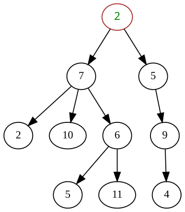

+++
date = '2025-05-20T16:13:04+08:00'
draft = false
title = '数据结构与算法-树形结构'
categories = ['Sub Sections']
math = true
+++

普通树的简单示意图如下：

树其实是特殊的[图]()，即没有环路的连通图。

## 相关术语
可以看出，树由多个节点(node)组成，大多数节点有父节点和子节点。

其中，最顶上的红圈（其值为 2 ），没有父节点，称为根节点。

最底下的几个节点（其值分别为 5, 11, 4 ），没有子节点，称为叶子节点。

具有相同父节点的子节点互为兄弟节点。

某些定义允许树中不包含任何节点，此时该树被称为空树。

内部节点（亦称内节点，简称 inode 或分支节点）是树中拥有子节点的任一节点。同理，外部节点（亦称外节点、叶节点或终端节点）则指不拥有子节点的任一节点。

节点的高度是从该节点向下到叶子节点的最长路径的长度。根节点的高度即为树的高度。

节点的深度是指到其根节点的路径长度（即其根路径）。

因此，根节点的深度为零，叶子节点的高度为零，而仅含单一节点（既是根也是叶）的树其深度和高度均为零。按照惯例，空树（若允许存在无节点的树）的高度为-1。

邻居节点：父节点或子节点。

祖先：一个可通过从子节点重复前进到父节点到达的节点。

后代：通过从父节点重复前进到子节点可到达的节点。也称为子子节点。

节点的度(Degree)：子节点的数量。

树的度：树的度是树中节点的最大度数。

两节点的距离：两个节点之间最短路径上的边数。

## 树在计算机中的表示
定义节点，节点包括指向父节点的指针，一系列指向子节点的指针，以及数据域。

另外，对于特殊的树，可以以线性表的方式存储。详见[线段树]()。

## 树的遍历
遍历是指访问数的所有节点，一般从根节点开始。

树的遍历是递归算法，到达某节点后，进行一些操作：

若每次先访问父节点再访问其子节点，则称为 **前序遍历(pre-order walk)** ；若先访问子节点再访问其父节点，则称为 **后序遍历(post-order walk)** ；若按照左子树、节点本身、右子树的顺序访问，则称为 **中序遍历(in-order traversal)** （特指具有左右两个子树的二叉树）。以上三种方法实质是对整棵树进行深度优先搜索（详见[图]()）。 **层序遍历(level-order walk)** 实质是对整棵树进行广度优先搜索（详见[图]()）：节点按层级顺序被访问，首先访问根节点，接着是其直接子节点及其兄弟节点，然后是孙节点及其兄弟节点，以此类推，直至遍历完树中所有节点。

## 搜索树
树这个数据结构的优点是拥有很好的搜索效率。我们首先构建有序的树，即每个节点的键及其子节点的键要形成固定的顺序。

### 二叉搜索树(Binary search tree)
二叉搜索树，每个节点最多只有两个子节点。

⌈每个节点的键及其子节点的键要形成固定的顺序⌋，具体是指：对于所有节点，规定左子节点的键要小于节点的键，节点的键要小于右子节点的键。当然，也可以作另一种规定：对于所有节点，节点的键要小于左子节点的键，左子树的键要小于右子节点的键。怎么样选择都可以。

现在，我们规定⌈对于所有节点，规定左子节点的键要小于节点的键，节点的键要小于右子节点的键⌋。

#### 二叉搜索树的搜索
在搜索时，对于每个节点：

* 如果要搜索的值小于当前节点的键，则进入左子节点；
* 如果要搜索的值大于当前节点的键，则进入右子节点；
* 如果要搜索的值等于当前节点的键，找到了要找到的节点；
* 如果当前节点没有子节点，则这个树没有要找的键。

在理想情况下（即每个非叶子节点都有两个孩子），那么每进入一个新节点，就会筛选掉一半的节点。所以二叉搜索树的搜索的搜索效率，最佳为 $O(\ln(n))$ 。

然而在最糟糕的情况下（即每一个非叶子节点都只有一个孩子），那么搜索就会退化为线性搜索，即一个一个地比较键值是否相等。所以二叉搜索树的搜索的搜索效率，最坏为 $O(n)$ 。

#### 二叉搜索树的插入和删除
要进行二叉搜索树的插入和删除，首先就是要进行二叉搜索树的搜索，搜索要插入的位置和要删除的元素，直接插入或删除即可。但是这样，在极端情况下，容易造成二叉搜索树的不平衡，即许多节点只有一个孩子。

### 自平衡二叉搜索树(Self-balanced binary search trees)
为了防止二叉搜索树不平衡，需要考虑如何平衡二叉搜索树，因此产生了许多变种：如 T-tree、treap、红黑树、B 树、B+树、伸展树等等。

关于搜索树的更多资料，请看：

1. [Search tree - Wikipedia](https://en.wikipedia.org/wiki/Search_tree)
1. [Binary search tree - Wikipedia](https://en.wikipedia.org/wiki/Binary_search_tree)
1. [B tree - Wikipedia](https://en.wikipedia.org/wiki/B-tree)
1. [B+ tree - Wikipedia](https://en.wikipedia.org/wiki/B%2B_tree)

