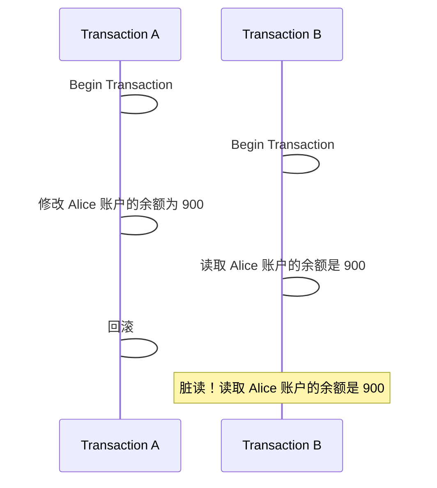
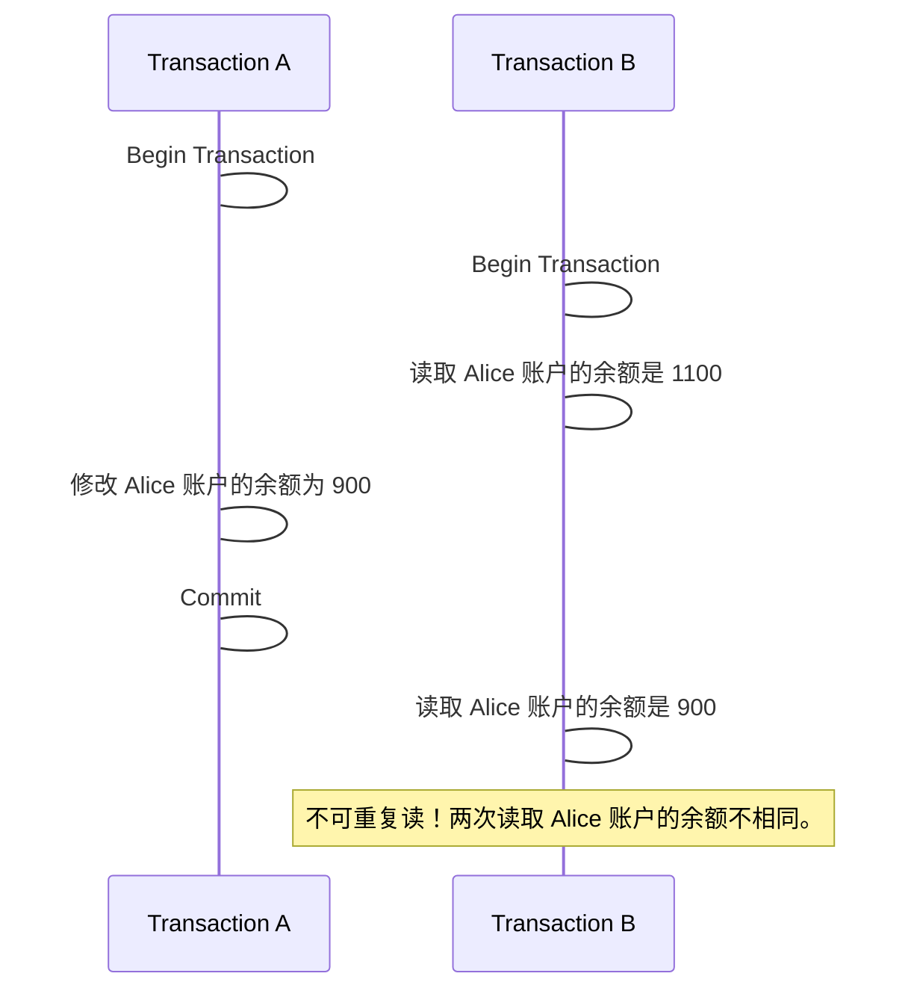
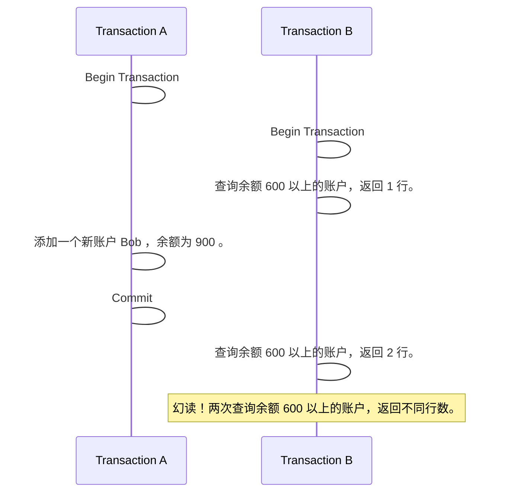
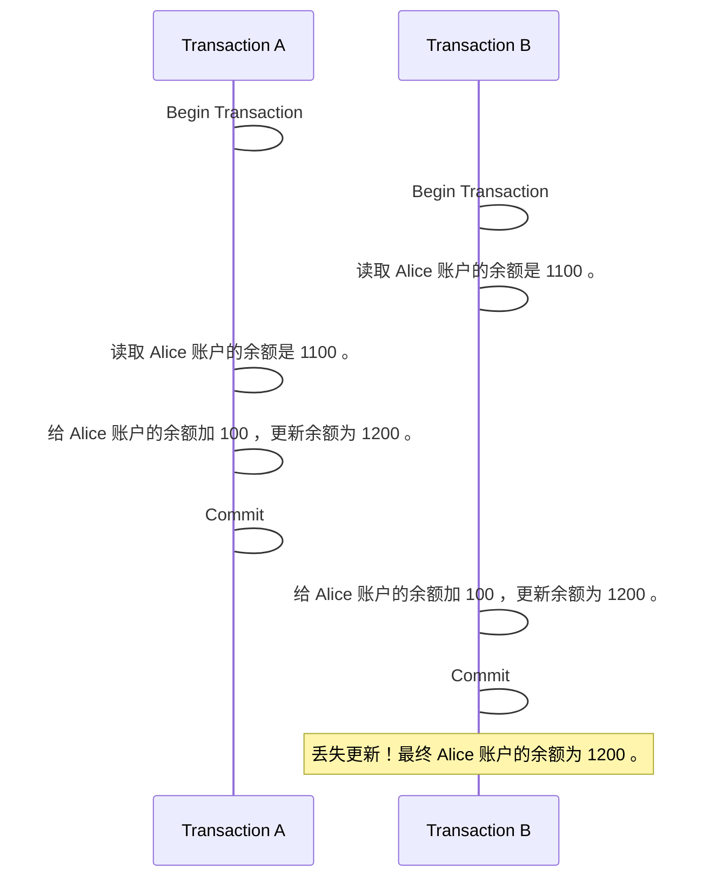

+++
date = '2025-08-15T20:28:50+08:00'
draft = false
title = '数据库并发控制'
categories = ['Sub Sections']
mermaid = true
+++

数据库并发控制的核心目标是​**​在保证数据一致性的前提下，最大限度地提高系统并发度​**​。当多个用户或事务同时访问和修改同一份数据时，如果没有有效的控制机制，会导致**​​脏读、不可重复读、幻读以及丢失更新**​​等问题。

## 没有并发控制的问题
### ​脏读
**读取到未提交的数据**。事务 B 读取了另一个尚未提交的事务 A 所修改的临时数据。如果那个未提交的事务 A 后来被回滚了，那么事务 B 读取到的数据就是无效的、从未真实存在过的“脏”数据。

示例：

​​后果：​​事务 B 基于它读取到的余额"900"这个脏数据进行后续操作（例如增加 100 ，则值更新为 1000），但这个更新最终出错（因为实际余额是 1000 ，再更新为 1000 ）。

### 不可重复读
**​同一事务内多次读取相同数据，结果不一致（值被修改）**。​​ 事务 B 在两次读取同一数据项的间隙，该数据被另一个已提交的事务 A 修改了，导致第一次和第二次读取的结果不同。

示例：

​​后果：​假设​事务 B 第一次读取到 Alice 账户的余额是 1100 ， 余额 1000 以上的送食用油， Alice 在送食用油名单中；​事务 B 第二次读取到 Alice 账户的余额是 900 ，余额 1000 以下的送大米， Alice 在送大米名单中。于是 Alice 薅到了羊毛。

### 幻读
**同一事务内多次执行同范围查询，返回的行数不一致（有新增或删除）**。​​注意：幻读关注的是​​新增或删除​​满足查询条件的行（记录行），而不可重复读关注的是​​修改​​同一行内的数据（同一行的不同列值）。

示例：

### 丢失更新
两个事务分别读取同一数据并进行更新，后提交的事务覆盖了先提交的事务的更新，导致先提交的更新“丢失”。​

示例：

## ​​事务隔离级别
事务隔离级别（Transaction Isolation Level）​​是数据库管理系统（DBMS）中定义事务并发执行时​​数据可见性规则和控制并发异常程度​​的重要标准。它规定了当一个事务操作数据时，其他并发事务对该数据的修改在何种程度上​​可见​​或​​产生干扰​​。

ANSI/ISO SQL 标准定义的四个隔离级别如下表：

| 隔离级别 | 脏读 (Dirty Read) | 不可重复读 (Non-Repeatable Read) | 幻读 (Phantom Read) | 典型应用场景 |
| :--: | :--: | :--: | :--: | :--: |
| **1. 读未提交 (READ UNCOMMITTED)** | ❌ **可能发生** | ❌ **可能发生** | ❌ **可能发生** | 极少使用，对数据准确性要求极低或只读统计 |
| **2. 读已提交 (READ COMMITTED)**  | ✅ **避免** | ❌ **可能发生** | ❌ **可能发生** | 大多数 OLTP 系统默认级别 |
| **3. 可重复读 (REPEATABLE READ)** | ✅ **避免** | ✅ **避免** | ❌ **可能发生** | 需一致性视图场景 |
| **4. 可串行化 (SERIALIZABLE)**    | ✅ **避免** | ✅ **避免** | ✅ **避免** | 最高一致性要求 (金融交易, 库存核心) |

更新丢失不被 ANSI SQL 标准隔离级别直接解决。不过可串行化可以避免（性能代价高，实际较少用）。

## 主要的并发控制技术
### 锁机制
这是最传统和广泛应用的方法，基于对数据项“加锁”来实现互斥访问。

#### 锁的粒度
锁可以作用在不同层次的数据对象上，如整个数据库、表、数据块（页）、行、甚至某些数据库支持列级锁。粒度越细（如行锁），并发度越高，但锁管理开销越大；粒度越粗（如表锁），管理开销小，但并发度低。现代 OLTP 数据库主要使用​​行级锁​​以达到高并发。

#### 锁的类型
* **共享锁（S Locks / Read Locks）**：​​ 允许多个事务同时读取一个数据项，但阻止任何事务对该数据项加排他锁（即阻止写）。
* **排他锁（X Locks / Write Locks）**：​​ 阻止其他事务对该数据项加任何锁（包括共享锁和排他锁），即独占访问（读/写）。
* **意向锁（Intention Locks）**：​​ 为了提高效率，在锁定数据项之前，事务会先在**上层对象**（如表、页）上加意向锁，表明有在更细粒度上加锁的“意图”。 包括意向共享锁（IS）、意向排他锁（IX）、共享意向排他锁（SIX）。

> 共享意向排他锁（SIX），是 S 锁和 IX 锁的组合。

#### 锁协议
最基本的是两阶段锁协议（2PL）。

**加锁阶段**：​​事务在需要访问任何数据项之前，必须先获得该数据项的相应锁。在此阶段，事务可以不断获取新锁，但不能释放任何锁。

**​​解锁阶段**：​​事务在加锁阶段结束后进入解锁阶段，在此阶段可以释放已持有的锁，但不能再获取任何新锁。

锁升级/降级：​​为了减少锁管理开销，某些系统允许在事务中动态地将一组更细粒度的锁升级为一个更粗粒度的锁（如多个行锁升级为一个表锁），或者根据需要降级锁（X -> S）。

**锁兼容性矩阵（Lock Compatibility Matrix）**：它清晰地展示了不同类型的锁在同时请求同一数据对象时，哪些组合可以兼容共存（不冲突），哪些组合会冲突导致等待。

| 当前持有的锁 →   请求的锁 ↓ | **无锁** | **共享锁 (S)** | **排他锁 (X)** | **意向共享锁 (IS)** | **意向排他锁 (IX)** | **共享意向排他锁 (SIX)** |
| :--: | :--: | :--: | :--: | :--: | :--: | :--: |
| **共享锁 (S)** | ✅ 兼容 | ✅ 兼容 | ❌ 冲突 | ✅ 兼容 | ❌ 冲突 | ❌ 冲突 |
| **排他锁 (X)** | ✅ 兼容  | ❌ 冲突 | ❌ 冲突 | ❌ 冲突 | ❌ 冲突 | ❌ 冲突 |
| **意向共享锁 (IS)** | ✅ 兼容  | ✅ 兼容 | ❌ 冲突 | ✅ 兼容 | ✅ 兼容 | ✅ 兼容 |
| **意向排他锁 (IX)** | ✅ 兼容  | ❌ 冲突 | ❌ 冲突 | ✅ 兼容 | ✅ 兼容 | ❌ 冲突 |
| **共享意向排他锁 (SIX)** | ✅ 兼容 | ❌ 冲突 | ❌ 冲突 | ✅ 兼容 | ❌ 冲突 | ❌ 冲突 |

2PL 的变种：​

* **严格两阶段锁（Strict 2PL）**：​​排他锁必须保持到事务结束（提交或回滚）后才释放。这有效防止了脏读和级联回滚。
* ​**​强两阶段锁（Rigorous 2PL / Conservative 2PL）**：​​所有锁（共享锁和排他锁）都必须保持到事务结束才释放。这是最严格的版本。

#### 死锁处理
* **预防**：通过要求事务一次性申请所有所需锁，或者规定所有事务必须按固定顺序申请锁（避免循环等待），在死锁发生前阻止它。但是这样做，并发性较低，所以较少用。
* ​**​检测与解除**：
    * **超时机制**：​​如果事务等待锁的时间超过预设阈值，则认为它可能发生了死锁，将其强制回滚。
    * **等待图检测**：​​数据库维护一个事务等待图（节点是事务，边表示等待关系）。系统定期检查图中是否存在环（死锁）。如果存在，则选择一个或多个事务作为“牺牲者”（通常基于代价最小原则，如事务已执行的时间或持有锁的数量）回滚，释放其持有的锁，让其他事务继续。

### 多版本并发控制
全称是 Multi-Version Concurrency Control(MVCC) 。创建数据项的多个​​版本​​。读取操作总是获取在操作开始时已​​提交​​的数据项的**某个​​一致性版本**​​，而不阻塞写操作。写操作会创建数据项的新版本。

#### 版本标识
每个事务被分配一个唯一的、递增的​​事务 ID（TXID）​​。每个**数据行**（记录）在系统中可能存储有多个版本。

在表中，除了用户定义的列以外，数据库管理系统还隐式定义以下列：

1. **事务 ID** (txid):​​ 记录​​创建​或修改​该行版本的​​事务 ID​​。
1. **删除标记** (delete_flag):​​ 标记该行是否已经删除。
1. **指针** (undo_ptr):​​ ​某些实现存储一个指向 undo log 记录的指针，通过 undo log 可以找到该行的​​前一个版本​​（即它的历史版本）。这样就形成了​​版本链（Version Chain）​​。详见[版本存储](#版本存储)。

#### 事务快照
事务在​​开始​（可重复读隔离级别）或​​执行每条语句时​（读已提交隔离级别）会获取一个​​事务快照 (Transaction Snapshot)​​。

这个快照记录了当前时刻哪些事务是​​“活跃的”(Active)​​, 即​​尚未提交或回滚​​的事务 ID 集合。快照中有以下数据：

* `m_ids` : 生成快照时，系统中未提交的事务列表，即活跃的事务列表。
* `min_trx_id` : `m_ids` 中最小的事务 ID 。
* `max_trx_id` : 创建快照时下一个将要分配的事务 ID 。

#### 可见性规则
这是 MVCC 的核心判断逻辑，决定一个事务的特定操作（主要是读操作）能否“看到”某个行版本。规则通常如下：

可见性规则如下：

* `txid == T.id` ，说明事务正在访问自己所修改的记录，可以访问。
* `txid < T.snapshot.min_trx_id` ，说明事务正在访问之前已经提交修改的数据，可以访问。
* `txid > T.snapshot.max_trx_id` ，说明生成该版本的事务，在生成快照时还未创建，不能访问。
* `T.snapshot.min_trx_id <= txid < T.snapshot.max_trx_id` ，需要在 `m_ids` 中查看该 `txid` 的事务是否活跃，如果活跃，则不能访问。

#### 版本存储
`UPDATE` 和 `DELETE` 操作产生的​​旧版本数据​​必须被存储起来，以便其他还在运行的事务能根据其快照访问它们。主要有两种策略：

* Append-Optimized: 将新行版本和旧行版本都存储在​​主表（堆表）​​ 中。新数据插入到表尾部，更新/删除只标记旧数据。这种设计读效率高（查找最新版本较快），但需要高效的空间回收机制。
* Rollback Segments(Undo Logs):​ 将行数据的​​旧版本​​存储在专门的 ​​undo log​​ 区域。主表中存放的是行的​​最新版本​​和一个指向该版本 undo log 的指针 (undo_ptr)。这种设计主表体积小，索引指向最新行，但读历史版本需要回溯 undo log（版本链查找），开销稍大。

#### 垃圾回收
随着事务不断提交，旧的、不再被任何事务可见的行版本就变成了​​“垃圾”​​。如果不清理，会导致存储空间无限增长（表膨胀）。一个行版本是垃圾​​应该满足以下所有条件​​：

* 修改它的事务已提交。
* 这个行版本不是最新版本。
* 该版本的事务 ID 低于所有活跃事务的快照 `min_trx_id` ，即没有任何当前活跃或未来的事务还需要看到这个版本​​。

> MVCC 还有另一种实现方式：把 `delete_flag` 换为 `txid_expired` ，记录删除这个记录的事务，不需要 `undo_ptr` 。 `UPDATE` 操作是 `DELETE` + `INSERT` 。

### 乐观并发控制
乐观并发控制（Optimistic Concurrency Control, OCC）是一种​​无锁并发机制​​，其核心思想是 ​​“先执行，后检查冲突”​​。与锁机制的“预先加锁防冲突”不同， OCC **假设事务之间的数据竞争概率较低**，仅在事务提交时校验数据是否被篡改。

在表中，除了用户定义的列以外，数据库管理系统还隐式定义以下列：

* `ConcurrencyStamp` ，int 亦可，string 亦可，时间戳亦可。本质上，这个字段就是随便存储一个值。

#### 工作流程
1. 读阶段（Read Phase）​：
    1. 一次性读取所有该事务所需的数据（​​读集（Read Set））。
    1. 计算事务计划修改的数据项及其新值集合（​写集（Write Set））（给 `ConcurrencyStamp` 赋予一个新值，随便什么都行）。
1. 验证阶段（Validation Phase）​：比较​读集中的 `ConcurrencyStamp` 值与数据库中的 `ConcurrencyStamp` 值。若相同，则校验通过；否则校验不是通过。
1. 写阶段（Write Phase）​：
    * 校验通过：将写集内容**​​原子性提交**​​到数据库
    * 校验失败：事务回滚（通常需应用层重试）

> 验证阶段和写阶段是​原子性的。

### 总结
| 特性 | 锁机制 (Locking) | 多版本并发控制 (MVCC) | 乐观并发控制 (OCC) |
| :--: | :--: | :--: | :--: |
| **核心理念** | 先加锁再操作 | 维护数据历史版本 + 快照读 | 先执行，提交时验冲突 |
| **读写关系** | 读写互斥 | 读写不阻塞 | 读写不阻塞 (无锁读) |
| **存储开销** | 低 (仅锁元数据) | 高 (多版本数据存储) | 低 (仅版本号/时间戳) |
| **典型死锁风险** | 高 (需死锁检测) | ✅ 极低 (读无锁) | ✅ 无 (无等待环) |
| **事务回滚代价** | 低 (仅释放锁) | 中 (清理旧版本) | 高 (整个事务重做) |
| **冲突处理方式** | 预防式 (阻塞等待) | 隔离式 (版本隔离) | 反应式 (提交时校验) |
| **优点** | 强一致性 | 高并发读 | 高吞吐，架构简单 |
| **缺点** | 死锁风险；并发度相对不高 | 写冲突检测滞后；存储膨胀， GC 压力 | 不适合写入多的场景 |

多数数据库采用​组合方案​​平衡性能与一致性。

本文主要讲述中心式数据库的并发控制，分布式系统的并发控制又是另一个故事了。
