+++
date = '2025-08-15T11:57:12+08:00'
draft = false
title = '数据库安全'
categories = ['Sub Sections']
tags = ['数据库']
mermaid = true
+++

## 专有名词
1. 数据库管理员：拥有所有对象的所有权限，根据实际情况不同的权限授予不同的用户
2. 用户：拥有自己建立的对象的全部的操作权限，可以使用 `GRANT` 语句，把权限授予其他用户。
3. 角色：数据库角色是权限的集合。可以为一组具有相同权限的用户创建一个角色，使用角色来管理数据库权限可以简化授权的过程。
4. 审计：启用一个专用的审计日志（Audit Log），将用户对数据库的所有操作记录在上面；审计员利用审计日志监控数据库中的各种行为，找出非法存取数据的人、时间和内容。
    * 审计很费时间和空间
    * DBA可以根据应用对安全性的要求，灵活地打开或关闭审计功能
    * 审计功能主要用于安全性要求较高的部门

## 什么是安全
这涉及到信息安全的概念，见[信息安全的指标](../../Introduction-to-Information-Security/IS-Criteria/index.md)。

对于数据库中的数据来说，重点是机密性和完整性。

## 用户权限管理
在数据库管理系统中，分为数据库管理员和普通用户。

对于普通用户读写数据库的控制，有两大方式：自主存取控制(Discretionary Access Control, DAC)和强制存取控制(Mandatory Access Control, MAC)

### 自主存取控制
数据的​​所有者​​（创建者）对于谁可以访问他们拥有的数据和对象拥有自主决定权（Discretion），可以自主地决定授予或撤销其他用户的访问权限。

* 每个数据库对象（如表、视图、存储过程）都有一个所有者。
* 所有者可以通过 SQL 语句（ `GRANT` 语句）授予其他用户特定的权限（如 `SELECT, INSERT, UPDATE, DELETE, EXECUTE` 等）。
* 所有者也可以使用 `REVOKE` 语句撤销这些权限。
* 获得权限的用户（被授权者）可以​​进一步转授权限​​给其他用户，除非授予时指定了不能再继续授权。

关系数据库系统中的存取权限表：

| 对象类型 | 对象 | 操作类型 |
| :--: | :--: | :--: |
| 数据库模式 | 模式 | `CREATE SCHEMA` |
| 数据库模式 | 基本表 | `CREATE TABLE` `ALTER TABLE` |
| 数据库模式 | 视图 | `CREATE VIEW` |
| 数据库模式 | 索引 | `CREATE INDEX` |
| 数据 | 基本表和视图 | `SELECT` `INSERT` `UPDATE` `DELETE` `REFERENCES` `ALL PRIVILEGES` |
| 数据 | 属性列 | `SELECT` `INSERT` `UPDATE` `REFERENCES` `ALL PRIVILEGES` |

授予其他用户权限的 SQL 语句：

```SQL
GRANT 权限 [,权限] ...
ON 对象类型 对象名 [,对象类型 对象名 ] ...
TO 用户 [, 用户]
[ WITH GRANT OPTION ];
```

> 指定了 `WITH GRANT OPTION` 子句，获得某种权限的用户可以把权限授予其他用户，但是不允许循环授权；没有指定 `WITH GRANT OPTION` 字句，只能使用该权限，不能转授权限。

> 此外，自主存取控制中还有"角色"这个概念。数据库角色是权限的集合。可以为一组具有相同权限的用户创建一个角色，使用角色来管理数据库权限可以简化授权的过程。

### 强制存取控制
访问控制决策由系统的​​安全策略​​强制决定，而​​非用户自己​​决定。系统为每个主体（用户/进程）和客体（数据对象）分配不可篡改的​​安全标签​​，访问基于这些标签和​​固定规则​​（如 Bell-LaPadula 模型）来强制执行。

* ​​主体标签 (Clearance Level)：​​ 代表主体的可信度或安全级别（如：绝密、机密、秘密、非密）。
* 客体标签 (Classification Level)：​​ 代表客体中数据的敏感度（如：绝密、机密、秘密、非密）。
* ​​访问规则：​​ 基于主体标签和客体标签，应用​​强制性的​​规则来判断访问是否被允许。最常见的是 Bell-LaPadula 模型的规则：
    * 简单安全属性规定（向下读/不向上读），处于特定安全级别的主体不得读取更高安全级别的客体。
    * \*（星）安全属性规定（向上写/不向下写），处于给定安全级别的主体不得向任何更低安全级别的客体进行写入操作。（原因：防止高密级信息泄露到低密级位置）
* 不可绕过：​​ 安全标签由系统管理员或安全管理员分配，并且普通用户（包括数据所有者）​​无法更改​​这些标签或绕过这些规则。

See also: [Bell–LaPadula model - Wikipedia](https://en.wikipedia.org/wiki/Bell%E2%80%93LaPadula_model)

自主存取控制和强制存取控制可以同时存在。访问请求通常需要​​同时通过 DAC 检查和 MAC 检查​​才能被允许。

## 数据库完整性
数据库完整性是指数据的正确性和相容性。完整性是为了防止数据库中存在不符合语义的数据，即防止数据库中存在不正确的数据。

关系模型中有三类完整性约束：

### 实体完整性(Entity Integrity)
关系模型以主键作为唯一性标识，主键中的属性不能取空值。

违规操作：拒绝执行。

### 参照完整性(Referential Integrity)
参照完整性要求在一个关系数据库中，对于所有使用外键的情况，每个外键值要么为空，要么必须在另一个表的主键中存在对应的值。这样的规则保证了数据之间的正确引用，防止了数据的不一致性。

当不一致发生时，系统可以采用如下策略处理：

1. 拒绝执行(No Action)。
1. 级联(Cascade)。当删除或修改被参照表的一个元组导致与参照表（SC）的不一致时，删除或修改参照表中的所有导致不一致的元组。
1. 设置为空值(Set Null)。

### 用户自定义完整性(User-defined Integrity)
反映某一具体应用所涉及的数据必须满足的语义要求。比如某个员工的年龄范围是 18 ~ 60 。使用 SQL 的 `CHECK` 语句定义约束条件。

```SQL
CREATE TABLE employe (
    id int NOT NULL,
    name varchar(50) NOT NULL,
    age SMALLINT,
    PRIMARY KEY(id),
    CHECK(18 < age AND age < 60)
);
```

违规操作：拒绝执行。

## 事务
事务(Transaction)是用户定义的一个数据库操作序列，这些操作要么全部成功要么全部不执行，是一个不可分割的工作单位。一个事务可以是一条 SQL 语句，也可以是一组 SQL 语句。

事务通常是以 `BEGIN TRANSACTION` 开始，以 `COMMIT` 或 `ROLLBACK` 结束。 `COMMIT` 表示提交， `ROLLBACK` 表示回滚，在事务运行的过程中发生某种故障事务不能继续执行，系统就会将事务对数据库的已完成操作全部撤销，从而回滚到事务开始时的状态。

### 事务的特性
1. 原子性(Atomicity)：事务是数据库的逻辑工作单位，事务中包括的操作要么都成功执行，要么都不执行。
2. 一致性(Consistency)：事务执行的结果必须是使数据库从一个一致性状态变到另一个一致性状态。即事务执行前后，无论是否成功，[数据库完整性](#数据库完整性)要得到保证。
3. 隔离性(Isolation)：一个事务的执行不能被其他事务干扰，并发执行的各个事务之间不能互相干扰。
4. 持续性(Durability)：一个事务一旦提交，它对数据库中数据的改变就应该是永久性的。

以上四个特性，统称 ACID 。

### 事务失败的原因
1. 事务内部的故障：如违反实体完整性、参照完整性、用户自定义完整性、死锁等等。
1. 系统故障：如网络故障、操作系统故障， CPU 故障，系统断电等。
1. 介质故障：如磁盘损坏、磁头碰撞、瞬时强磁场干扰等。
1. 计算机病毒。

### 实现事务的基本原理
#### 预写式日志
​​预写式日志(Write-Ahead Logging, WAL)是指，在对物理数据文件进行修改​​之前​​，必须先将描述该操作的​​日志记录​​写入磁盘上的​​持久化日志文件​​。

关键日志记录类型有：

1. `BEGIN TRANSACTION` : 标记一个事务的开始。
1. 记录具体的修改操作。通常包含:
    * 修改类型 (`UPDATE` `INSERT` `DELETE`)
    * 修改对象 (表名、唯一标识)
    * 修改前的旧值 (UNDO 信息，用于回滚)
    * 修改后的新值 (REDO 信息，用于重做)
1. `COMMIT TRANSACTION` : 标记事务成功提交。
1. `ABORT` `ROLLBACK` : 显式标记事务中止（有时由系统在内部隐式处理）。
1. `CHECKPOINT` : 定期的检查点记录，包含关键信息如当前活跃事务列表、最近已提交事务 LSN 等，用于加速恢复。

##### WAL 如何保证 ACID
1. 原子性(Atomicity)：如果事务的 WAL 中没有 `COMMIT` 记录，说明事务没有完成。根据 WAL 中的记录（ UNDO 信息），把对应对象的值全部修改为旧值，就像这个事务从未执行过一样，确保了“全部成功”或“没有执行”。
1. 一致性(Consistency)：通过 WAL 保证的原子性（失败回滚）和持久性（提交成功），再结合数据库系统本身的约束检查（在事务提交前进行），确保了数据库在事务开始前和结束后都处于一致状态。
1. 隔离性(Isolation)：WAL ​​主要不负责隔离性​​。隔离性通常由其他方法实现，见[并发控制](.././Concurrency-control/index.md)章节。
1. 持续性(Durability)：一旦事务的 WAL 中的 `COMMIT` 记录成功写入并持久化到磁盘日志文件，就表示该事务已完成。即使此时修改的数据还没来得及写入磁盘数据文件（还在内存缓冲区中）或者写入中途发生故障，数据库恢复过程也能根据该事务的 WAL 中的记录（ REDO 信息），把对应对象的值全部修改为新值，使修改最终体现在磁盘数据文件中。

##### 例子
假设 Account 表结构如下：

| Id | Balance |
| :--: | :--: |
| A | 1000 |
| B | 500 |

有一事务 T1 ：从账户 A 转账 100 元到账户 B 。

具体操作如下：
1. 写 `BEGIN T1` 日志到内存缓冲区。
1. 读账户 A 。
1. 写日志 `T1 Update, A, Old=1000, New=900`​​ 到内存缓冲区。
1. 在​​内存缓冲区中修改账户 A 余额为 900 。
1. 读账户 B 。
1. 写日志 `T1 Update, B, Old=500, New=600`​​ 到内存缓冲区。
1. 在​​内存缓冲区中修改账户 B 余额为 600 。
1. ​​写日志 `COMMIT T1​`​ 到内存缓冲区。
1. 强制刷新日志缓冲区​​：确保以上所有日志记录都写入​​持久化日志文件​​(磁盘)。
1. DBMS 后台进程​​异步​​将内存缓冲池中修改过的账户 A 和账户 B 的数据（现在分别是 900 和 600 ）写回​​磁盘数据文件​​。

接下来假设故障发生：

1. 假设故障发生在第 3 步之后，第 4 步之前。此时，内存缓冲区有可能刷新到磁盘中。
    * 假设内存缓冲区没有刷新到磁盘。日志中没有事务 T1 ，数据库实际内容没有更改。
    * 假设内存缓冲区已经刷新到磁盘。日志中有事务 T1 ，但没有 `COMMIT` 记录。此时，要回滚(ROLLBACK)。根据日志记录，把账户 A 的余额设置为旧值， 1000 。这样就保证了原子性。
1. 假设故障发生在第 10 步，写入数据库磁盘文件中的时候，系统崩溃。
    * 日志中有事务 T1 ，有 `COMMIT` 记录。但不能保证数据库文件已经成功写入。此时，要重做(REDO)。根据日志记录，把账户 A 的余额设置为新值， 900 ，把账户 B 的余额设置为新值， 600 。这样就保证了持久性。

##### 检查点
通过上面的例子，很容易想象到，系统故障后，就需要重做(REDO)所有已经提交的事务。这会产生严重的性能问题。为了解决这个问题，现代数据库系统引入了一个至关重要的优化机制：​​检查点 (Checkpoint)​​。

###### LSN
首先，先介绍一下 LSN 。LSN 是日志序列号 (Log Sequence Number)​ 的缩写，是一个单调递增的逻辑时间戳。每个日志记录在写入时都会被赋予一个唯一的 LSN。

###### 创建检查点
1. ​短暂暂停（或协调管理）新事务的开始，以确保记录一组清晰的活动事务（此操作通常很快）。
1. 刷新脏页：​​​强制将所有或大部分当前内存中已被修改但尚未写入磁盘的“脏页” (Dirty Pages) 刷新（Flush）到磁盘的数据文件中​​。
1. 写入检查点记录：​​在 WAL 中写入一条​​检查点日志记录​​。这条记录包含一些关键信息：
    * ​​检查点发生时的 LSN (CheckpointLSN)​​。
    * ​​活跃事务列表 (Active Transaction List)：​​ 在检查点发生时尚未提交的事务 ID（那些在检查点之后启动或在检查点时还没提交的事务）。
    * ​​已刷新数据页的最小 LSN (有时是记录刷新的起始位置)​​: 明确表明​​哪些修改在检查点之前已确保写入磁盘数据文件​​。

###### 系统恢复步骤
当系统崩溃后开始恢复时，恢复过程如下操作：

1. 恢复程序从日志文件的​​尾部向前扫描​​，找到最近一条​​完整的、有效的​​检查点记录 (确保其已落盘)。
1. ​​确定 REDO 起始点。
1. 通过​​活跃事务列表确定 UNDO 列表。
1. 恢复(REDO 和 UNDO)。

需要重做和撤销的事务如下图所示:

```mermaid
gantt
    title 系统恢复策略图
    dateFormat HH:mm
    axisFormat %H:%M
    检查点 : vert, 00:10,
    系统故障 : vert, 00:20,
    Transaction A : done, 00:00, 8m
    Transaction B (REDO) : crit, done, 00:04, 10m
    Transaction C (UNDO) : crit, active, 00:08, 15m
    Transaction D (REDO) : crit, done, 00:12, 6m
    Transaction E (UNDO) : crit, active, 00:18, 4m
```



## 数据库的备份与恢复
### 数据库备份与恢复策略对比表

| **策略类型** | **备份机制** | **恢复特点** | **适用场景** | **优点** | **缺点** |
| :--: | :--: | :--: | :--: | :--: | :--: |
| **完全备份（Full）** | 备份数据库所有数据 | 直接恢复单一备份文件即可完整还原 | 小型数据库、低频备份需求 | 恢复简单、数据完整性高 | 占用存储大、备份耗时长 |
| **增量备份（Incremental）** | 仅备份上次备份（完全/增量）后的**新增/修改**数据 | 需按顺序恢复：**全备 + 所有增量备份** | 频繁备份、中大型数据库 | 备份快、占用存储小 | 恢复复杂、单点故障导致备份链断裂风险高 |
| **差异备份（Differential）** | 仅备份上次**完全备份**后的所有变化数据 | 只需恢复：**全备 + 最新差异备份** | 平衡备份效率与恢复速度的场景 | 恢复比增量备份简单、存储占用适中 | 长期未全备时差异备份体积趋近全备 |
| **事务日志备份（Log）** | 备份事务日志（事务操作记录） | 需恢复：**全备 + 日志备份序列**，支持时间点恢复 | 要求零数据丢失、高可用性数据库（如SQL Server, PostgreSQL） | 支持精确到秒的恢复、占用存储极小 | 需持续备份日志、管理复杂 |
| **冷备份（Offline）** | 关闭数据库后复制物理文件 | 直接替换文件并重启数据库 | 允许停机维护的环境 | 操作简单、一致性高 | 业务中断、备份期间服务不可用 |
| **热备份（Online）** | 数据库运行时备份 | 与冷备恢复方式相同 | 24/7运行的关键业务系统 | 无需停机、无缝备份 | 可能轻微影响性能、依赖数据库引擎支持 |
| **快照备份（Snapshot）** | 利用存储/虚拟化层生成磁盘快照 | 基于快照快速回滚或克隆新实例 | 云数据库（AWS RDS, Azure SQL）、虚拟化环境 | 秒级备份/恢复、几乎零性能影响 | 依赖底层设施、可能需结合日志备份保证一致性 |
| **持续备份（Cloud）** | 云服务自动实时同步数据变化 | 一键恢复至任意时间点（低RPO/RTO） | 云原生数据库（Aurora, CosmosDB） | 自动化、细粒度恢复能力 | 绑定云平台、成本可能较高 |

---

### **关键恢复指标**
- **RTO（恢复时间目标）**：从故障到业务恢复的时间。
   *示例：快照恢复（分钟级） vs 增量备份恢复（小时级）*
- **RPO（恢复点目标）**：允许丢失的数据量。
   *示例：日志备份（秒级丢失） vs 每日全备（24小时丢失）*

---

### **备份策略设计建议**
1. **复合策略**：  
   `全备（每周1次） + 差异备份（每日） + 日志备份（每15分钟）
2. **3-2-1原则**：  
    * 3 份数据：保留 1 份原始数据 + 2 份备份。
    * 2 种不同存储媒介：避免单一媒介风险（例如：原始硬盘 + 移动硬盘）。
    * 1 份异地备份：至少 1 份备份存放在物理隔离的位置（如云端、公司或亲友家）。
3. **恢复验证**：定期测试备份文件有效性（模拟灾难恢复）。

> **注意事项**：
> - 加密敏感数据备份（如AES-256）
> - 监控备份任务状态与存储空间
> - 避免备份与高负载时段重叠

根据业务需求（RTO/RPO）、数据规模及基础设施选择组合策略，例如金融系统推荐 **全备+日志备份**，而开发环境可使用 **每日全备+快照**。
