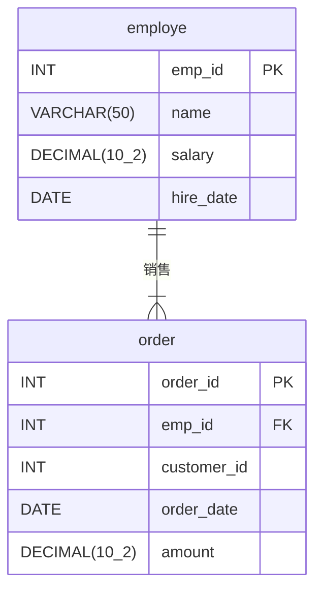

+++
date = '2025-08-12T15:42:54+08:00'
draft = false
title = 'ORM'
categories = ['Sub Sections']
mermaid = true
+++

## 什么是 ORM
ORM 的全称是 ​​Object-Relational Mapping​ ​，即​​对象关系映射​​。它是一种​​编程技术​​，用于在​​面向对象编程语言​​中的​​对象​​和​​关系型数据库​​中的​​表​​之间搭建一座桥梁。

我们在使用 Python, Java, C#, JavaScript 等现代面向对象的语言编写程序时，数据是以​​对象(Objects)​的形式存在和操作的，对象有属性(字段)和方法。例如，一个 User 对象可能有 id, name, email, password_hash 等属性。

然而，大多数持久化数据存储(特别是最常用和成熟的关系型数据库如 MySQL, PostgreSQL, Oracle, SQL Server)是​​关系型​​的。数据被严格组织在​​表(Tables)​​中，表由​​行(Rows)​​ 和​​列(Columns)​​ 构成。表之间通过​​主键(Primary Keys)​​ 和​​外键(Foreign Keys)​​ 建立关联(Relationships)。通常，我们使用 SQL 操作数据库。

在实际编程中，如果在程序中直接嵌入 SQL ，那就比较繁琐，且无类型转换。因为使用 SQL 查询，在编程语言中得到的结果是一个没有类型的数组。比如使用 C# 中的 ADO\.NET 框架，是直接使用 SQL 查询数据库的框架，一个简单的查询如下：

```CSharp
// tuplesReader 是保存了 SQL 查询结果的对象
while (await tuplesReader.ReadAsync())
{
    // 对于其中一个元组，读取每一列的数据，赋值到对象的对应的属性中。
    var user = new User
    {
        Id = tuplesReader.GetInt32(0),
        UserName = tuplesReader.GetString(1),
        DateModified = tuplesReader.GetInt64(2)
    };
    list.Add(user);
}
```

ORM 用于弥合**面向对象编程**和**关系模型**的差异​​。

## ORM 的核心概念
### ​​实体(Entity)​​/模型(Model)
映射到数据库表的类(如 User, Product, Order)。一个类对应一个表。

### 映射元数据(Metadata)
描述实体类如何映射到数据库表(列名、类型、关系、约束等)。通常在类定义中通过注解、装饰器或在单独的文件/代码中定义。

### ​​会话管理(Session Management)
跟踪对象的改变(脏数据检查)，管理对象缓存(Identity Map)，并协调数据库操作的执行(生成 SQL、提交事务)。常见的类名称是 `Session` , `DbContext` , `Connection` 。一般来说，业务代码会通过这些类来进行数据库的交互。

### ​缓存(Caching)
一级缓存(Session 级别)和二级缓存(跨 Session 的进程级/集群级缓存)，用于减少数据库访问。

### ​​迁移(Migrations)
帮助管理数据库模式(Schema)的演化(如创建/修改表)，使数据库结构的变化与代码模型的变化同步。在数据库中，通常有一个带有"history"字眼的表来记录数据库模式的演化历史。

### 加载策略
加载策略通常涉及到多表查询。

为了方便说明，假设我们有以下关系：


employe 是员工表， order 是订单表。这两个表是一对多关系。

#### 延迟加载(Lazy Loading)
核心思想：按需加载。

相关模型会在您请求时按需加载，这种方式适合需要根据应用程序逻辑来加载关联模型的情况。

拿上面的例子来说：

1. 当加载一个主对象（ employe ）时，ORM 只查询该对象对应的表数据（ employe 表）。
1. 该主对象内部持有的关联对象（例如 employe.orders ，员工的订单项列表）通常被初始化为一个​​代理对象​​或​​占位符集合​​（而不是真实数据）。
1. 当你的代码​​首次尝试访问​​这个关联属性（例如 `employe.orders[0]` ）时，ORM 框架会​​拦截这个访问​​。
1. 拦截后， ORM ​​立即执行​​一个 SQL 查询去获取关联数据。
1. 获取到的数据被填充到关联对象或集合中，后续访问就直接使用这些已加载的数据。

#### 预先加载(Eager Loading)
核心思想：​​提前加载。

所有关联模型会一次性加载完成。

拿上面的例子来说：

1. 当加载一个主对象（ employe ）时，ORM 直接查询该对象对应的表数据（ employe 表）及其关联对象数据（ order 表）。
1. 查询结果返回后，ORM 将数据分别填充到主对象和关联对象中。

#### 批量加载(Batch Loading)
核心思想：​​智能分组加载。

不预先加载所有关联对象，而是在检测到需要加载多个关联对象时，​​将多个延迟加载请求合并成一次批量查询​​。

拿上面的例子来说：

1. 当加载一个主对象（ employe ）时，ORM 只查询该对象对应的表数据（ employe 表）。
1. 当代码​​首次访问某个主对象的关联属性​​时， ORM ​​不会立即执行查询​​。 ORM 会​​收集​​当前上下文中所有​​待加载的同类型关联请求（例如 `foreach o in employe.orders` ）。
1. 在一个​​稍后的时间点​​（通常在当前操作单元结束前，如 Session Flush 或事务提交时，或显式触发时）， ORM ​​执行一次批量查询​​。这个查询使用 `IN` 子句或其他批量操作方式，一次性加载所有待加载主对象（如一批 `Order` ）的关联数据。
1. 加载到的关联数据被​​分发​​到各自对应的主对象的关联属性中。

#### 优缺点总结表
| 特性 | Lazy Loading | Eager Loading | Batch Loading |
| :--: | :--: | :--: | :--: |
| 加载时机 | 访问关联属性时才加载 | 加载主对象时​​同时​​加载关联属性 | 访问关联属性时​收集请求，稍后批量​​加载 |
| 查询次数 | 高 (易引发 **N+1 问题**<sup>*1</sup>) | 低 (通常 1 次或很少几次) | 中 (显著少于延迟加载，多于预先加载) |
| 初始速度 | 快​​ (只查主对象) | 慢​​ (复杂 JOIN/大结果集) | ​​快​​ (初始只查主对象) |
| 内存占用 | 低​​ (初始只加载主对象) | ​​高​​ (一次性加载所有数据) | 中​​ (按需加载，但一次加载一批) |
| 数据冗余 | ​​无 | 可能有 (JOIN 导致主对象数据重复) | 无 |
| 主要风险 |  **N+1 问题**<sup>*1</sup>| 过度加载，查询复杂，内存爆炸 | 实现依赖框架，`IN` 列表限制 |
| 最佳场景 | 不确定用关联/单个对象/关联数据大 | 确定用关联/多个对象/关联数据小 | 多个对象需同类型关联/避免  **N+1 问题**<sup>*1</sup>/关联数据中到大 |

<sup>*1</sup> N+1 问题：当遍历主对象的关联对象时，就会导致 ​​1 次查询加载主对象 + N 次查询加载每个主对象的关联对象​​。比如：对于某个 employe ，遍历其所有订单： `foreach o in employe.orders` ，假设 `orders` 有 10 个，就总共需要 11 次查询（ 1 次 employe ， 10 次 order ）。当 N 很大时，性能急剧下降。

## ORM 的主要优点​
1. ​​提高开发效率​​：绝大部分基础的 CRUD 操作无需手写繁琐且容易出错的 SQL 语句，开发者可以专注于业务逻辑和对象模型。
1. ​​降低数据库耦合度​​：业务逻辑代码不再直接依赖特定数据库的 SQL 方言（语法差异）。更换数据库相对容易（只需更改连接字符串和可能的少量方言配置）。
1. ​​提高代码可维护性​​：数据操作集中在 ORM 层和实体定义中，更符合面向对象的设计原则（如 DRY ）。代码通常更简洁、易读。
1. ​​类型安全​​：基于对象的查询 API 可以在编译时（对于静态语言）或编辑时（利用 IDE）检查类型错误。
1. 对象化​​：查询结果直接是对象实例，方便在业务逻辑层直接使用其属性和方法。
1. 内建功能​​：事务管理、连接池、缓存等通常由 ORM 框架内置或方便地集成，简化了这些基础设施的使用。
1. ​​更好的抽象​​：ORM 提供了处理数据库底层复杂性的高级抽象（如关联、继承映射策略）。

## ORM 的主要缺点
1. 性能开销：
    * ORM 的抽象层必然会带来一些解析和转换的开销。
    * N+1 问题：如果处理关联不当（如不加控制地使用延迟加载），可能导致大量小型查询。
    * 自动生成的 SQL 有时不是最优的（尤其在复杂连接或聚合查询时）。
1. 学习曲线：要高效、正确地使用 ORM，需要理解其概念（Session 生命周期、缓存策略、加载策略、映射关系）和高级功能，有学习成本。
1. 复杂性：对于极其复杂、非常规的查询或优化要求极高的场景，手写原生 SQL 可能更直接且高效。在复杂场景下调试 ORM 生成的 SQL 可能比较麻烦。
1. 过度抽象的风险：如果开发者不关心底层数据库的工作原理（如索引、事务隔离级别），可能会设计出低效的数据库模型或查询。
1. “阻抗失配” 不可能完全消除：对于对象模型中的某些高级特性（如复杂的继承结构、多态关联），映射到关系模型总会有妥协或不自然的地方。ORM 通常提供不同的继承映射策略（单表继承、类表继承、具体表继承），各有优缺点。

## 总结
ORM 是现代软件开发中一个不可或缺的工具，尤其在快速开发、维护性和面向对象设计中带来巨大优势。它有效地充当了面向对象世界和关系型数据库世界之间的“翻译官”。然而，它并非万能药，理解其优缺点以及底层数据库知识对于构建高性能、可扩展的应用至关重要。合理使用 ORM，在享受其便捷性的同时，对关键路径上的复杂查询进行必要的优化（有时是手写 SQL ），是掌握这门技术的平衡之道。