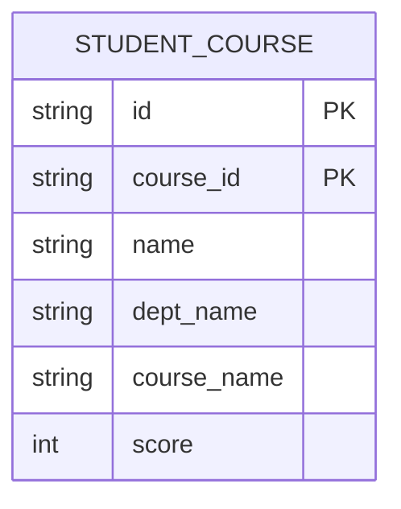

+++
date = '2025-05-29T20:10:14+08:00'
draft = false
title = '数据库-关系数据库理论'
categories = ['Sub Sections']
tags = ['数据库']
mermaid = true
math = true
+++

# 假设情景
假设要设计一个学生选课表，需要记录学生信息和所修课程。

一个新手设计出了这么个实体模型：

具体数据如下：

| id | course_id | name | dept_name | course_name | score |
| :--: | :--: | :--: | :--: | :--: | :--: |
| S001 | C001 | 张三 | 计算机 | 数据库 | 3 |
| S001 | C002 | 张三 | 计算机 | 操作系统 | 4 |
| S002 | C001 | 李四 | 数学 | 数据库 | 3 |

没错，这个表满足了上文所说的需求。但是有以下几个问题：

1. **数据冗余**：信息被重复存储，导致浪费大量存储空间。具体到这个例子中，一个学院（dept_name）往往有多个学生；于是在 STUDENT_COURSE 表中，学院名称被记录了多次。
1. **更新异常**：当重复信息的一个副本被修改，所有副本都必须进行同样的修改。因此当更新数据时，系统要付出很大的代价来维护数据库的完整性，否则会面临数据不一致的危险。具体到这个例子中，假设张三要转到电子系，那么就需要更改两个元组的数据；如果只修改了一个元组的数据，就会产生数据不一致的问题。
1. **插入异常**：无法插入某些合法数据，除非同时插入其他无关数据。具体到这个例子中，如果新增一名学生“王五”（学号S003，系别为“物理系”），但他尚未选课。因主键(id, course_id)中"course_id"[不可为空](../relational-databases/index.md#关系的完整性)，无法插入该学生信息。只能等待王五选课后才能插入数据，违背业务逻辑。
1. **删除异常**：删除某些数据时，意外丢失其他本应保留的信息。具体到这个例子中，李四退选“数据库”课程，删除元组（主键(S002, C001)），删除后，李四的姓名和学院的信息会丢失。

# 数据依赖
## 函数依赖
函数依赖（Functional Dependency, FD）​，定义如下：

假设关系 $R(U), \; X, Y \subset U$ ，如果对于属性 $X$ 的每一个值，属性 $Y$ 只有唯一的值对应，则称 $X$ 函数决定 $Y$ ，或称 $Y$ 函数依赖于 $X$ ，记作 $X \to Y$ 。

​​关键点：

* $X \to Y$ 不意味着 $Y \to X $ 。
* 依赖基于数据的语义（业务规则）。​​ 数据库本身不会自动推断出所有 FD，需要设计者根据对业务的理解来定义。DBMS 的作用是在定义之后​​强制维护​​这种依赖关系。

### 平凡函数依赖
平凡函数依赖(Trivial Functional Dependency)​，定义如下：

如果 $X \to Y$ ，且 $Y \subseteq X$ ，那么 $Y$ 平凡函数依赖于 $X$ 。这是理所当然的，也没有什么好讨论的，所以我们往往更关注非平凡函数依赖。往后的讨论，“函数依赖”默认是指非平凡函数依赖。

> 在数学术语中，“平凡(trivial)”的意思就是容易得到的，显然的，无需讨论的。

### 完全函数依赖
完全函数依赖(Full Functional Dependency)​，定义如下：

假设 $X \to Y$ ，如果对于所有 $X$ 的真子集 $x$ ， $x \nrightarrow Y$ ，那么 $Y$ 完全函数依赖于 $X$ 。

### 部分函数依赖
部分函数依赖(Partial Functional Dependency)​，定义如下：

假设 $X \to Y$ ，如果对于 $X$ 的真子集 $x$ ， 存在 $x \rightarrow Y$ ，那么 $Y$ 部分函数依赖于 $X$ 。

### 传递函数依赖
传递函数依赖(Transitive Functional Dependency)​，定义如下：

$X \to Y, \; Y \nrightarrow X, \; Y \to Z$ ，那么 $Z$ 传递函数依赖于 $X$ 。

## 多值依赖
首先举个例子：

一门课程可以有​​多个​​教师教授，同时也可以有​​多本​​参考教材。重要的是，教师和教材之间是​​相互独立的​​：

* 分配哪位教师教授这门课，不取决于指定使用哪本教材。
* 选定哪本教材作为参考，也不取决于由哪位教师授课。
* 教师和教材之间​​没有直接的联系规则​​。

如果将这些属性都放在一个表 Teaching(course, teacher, textbook) 中，为了表达所有可能的有效组合，你需要为每个教师和每本教材建立一条记录：

| course | teacher | textbook |
| :--: | :--: | :--: |
| 数据库 | 王老师 | 书A |
| 数据库 | 王老师 | 书B |
| 数据库 | 张老师 | 书A |
| 数据库 | 张老师 | 书B |

这个表存在数据冗余、更新异常、插入异常、​​删除异常问题。

多值依赖(Multivalued Dependency, MVD)正是用来形式化地描述这种“多个独立一对多”关系的约束机制。​定义如下：

假设有关系：

$R(U), \; X, Y \subset U, \; Z = U - X - Y$

> 这个定义隐含了以下信息：
> * $X \cap Y$ 可能不为空。
> * $Z \cap Y = \emptyset$

当且仅当对于任何合法关系实例 (即表中实际存储的数据)​​ $r$ 中，​所有满足 $t_1[X] = t_2[X]$ (即它们在 $X$ 属性上的取值相等) 的元组对 $t_1$ 和 $t_2$​​ ，都存在 $r$ 中的元组 $t_{3}$ 和 $t_4$ ，使得下列条件成立时，称 $X$ 多值决定 $Y$ ，记作 $X \twoheadrightarrow Y$ ：

$$
{\begin{matrix}
t_{1}[X]=t_{2}[X]=t_{3}[X]=t_{4}[X] \\
t_{1}[Y]=t_{3}[Y]\\t_{2}[Y]=t_{4}[Y] \\
t_{1}[Z]=t_{4}[Z] \\
t_{2}[Z]=t_{3}[Z]
\end{matrix}}
$$

结合上面的例子， $U = \{课程, 教师, 教材\},\; X=\{课程\},\; Y=\{教师\},\; Z=\{教材\}$ 。

MVD 有一个重要的性质：互补律（Complementation Rule）：如果 $X \twoheadrightarrow Y$ ，则 $X \twoheadrightarrow Z$ 。

我们一般关心非平凡多值依赖，即同时满足以下条件：

* $Y \subsetneqq X$
* $Z \neq \emptyset$

如果 $X \to Y$ ，则 $X \twoheadrightarrow Y$ 。函数依赖是多值依赖的特例。

# 函数依赖的计算
## ​​阿姆斯特朗公理
阿姆斯特朗公理(Armstrong's Axioms)是一组​​推理规则(Inference Rules)。它们提供了一种​​形式化的方法​​，用于从一个给定的函数依赖集 $F$ 出发，​​推导出​​所有在逻辑上蕴含于 $F$ 的其他函数依赖。

阿姆斯特朗公理的三条基本公理如下：

1. 自反律 (Reflexivity Rule / Inclusion Rule)
    * 如果 $Y \subseteq X$ ，则 $X \to Y$ 。
    * 比如：(学号, 姓名) $\to$ 学号 。
1. 增广律 (Augmentation Rule)
    * 如果 $X \to Y$ ，那么对于​​任意​​属性集 $Z$ ， $X \cup Z \to Y \cup Z$
    * 比如：已知 学号 $\to$ 姓名 ，那么(学号, 学院) $\to$ (姓名, 学院) 成立。
1. 传递律 (Transitivity Rule)
    * 如果 $X \to Y$ ，且 $Y \to Z$ ，那么 $X \to Z$ 成立。
    * 比如：已知 学号 $\to$ 系别，且 系别 $\to$ 系主任，那么 学号 $\to$ 系主任 成立。

由以上三条公理，可以推导出几个规则：

1. ​​合并律 (Union Rule)
    * 如果 $X \to Y$ 且 $X \to Z$ ，那么 $X \to Y \cup Z$ 。
    * 比如：已知 学号 $\to$ 姓名，且 学号 $\to$ 系别 ，那么 学号 $\to$ (姓名, 系别) 。
1. 分解律 (Decomposition Rule)
    * 如果 $X \to Y \cup Z$ ，那么 $X \to Y$ 且 $X \to Z$ 。
    * 比如：已知 学号 $\to$ (姓名, 系别)，那么学号 $\to$ 姓名 ，且 学号 $\to$ 系别。
1. 伪传递律 (Pseudo-transitivity Rule)
    * 如果 $X \to Y$ 且 $W \cup Y \to Z$ ，那么 $W \cup X \to Z$ 。
    * 比如：已知 课程号 $\to$ 教师ID 且 (教师ID, 学期) $\to$ 上课地点，那么 (课程号, 学期) $\to$ 上课地点。

## 函数依赖集的闭包
函数依赖集的闭包(Closure of a Set of Functional Dependencies)，定义如下：

给定一个函数依赖集 $F$ （我们显式知道的各个属性集的依赖关系）， $F$ 的闭包 $F^+$ 是指所有能够从 F 出发，​​通过有限次应用阿姆斯特朗公理​​推导出的函数依赖的集合。

直接计算 $F^+$ 通常非常困难且不必要，因为它的规模可能极其庞大（即使 $F$ 本身很小）。实践中，我们通常通过计算​​属性集的闭包​​来解决相关问题。

## 属性集的闭包
属性集的闭包(Closure of an Attribute Set)，定义如下：

给定一个函数依赖集 $F$ 和一个属性集 $X \subseteq R$ ， $X$ 关于 $F$ 的闭包（记作 $X^+$）是指所有能够通过 $F$ 中的函数依赖​​推导出​​的、函数依赖于 $X$ 的属性的集合。换句话说， $X^+$ 包含了所有由 $X$ 决定的属性。

计算 $X^+$ 的流程：

1. 初始化：定义结果集合 $A = X$ 。
1. 依次检查 $F$ 中的每一个函数依赖 $B \to C$ :
    1. 如果 $B \in A$ ，将 $C$ 加入到 $A$ 中。
1. 重复步骤 2 ，直到结果集合 $A$ 不再变化。
1. $A$ 就是 $X^+$ 。

属性集的闭包，有以下几个作用：

1. 判断 $X \to Y$ 是否属于函数依赖集的闭包 $F+$ ：先求出 $X^+$ ，然后检查 $Y \subseteq X^+$ 。如果 $Y$ 的所有属性都在 $X^+$ 中，则 $X \to Y$ 成立；否则不成立。
1. ​​寻找候选键：如果 $X^+$ 包含了关系模式 $R$ 的所有属性（即 $X^+ = R$ ），那么 $X$ 是一个超键。通过检查 $X$ 的真子集是否也能闭包出 $R$ ，可以判断 $X$ 是否是候选键（Candidate Key）。
1. ​​检查无损连接分解：​​ 在关系模式分解时，可以用属性闭包来验证分解是否满足无损连接性。

# 范式
首先先介绍几个概念：

* 超键(Super Key)：在关系中能唯一标识元组的属性集。
* 候选键(Candidate Key): 在关系中能唯一标识元组的最小属性集。
* 主键(Primary Key)：用户选作元组标识的一个候选键。
* 外键(Foreign Key)：如果关系模式 $R$ 中属性 $K$ 是其它模式的主键，那么 $K$ 在模式 $R$ 中称为外键。
* 主属性(Prime Attribute)：包含在任何候选键中的属性。

## 第一范式(1NF - First Normal Form)​
要求：

* 表的每一列（属性）都必须是​​原子的​​，即包含​​不可再分​​的基本数据项。

## 第二范式(2NF)
要求：

* 满足 1NF 。
* 消除​[​部分函数依赖](#部分函数依赖)。

## 第三范式(3NF)
要求：

* 满足 2NF 。
* 消除​[​传递函数依赖](#传递函数依赖)​​。

## 巴斯-科德范式(BCNF - Boyce-Codd Normal Form)
要求：

* 满足 3NF 。
* 对于表中的​​每一个非平凡函数依赖 $X \to Y$​ ​， $X$ ​​必须包含候选键​​（即 $X$ 必须是一个超键）。

## 第四范式(4NF)
要求：

* 满足 BCNF 。
* 消除​​非平凡且非函数的多值依赖​。对于每一个非平凡的多值依赖 $X \twoheadrightarrow Y$ ， $X$ ​​必须包含候选键​​（即 $X$ 是超键）。

## 第五范式(5NF)
又称为投影-连接范式 (PJNF)​。

要求：

* 满足 4NF 。
* 表不能被无损分解为多个更小的表结构，并且这些分解后表的连接运算可以重新构成原表而不产生多余或丢失的数据。

## 如何选择范式
范式并不是最高越好，对于特定场景，低一些的范式可能更好。

对于大多数场景而言， 3NF 或 BCNF 就已经足够，特殊场景才使用更高的范式。