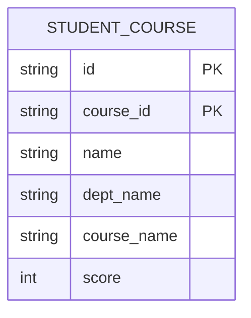

+++
date = '2025-05-29T20:10:14+08:00'
draft = false
title = '数据库-关系数据库理论'
categories = ['Sub Sections']
+++

# 假设情景
假设要设计一个学生选课表，需要记录学生信息和所修课程。

一个新手设计出了这么个实体模型：

具体数据如下：

| id | course_id | name | dept_name | course_name | score |
| :--: | :--: | :--: | :--: | :--: | :--: |
| S001 | C001 | 张三 | 计算机 | 数据库 | 3 |
| S001 | C002 | 张三 | 计算机 | 操作系统 | 4 |
| S002 | C001 | 李四 | 数学 | 数据库 | 3 |

没错，这个表满足了上文所说的需求。但是有以下几个问题：

1. **数据冗余**：信息被重复存储，导致浪费大量存储空间。具体到这个例子中，一个学院（dept_name）往往有多个学生；于是在 STUDENT_COURSE 表中，学院名称被记录了多次。
1. **更新异常**：当重复信息的一个副本被修改，所有副本都必须进行同样的修改。因此当更新数据时，系统要付出很大的代价来维护数据库的完整性，否则会面临数据不一致的危险。具体到这个例子中，假设张三要转到电子系，那么就需要更改两个元组的数据；如果只修改了一个元组的数据，就会产生数据不一致的问题。
1. **插入异常**：无法插入某些合法数据，除非同时插入其他无关数据。具体到这个例子中，如果新增一名学生“王五”（学号S003，系别为“物理系”），但他尚未选课。因主键(id, course_id)中"course_id"[不可为空](../relational-databases/index.md#关系的完整性)，无法插入该学生信息。只能等待王五选课后才能插入数据，违背业务逻辑。
1. **删除异常**：删除某些数据时，意外丢失其他本应保留的信息。具体到这个例子中，李四退选“数据库”课程，删除元组（主键(S002, C001)），删除后，李四的姓名和学院的信息会丢失。

# 数据依赖
## 函数依赖
函数依赖（Functional Dependency, FD）​，定义如下：

假设关系 $R(U), \; X, Y \subset U$ ，如果对于属性 $X$ 的每一个值，属性 $Y$ 只有唯一的值对应，则称 $X$ 函数决定 $Y$ ，或称 $Y$ 函数依赖于 $X$ ，记作 $X \to Y$ 。

​​关键点：

* $X \to Y$ 不意味着 $Y \to X $ 。
* 依赖基于数据的语义（业务规则）。​​ 数据库本身不会自动推断出所有 FD，需要设计者根据对业务的理解来定义。DBMS 的作用是在定义之后​​强制维护​​这种依赖关系。

### 平凡函数依赖
平凡函数依赖(Trivial Functional Dependency)​，定义如下：

如果 $X \to Y$ ，且 $Y \subseteq X$ ，那么 $Y$ 平凡函数依赖于 $X$ 。这是理所当然的，也没有什么好讨论的，所以我们往往更关注非平凡函数依赖。往后的讨论，“函数依赖”默认是指非平凡函数依赖。

> 在数学术语中，“平凡(trivial)”的意思就是容易得到的，显然的，无需讨论的。

### 完全函数依赖
完全函数依赖(Full Functional Dependency)​，定义如下：

假设 $X \to Y$ ，如果对于所有 $X$ 的真子集 $x$ ， $x \nrightarrow Y$ ，那么 $Y$ 完全函数依赖于 $X$ 。

### 部分函数依赖
部分函数依赖(Partial Functional Dependency)​，定义如下：

假设 $X \to Y$ ，如果对于 $X$ 的真子集 $x$ ， 存在 $x \rightarrow Y$ ，那么 $Y$ 部分函数依赖于 $X$ 。

### 传递函数依赖
传递函数依赖(Transitive Functional Dependency)​，定义如下：

$X \to Y, \; Y \nrightarrow X, \; Y \to Z$ ，那么 $Z$ 传递函数依赖于 $X$ 。

