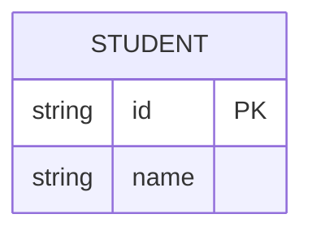
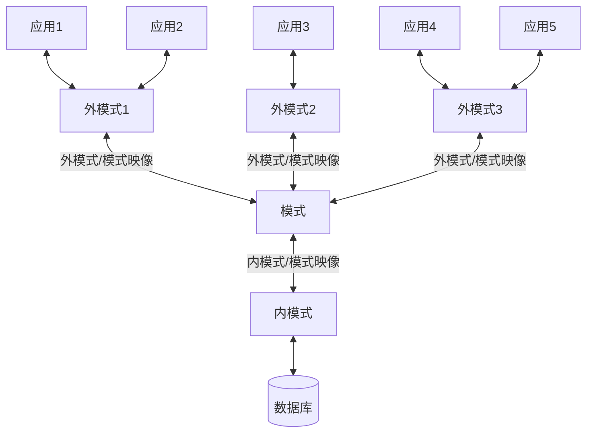

+++
date = '2025-05-25T16:24:04+08:00'
draft = false
title = '数据库-引言'
categories = ['Sub Sections']
mermaid = true
+++

数据库及其相关技术，是用来管理大量数据的。先简单介绍人类管理数据的历史。

## 数据管理技术的发展过程
### 人工管理阶段
在计算机出现之前，人们运用常规的手段从事记录、存储和对数据加工，也就是利用纸张来记录和利用计算工具（算盘、计算尺）来进行计算，并主要使用人的大脑来管理和利用这些数据。

### 文件系统阶段
在刚计算机的时期，人们使用文件来管理数据。但是普通文件，在逻辑上，基本只能以线性结构存储数据，对于大规模的增删改查（CURD），效率较低。同时还存在数据冗余、数据不一致性、数据独立性差问题（这几个概念后面会介绍）。

### 数据库系统阶段
随着计算机相关技术的发展，需要管理的数规模越来越大。为了克服文件系统管理数据的不足，出现了数据库系统。使用数据库系统管理数据，有以下特点：

1. 数据结构化。
1. 数据共享性高、冗余少且易扩充。
1. 数据独立性高。
1. 数据由数据库管理系统统一管理和控制。

## 重要概念介绍
### 基本术语
1. 数据(Data): 是数据库中存储的基本对象。定义为描述事务的符号记录。数据的含义称为语义，数据与其语义是不可分的。
1. 数据库(Database, DB): 长期存储在计算机内，有组织的，可共享的大量数据的集合。
1. 数据库管理系统(Database Management System, DBMS): 位于用户与操作系统之间的一层管理软件，和操作系统一样是计算机的基础软件。
1. 数据库系统(Database System, DBS): 数据库系统由 DB, DBMS，数据库管理员(DBA)和应用程序组成的存储、管理、处理和维护数据的系统。

### 数据模型(Data Model)
数据模型分为以下几类：

1. 概念模型：按用户的观点来对数据和信息建模，主要用于数据库设计。概念模型的表示方法很多，最常用的为实体-联系方法(Entity-Relationship approach)，该方法用 E-R 图来描述概念模型。
1. 逻辑模型：逻辑模型主要包括层次模型、网状模型、关系模型、面向对象模型和对象关系数据模型等，主要用于数据库管理系统的实现。**本章节主要介绍关系型数据库的设计和使用方法。**
1. 物理模型：物理模型是对数据最底层的抽象，它描述数据在系统内部的表示方法和存取方法，在磁盘或磁带上的存储方式和存取方法，是面向计算机系统的。

数据库设计人员对真实世界进行抽象，设计概念模型。数据库设计人员使用工具或不使用工具，把概念模型转化为逻辑模型。 DBMS 把逻辑模型转化为物理模型。

#### 数据模型的组成要素
数据模型通常由数据结构、数据操作和完整性约束三个部分组成。

**数据结构**描述数据库的组成对象以及对象之间的联系，通常按其数据结构的类型来命名数据模型，例如层次结构、网状结构和关系结构的数据模型分别命名为层次模型、网状模型、关系模型。

**数据操作**是指对数据库中各种对象的实例允许执行的操作的集合，包括操作及其有关的规则，主要分为查询和更新（插入、删除、修改）两大类操作。

**完整性约束条件**是给定的数据模型中数据及其联系所具有的制约和依存规则，在关系模型中体现为实体完整性和参照完整性。例如，某大学的数据库中规定学生成绩如果有6门以上不及格则不能授予学士学位，教授的退休年龄是65周岁等。

#### 实体-联系方法(Entity-Relationship approach)
实体-联系方法是表示概念模型的方法。

考虑以下例子：如何记录学生的数据？首先，学生有学号，姓名。那么学生就是一个**实体类型**，学号和姓名是学生的属性。那么可以用 E-R 图表示学生这个实体类型。 E-R 图有许多表示方法，mermaid 支持 Crow's Foot 表示法，具体如下：

这里仅作简单介绍，具体请看[维基百科](https://en.wikipedia.org/wiki/Entity%E2%80%93relationship_model)。

### 数据库系统结构
数据库系统的系统结构是三级模式结构：模式(Schema)、外模式(External Schema)、内模式(Internal Schema)。

1. 模式（也称逻辑模式），是数据库中全体数据的逻辑结构和特征的描述。模式与数据的物理存储细节和硬件环境无关，与具体的应用程序、开发工具及高级程序设计语言无关。
1. 外模式（也称子模式，用户模式，视图），是数据库用户（包括应用程序员和最终用户）使用的局部数据的逻辑结构和特征的描述。每个用户只能看见和访问所对应的外模式中的数据，是保证数据库安全性的一个有力措施。
1. 内模式（也称存储模式），是数据物理结构和存储方式的描述，是数据在数据库内部的表示方式。
