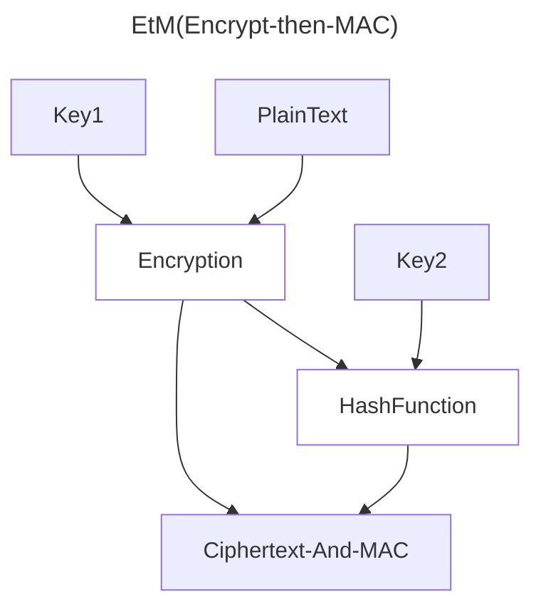
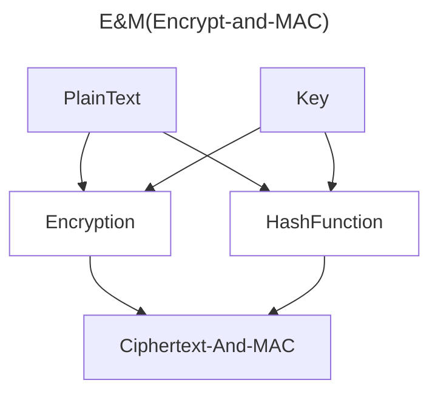
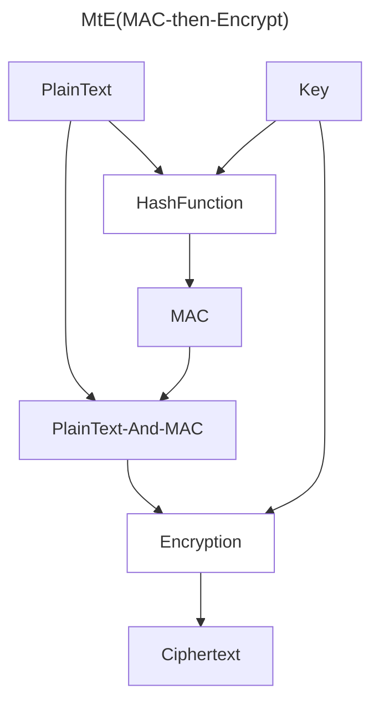

+++
date = '2025-12-05T13:15:30+08:00'
lastmod = '2025-12-05T16:47:23+08:00'
draft = false
title = 'ChaCha20 算法'
categories = ['Sub Sections']
math = true
mermaid = true
+++

ChaCha20 是一种对称加密算法。基本信息如下：

|    属性    |                                                 说明                                                 |
| :--------: | :--------------------------------------------------------------------------------------------------: |
|    类型    |                                       流加密（Stream Cipher）                                        |
|  密钥长度  |                                          256 bit（32 字节）                                          |
| Nonce 长度 |                                          96 bit（12 字节）                                           |
|  工作方式  | 生成伪随机密钥字节流，与明文字节流逐字节异或。解密也是生成同样的密钥字节流，与密文字节流逐字节异或。 |

## ChaCha20 算法

### 初始化状态矩阵

ChaCha20 内部维护一个 512 bit(64 Byte, 16 uint32) 的状态矩阵。按下面的方法初始化（单位是 32 位无符号整数）

```csharp
uint[] state = [
    0x61707865, 0x3320646e, 0x79622d32, 0x6b206574,
    key[0], key[1], key[2], key[3],
    key[4], key[5], key[6], key[7],
    counter, nonce[0], nonce[1], nonce[2],
]
```

其中，前 4 个整数是固定值("expand 32-byte k" 的 ASCII 编码)； `key` 是 256 bit(32 Byte, 8 uint32) 密钥；`nonce` 是 96 bit(12 Byte, 3 uint32) Nonce； counter 可以从任意值开始（一般是 0 或 1）。

### Quarter Round

Quarter Round （四分之一轮）是 ChaCha20 算法的基本操作。

输入：4 个 uint32, (a, b, c, d).

计算过程(伪代码)：

```csharp
a += b;  d ^= a;  d <<< 16;
c += d;  b ^= c;  b <<< 12;
a += b;  d ^= a;  d <<<  8;
c += d;  b ^= c;  b <<<  7;
```

其中：

- \- 是 mod 2^32 加法
- ^ 是异或(XOR)
- <<< 是 循环左移

这就是典型的 ARX 结构（Add：有限域上的模加， Rotate：循环移位， XOR：异或）。

### 20 轮变换

#### Column Round

对状态矩阵的以下 4 组**下标的值**，执行 QuarterRound：

```csharp
QuarterRound(0, 4,  8, 12);
QuarterRound(1, 5,  9, 13);
QuarterRound(2, 6, 10, 14);
QuarterRound(3, 7, 11, 15);
```

其实就是状态矩阵的四列。

#### Diagonal Round

对状态矩阵的以下 4 组**下标的值**，执行 QuarterRound：

```csharp
QuarterRound(0, 5, 10, 15);
QuarterRound(1, 6, 11, 12);
QuarterRound(2, 7,  8, 13);
QuarterRound(3, 4,  9, 14);
```

其实就是状态矩阵的四个主对角线。

#### 总体结构

```csharp
var state2 = state.Copy();
for (var i in 1..10)
{
    ColumnRound(state2);
    DiagonalRound(state2);
}

// 逐字节加法（mod 2^32）
final_state = AddMod(state2, state);
```

### 输出 Keystream Block

ChaCha20 算法是一下子计算出 64 个密钥流字节。在[总体结构](#总体结构)一节中， `final_state` 就是要输出的 Keystream Block 。

这时，状态矩阵的 counter 加 1 。

```csharp
//状态矩阵的 counter 加 1
state[12] += 1
```

### 计算明文或密文

由于异或的对称性，只要生成同样的字节流，与明文或密文逐字节异或，就能得到密文或明文。

## ChaCha20 的规范使用方式

### 为什么要 Nonce ？

在说明 ChaCha20 的算法原理之前，先讨论一下 Nonce 的存在意义。

生成的密钥流，使通过密钥和 Nonce 计算得出，如果没有 Nonce ，则对于每个消息，都会生成同一个密钥流。假设同一个密钥流加密了两个不同的消息（这里的消息用一个字节表示）：

$$
C_1 = P_1 \oplus K \\
C_2 = P_2 \oplus K
$$

攻击者做出操作：

$$
\begin{align*}
    C_1 \oplus C_2
    &= (P_1 \oplus K) \oplus (P_2 \oplus K) \\
    &= P_1 \oplus (K \oplus P_2 \oplus K) \\
    &= P_1 \oplus (P_2 \oplus K \oplus K) \\
    &= P_1 \oplus P_2
\end{align*}
$$

攻击者获得了两个明文的异或值，这会导致：已知一个明文，就可以知道另外一个明文。

这是非常不安全的，所以 Nonce 的存在意义是，每个消息使用不同的 Nonce ，使得每个消息使用不同的密钥流加密。

### 总结

ChaCha20 的规范使用方式：

- 通过非对称加密，与对方交换密钥。
- 一条消息用一个 Nonce ，不要在不同的消息中使用同一组 Key 和 Nonce 。
- Nonce 和 密文一同发送给对方。

## AEAD 介绍

单纯的对称加密算法，无法保证数据的完整性和真实性。

一方面，加密的数据有可能遭到篡改（即使攻击者不知道密钥，不知道修改的结果，也能闭着眼睛修改），解密的时候也无法检测，认为解密后的数据是正确的数据。

另一方面，加密的数据没有被篡改，解密步骤是无法确认密钥是否正确的。也就是说，加密后的数据可以用任何密钥执行解密运算，得到一组疑似原始数据，而不知道密钥是否是正确的，也不知道解密出来的原始数据是否正确。

所以在实践中，传输加密数据的时候，对称加密算法常常需要结合哈希算法等算法，保证数据的完整性和真实性。

比如：







然而，上面的做法或多或少是有问题的。业内开始提出，需要在一个算法在内部同时实现加密和认证。AEAD 就出现了。

AEAD（带有关联数据的认证加密）（Authenticated Encryption with Associated Data），是一种同时提供数据保密性、完整性和真实性的加密模式。它能保证加密数据不被篡改，并且还能为未加密的“关联数据”提供完整性保护，这使得 AEAD 成为现代安全通信协议和标准中的主流加密规范。

目前主流的 AEAD 算法有： AES-GCM 系列，ChaCha20-Poly1305 。

## ChaCha20-Poly1305 算法

下面的算法依据 RFC 8439 。

该算法的加密步骤，输入是： Key, Nonce, PlainText, Aad(附加信息(可选，明文)) 。输出是： CipherText, Tag(消息认证码) 。

加密算法主要步骤如下：

1. 使用 Key 和 Nonce 初始化状态矩阵， counter 必须是 0，这是 RFC 8439 规定的。
1. 生成 Poly1305 一次性密钥：PolyKey, 就是刚刚初始化状态矩阵。随后， counter 加一。
1. 加密明文。
1. 计算密文的 Poly1305 MAC ， 也就是 Tag 。具体见[计算 Poly1305 MAC](#计算-poly1305-mac)小节。
1. 输出密文和 Tag 。

该算法的解密步骤，输入是： Key, Nonce, CipherText, Tag(消息认证码), Aad(附加信息(可选，明文)) 。输出是： PlainText 。

1. 使用 Key 和 Nonce 初始化状态矩阵， counter 必须是 0，这是 RFC 8439 规定的。
1. 生成 Poly1305 一次性密钥：PolyKey, 就是刚刚初始化状态矩阵。随后， counter 加一。
1. 计算密文的 Poly1305 MAC ， 也就是 Tag2 。具体见[计算 Poly1305 MAC](#计算-poly1305-mac)小节。
1. 比较 Tag 和 Tag2 ，如果不同，则解密失败。
1. 解密密文。
1. 输出明文。

### 计算 Poly1305 MAC

Poly1305 的输入是： Key(256 bit, 32 Bytes), Message ；输出是： MAC(128 bits, 16 Bytes).

从 ChaCha20 中，获取 Poly1305 算法的输入：

```
MAC_input = pad16(aad) || pad16(ciphertext) || len(aad) || len(ciphertext)
tag = Poly1305(poly_key, MAC_input)
```

其中， pad16 是指，在字节流后面填充 0x00 字节，直到 16 整数倍的字节（若原本字节流的长度是 16 的整数倍，则不填充）； len 是指字节流的字节数， 64-bit 小端序整数。

#### Poly1305 算法

Key 是 32 字节，分为两个 16 字节的参数：r 和 s 。

对于 r ，作为多项式系数，要进行剪位（clamping），保证安全。剪位，就是对 r 的某些比特位进行“强制清零（mask）”，具体来说，是每 4 个字节一组：高 4 位清 0 ，低 2 位清 0 。这是为了防止太容易被破解，这是个数学问题。

把 MAC_input ，按照 16 字节拆分成多个块。每个块，按照小端序**看作**一个 130 bit 的整数（**等价于**在后面添加一个 0x01 字节，也就是说第 129 bit 是 1）。

核心算法：

```
acc = 0
foreach var block in blocks:
    acc = ((acc + block) * r) mod (2^130 - 5)
mac = (acc + s) mod 2^128
```

`mac` 就是消息认证码了，也就是上文的"Tag"。

## 参考






