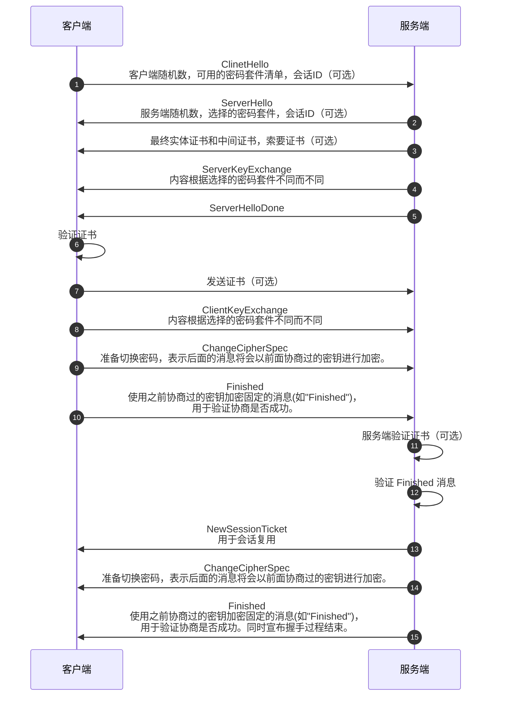

+++
date = '2025-05-20T16:37:43+08:00'
draft = false
title = '信息安全概论-建立安全的加密通道'
categories = ['Sub Sections']
mermaid = true
+++

在前面几章，介绍了对称加密、非对称加密和哈希算法，可以保证信息的机密性和完整性。现在，我们可以在任意两台计算机之间，在不可信的网络中建立了可信的加密通道。

建立安全的加密通道，基本流程如下：

1. 通信双方协商非对称加密算法、对称加密算法、哈希算法和公钥，同时附带[数字签名](../Message-Digest/index.md#数字签名)。
1. 通信双方通过非对称加密交换对称加密的密钥，同时附带[数字签名](../Message-Digest/index.md#数字签名)。
1. 通信双方使用对称加密算法加密通信内容，同时附带[数字签名](../Message-Digest/index.md#数字签名)。

但是！在上面的流程中还有一个小小的漏洞：第一步中的公钥，是可信的吗？于是我们需要公钥基础设施。

## 公钥基础设施
公钥基础设施(Public Key Infrastructure, PKI)是一种通过公钥密码学实现安全通信和数字签名的系统。它的核心功能包括：

1. 身份认证： PKI 通过数字证书验证通信对象的身份，确保信息的发送者和接收者是可信的。
1. 信任模型： PKI 建立了一种信任模型，使用户能够确认通信内容的完整性和可信性。

PKI在信息安全领域中发挥着至关重要的作用，尤其是在不安全的网络环境中。

### 安全证书
安全证书是基于 X.509 标准的数字证书，用于验证服务器或客户端的身份，并包含加密所需的公钥信息。

在安全证书中，包含数字签名算法(非对称加密算法和哈希算法)和证书颁发机构(Certification Authority, CA)的数字签名。证书颁发机构的数字签名对安全证书的其他部分进行签名。

### 信任链(Certificate Chain)
1. 根证书(Root Certificate)：根证书是信任的起点，由根证书颁发机构(Root CA)生成，其公钥被预置在操作系统、浏览器或应用程序中。根证书是自签名的，只要其在系统的根证书库中，就直接信任。
1. 中间证书(Intermediate Certificate)： Root CA 出于安全考虑，通常不会直接用 Root CA 签发最终实体证书，而是通过 Intermediate CA 签发。
1. 最终实体证书(End-Entity Certificate)：由 Intermediate CA 或 Root CA 签发。

服务器必须将中间证书随自己的证书（最终实体证书）一起发送，客户端需验证整个链的合法性。客户端验证证书时，先验证最终实体证书，再验证中间证书，最后验证根证书。

其中对于每个证书：

1. 证书签名是否由上级 CA 的私钥生成。
1. 证书是否在有效期内。
1. 是否被吊销(通过 CRL 或 OCSP)。

### 为什么要生成中间证书？
1. 分层管理：通过引入中间证书，可以创建一个分层的证书结构，使得根证书不需要直接签发大量的终端实体证书。这种分层管理可以提高证书管理的效率和灵活性。
1. 减少根密钥的暴露风险：如果根密钥被泄露，那么所有由该根证书签发的证书都将受到威胁。通过使用中间证书，可以减少根密钥的暴露风险，因为即使中间密钥被泄露，影响的范围也仅限于由该中间证书签发的证书。
1. 密钥轮换：中间证书的密钥可以定期更换，而不需要更换根密钥。这样可以保持根证书的长期稳定性，同时确保整个系统的安全性。
1. 策略和控制：不同的中间证书可以实施不同的策略和控制措施。例如，一个中间证书可以专门用于签发服务器证书，另一个可以用于客户端证书，这样可以根据不同的业务需求和安全要求进行更细致的管理。

## SSL/TLS
SSL（Secure Sockets Layer，安全套接层）和TLS（Transport Layer Security，传输层安全）是用于保护网络通信的协议。SSL/TLS 的基本思路和本章开头讲的流程差不多。

### SSL/TLS 握手详细过程

## 拓展
### 网络层的安全
SSL/TLS 工作在传输层。还有工作在网络层的 IPsec ，思路也是差不多。

### 离线通信的安全
我们刚刚介绍的思路，适用于在线通信，即双方都是立刻应答的。那么离线通信又如何？比如端到端加密的电子邮件，发送方发送邮件，邮件到达邮件服务器。不知道过多久，接收方才会接收邮件。

基本流程是：
1. 生成随机的对称密钥。
1. 加密邮件内容。
1. 用接收方证书中的公钥加密对称密钥。
1. 进行数字签名。
1. 将加密后的对称密钥、邮件内容和数字签名封装，并发送。

电子邮件的端到端加密协议有 S/MIME（Secure/Multipurpose Internet Mail Extensions，安全/多用途互联网邮件扩展）和 PGP/GPG（Pretty Good Privacy/GNU Privacy Guard，相当不错的隐私/GNU 隐私卫士）。
