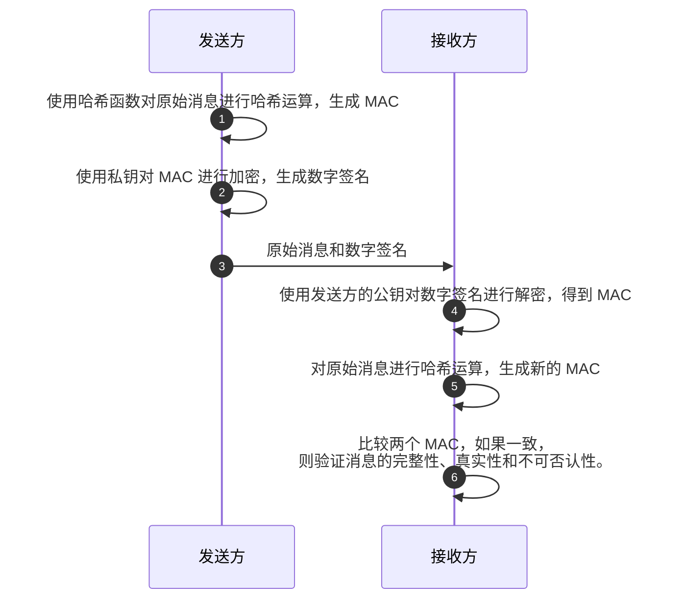

+++
date = '2025-05-20T16:36:43+08:00'
lastmod = '2025-12-05T13:07:11+08:00'
draft = false
title = '信息安全概论-消息摘要'
categories = ['Sub Sections']
mermaid = true
+++

消息摘要，又叫哈希，又叫散列。消息摘要算法的输出称为消息认证码(MAC, Message Authentication Code)。消息摘要算法有以下几个特点：

1. 输入是任意长度的字节数组，输出是固定长度的字节数组。
1. 确定性：如果输入不改变，输出一定不会改变。
1. 单向性：不能通过输出反推输入。
1. 抗碰撞性：找到两个不同输入产生相同哈希值的概率极低。
   1. 弱抗碰撞：给定输入，难找另一输入与其哈希相同。
   1. 强抗碰撞：难找到任意两个输入哈希相同。
1. 雪崩效应：输入微小变化（如一个比特）会导致输出完全不同。

所谓破解消息摘要算法，就是快速地找碰撞。

所谓查表攻击，其实只是通过输出反推**最常见的输入**，并不能说就是反推输入。因为理论上，存在无数个输入的哈希相同。因为输出是固定长度的字节数组，所能表达的信息是有限的；而输入是任意长度的字节数组，能表达无限的信息。在哈希的过程中，其实是丢失了信息，故不可能通过输出反推输入。

有些资料说消息摘要算法是加密算法，其实不然。加密是需要解密的，消息摘要算法具有单向性，不能还原原始信息，故不能称为加密算法。

目前(2025 年)常用的消息摘要算法有： SHA-256, SHA-3。

## 应用场景

### 数据完整性验证

网络传输文件时，同时发送文件的哈希值。下载方下载完毕后，可以校验文件的哈希值，验证数据完整性。

### 数字签名

数字签名是一种基于公钥密码学的安全机制，主要用于确保数据的完整性、真实性及发送者身份的认证。比如小明发来消息"明天中午吃饭"，但是我们如何确定发送信息的人真的是小明？数字签名的基本流程如下：

其实在数字签名中，这公钥和私钥的用法与公钥密码体制相反。即：私钥签名，公钥验证。
