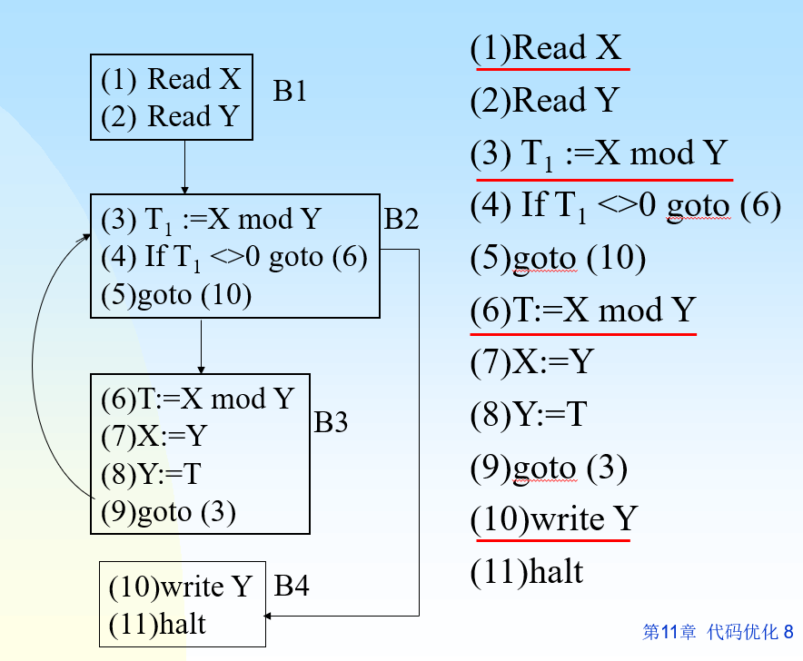
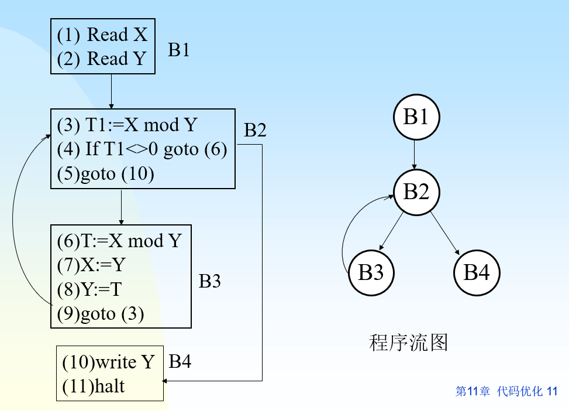
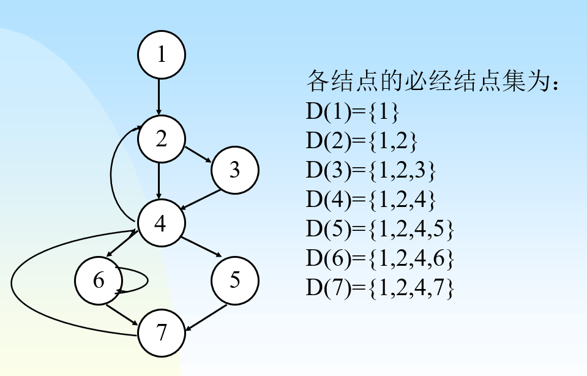
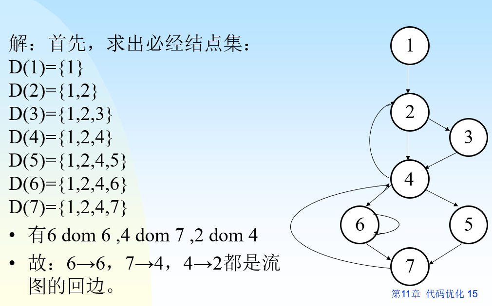
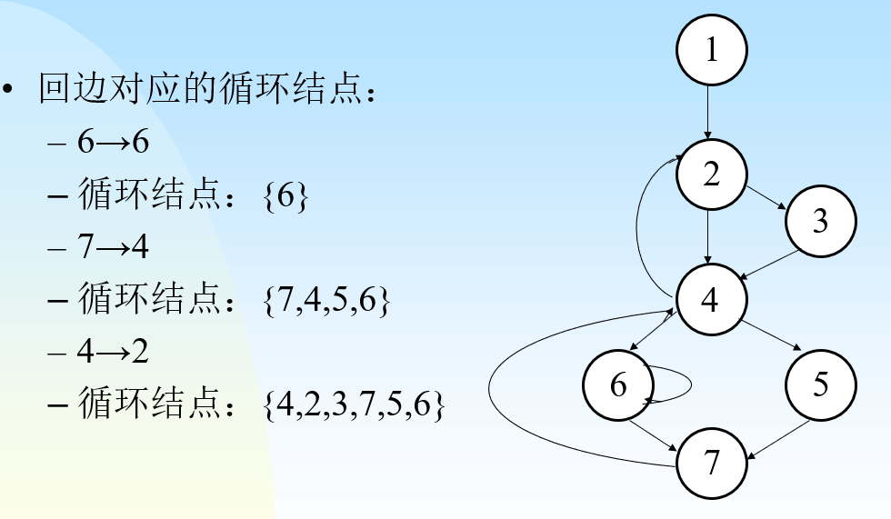

+++
date = '2025-05-20T17:23:32+08:00'
draft = false
title = '编译原理-代码优化和目标代码生成'
categories = ['Sub Sections']
math = true
+++

## 基本块
基本块是程序中一段顺序执行的语句序列，只有一个入口，一个出口。执行时只能从其入口进入，从出口退出。

一个给定的程序，可以划分为一系列的基本块,优化在各基本块中分别进行。局限于基本块范围内的优化称为基本块内的优化。

## 为四元式程序划分基本块
1. 找出四元式程序中各基本块的入口语句，即:
   1. 程序的第一个语句
   2. 能由条件转移语句和无条件转移语句转移到达的语句
   3. 紧跟在条件转移语句后面的语句
2. 为每个入口语句构造其所属的基本块: 由该入口语句到下一入口语句(不包括该入口语句)、或到一转移语句(包括转移语句)、或到停(halt)语句(包括该语句)之间的语句序列组成
3. 凡是没有纳入到任何一个基本块中的语句，都是程序控制流程所无法到达的语句，即不会被执行到的语句，可将其删除。

例子:

如上图，有“if...goto(6)”，“goto(10)”“goto(3)”语句，所以入口语句有1，3，6，10。再有“紧跟在条件转移语句后面的语句”第5句。又由于“或到一转移语句(包括转移语句)”，所以基本块划分如上图。

## 程序流图
定义: 以基本块作为结点，控制程序流向作为有向弧，画出的图。

特点: 具有唯一首结点(包含程序第一个语句的基本块)的有向图。

## 必经节点集
定义: 若从首结点出发到达 $n_j$ 结点的各条通路都必须经过结点 $n_i$ ，称 $n_i$ 为 $n_j$ 的必经结点，记做 $n_i \; dom \; n_j$ 。 $n_j$ 的全部必经结点的集合称为 $n_j$ 的必经结点集。记做 $D(n_j)$ 。

求法: 设结点 $n$ 的父结点是 $P_1,P_2, \cdots P_k$ ，则

$D(n) = (D(P_1) \bigcap D(P_2) \bigcap \cdots \bigcap D(P_k)) \bigcup \lbrace n \rbrace$

例子:

## 回边
定义: 设 $a \to b$ 是流图中一条有向边，若 $b \; dom \; a$ ，则 $a \to b$ 是流图中一条回边。

例子:

## 循环
每条回边可构成一个循环。

设 $n \to d$ 是回边，则该回边构成的循环包括下列结点: $n, d$ 以及不经过 $d$ 能到达 $n$ 的所有结点。

例子:

