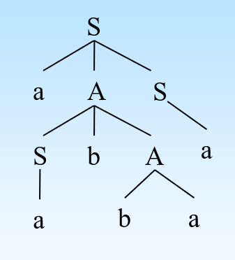
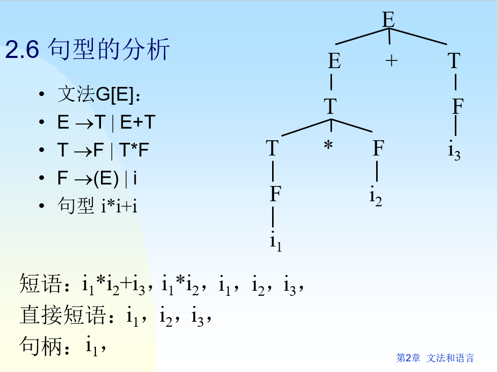

+++
date = '2025-05-20T17:17:17+08:00'
draft = false
title = '编译原理-文法和语言'
categories = ['Sub Sections']
math = true
+++

## 相关概念
* $\varepsilon$ : 空字符串
* 符号串 $ s $ 的长度记为 $ \lvert s \rvert $ 。
* $ V = \lbrace a, b \rbrace $ 是字符集， $ V^* = \lbrace \varepsilon, a, b, aa, ab, ba, bb, aaa, \cdots \rbrace, V^+ = V^* - \lbrace \varepsilon \rbrace $
## 文法的形式化定义
文法是四元组 $ (V_N, V_T, P, S) $ ，其中: 
* $ V_N $ 是非终结符集
* $ V_T $ 是终结符集
* $ P $ 是产生式集
* $ S $ 是开始符号，是一个非终结符，至少要在一条产生式中作为左部出现。
* $ V := V_N \bigcup V_T $
## 文法的分类
Chomsky文法分类，根据对产生式施加的限制，可分为: 
* 0型文法
  * 定义: 
    * $ \forall \alpha \to \beta \in P, \alpha \in V^+, \beta \in V^*, \alpha$ 中至少有一个非终结符。
  * 说明: 
    * 0型文法是对产生式限制最少的文法。
* 1型文法
  * 定义: 
    * $ \forall \alpha \to \beta \in (P \bigcap \lbrace S \to \varepsilon \rbrace), \lvert \beta \rvert \geq \lvert \alpha \rvert $
  * 说明: 
    * 1型文法又称为长度增加文法、上下文有关文法。
    * 1型文法意味着，对非终结符进行替换时务必考虑上下文，并且，一般不允许替换成 $ \varepsilon $ ，除非是开始符号产生 $ \varepsilon $ 。
* 2型文法
  * 定义: 
    * $ \forall A \to \beta \in P, A\in V_N, \beta \in V^* $
  * 说明: 
    * 2型文法也称为上下文无关文法。
    * 2型文法对产生式的要求是: 产生式左部一定是一个非终结符，产生式右部可以包含 $ V_N, V_T $ 或 $ \varepsilon $ 。
* 3型文法
  * 定义: 
    * $ \forall A \to \beta \in P, \beta = \alpha B | \beta = B \alpha | \beta = \alpha, A \in V_N, B \in V_N, \alpha \in V_T^* $
  * 说明: 
    * 3型文法也称为正规文法(RG)
    * 根据非终结符 $ B $ 的位置，又分为右线性文法 $ \beta = \alpha B $ 和左线性文法 $ \beta = B \alpha $ 。
四种文法之间是逐级包含关系。

## 最左(最右)推导和语法树
如果在推导的任何一步 $ \alpha \to \beta $ ，其中 $ \alpha, \beta $ 是句型，都是对 $ \alpha $ 中最左(最右)的非终结符进行替换，则称这种推导为最左(最右)推导。

最右推导常称为规范推导。

规范推导所得到的句型称为规范句型。

例子：
有文法：
1. $ S \to aAS $
2. $ A \to SbA $
3. $ A \to SS $
4. $ S \to a $
5. $ S \to ba $

推导句子: aabbaa

最左推导:

$$ \underline{S} \to a\underline{A}S \to a\underline{S}bAS \to aab\underline{A}S \to aabba\underline{S} \to aabbaa $$

语法树:

## 二义性
句子二义性: 如果文法的一个句子存在对应的两棵或两棵以上的语法树，则该句子是二义的。

文法二义性: 包含二义性句子的文法是二义文法。

## 句型分析
句型分析是指识别输入符号串是否是语法上正确的程序的过程。

分为两类：自上而下语法分析和自下而上语法分析。

## 句柄和短语
短语：子树的末端符号自左到右连成串，相对于子树树根而言称为短语。树根的子树有多个。

简单短语（直接短语）：若短语是某子树根经过1步推导得到的，则称之为该子树根的简单短语。

句柄：句型中的最左简单短语。

例子:

