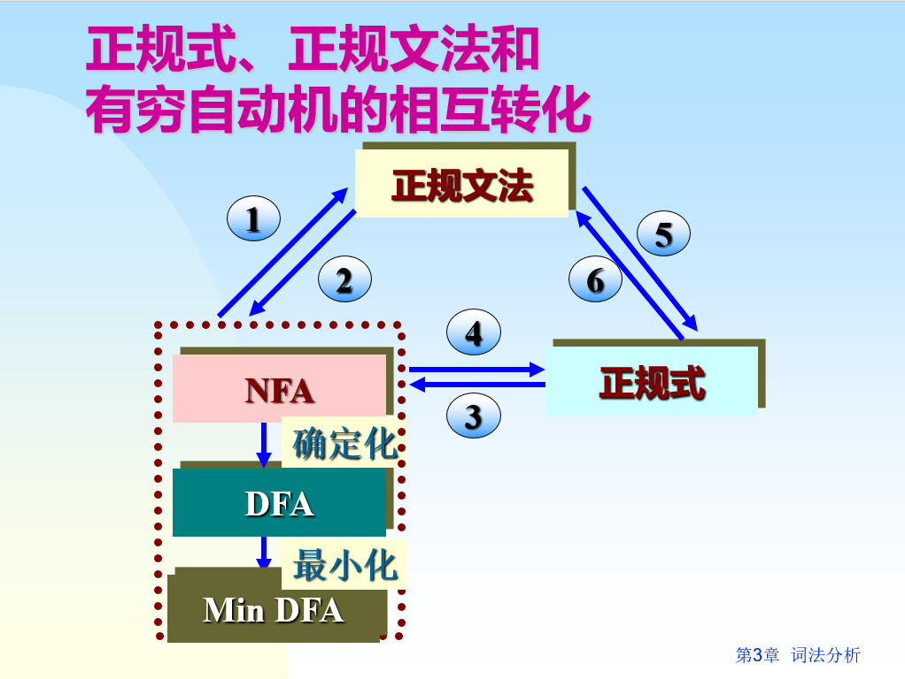
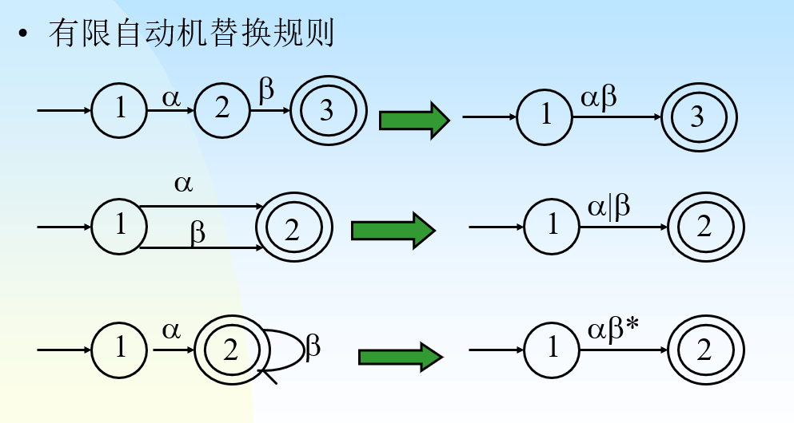
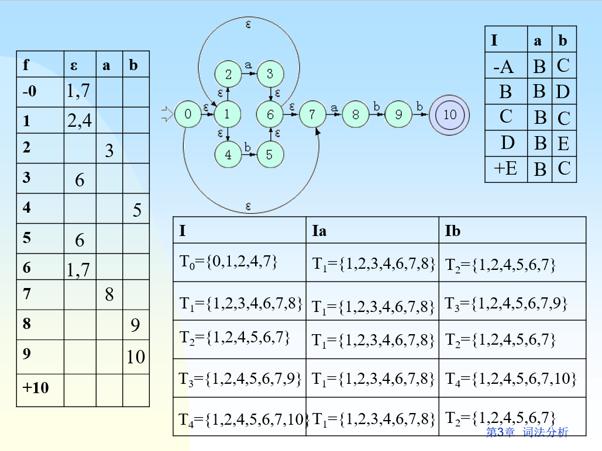
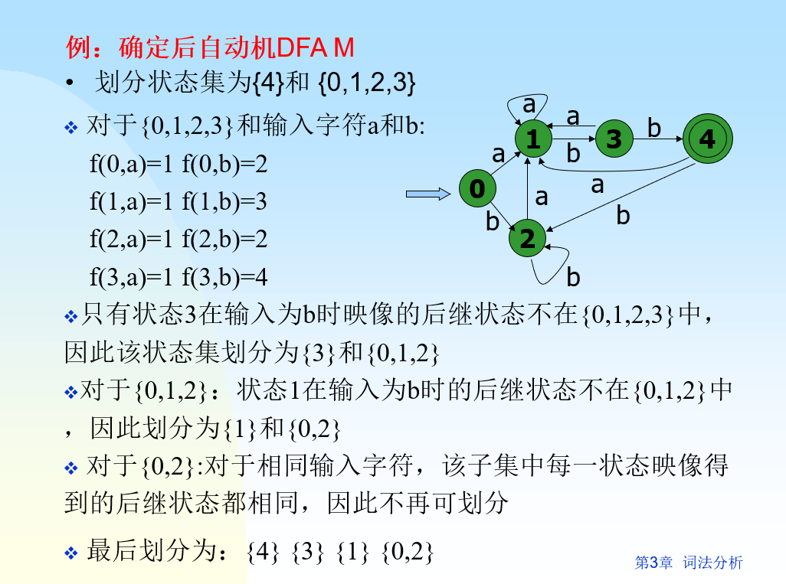

+++
date = '2025-05-20T17:18:18+08:00'
draft = false
title = '编译原理-词法分析'
categories = ['Sub Sections']
math = true
+++



## 相关概念
### 正规文法: [Chomsky 3型文法](../2/index.md#文法的分类)。

### 正规式

| 正规式 | 正规集 |
| :--: | :--: |
| $ a $ | $ \lbrace a \rbrace $ |
| $ a \mid b $ | $ \lbrace a, b \rbrace $ |
| $ ab $ | $ \lbrace ab \rbrace $ |
| $ (a \mid b)(a \mid b) $ | $ \lbrace aa, ab, ba, bb \rbrace $ |
| $ a^* $ | $ \lbrace  \varepsilon, a, aa, aaa, \cdots \rbrace $ |
| $ (a \mid b)^* $ | $ \lbrace \varepsilon, a, b, aa, ab, ba, bb,  aaa, \cdots \rbrace $ |

若两个正规式 $ e_1 $ 和 $ e_2 $ 所表示的正规集相同，则说$ e_1 $ 和 $ e_2 $ 等价，写作 $ e_1=e_2 $ 。

### 确定的有穷自动机(DFA)
定义: 五元组 $ (K, \Sigma, f, S, Z) $
* $ K $ 是一个有穷集，它的每个元素称为一个状态。
* $ \Sigma $ 是输入符号表。
* $ f $ 是转换函数集，其元素有两个输入，一个输出， $ f(k_i, a)=k_j, k_i\in K, k_j \in K $ ，当前状态 $ K_i $ ，输入为 $ a $ 时，转换为下一个状态 $ k_j $ 。把 $ k_j $ 称为 $ k_i $ 的一个后继状态。
* $ S \subseteq K $ 是初态集，只有一个元素。
* $ Z \subseteq K $ 是终态集。终态也称可接受状态或结束状态。

DFA $ M $ 所能接受的符号串的全体记为 $ L(M) $ 。

对于任何两个有穷自动机 $ M $ 和 $ M' $ ，如果 $ L(M)=L(M')$ ，则称 $ M $ 与 $ M' $ 是等价的。

DFA的确定性表现在其转换函数只有一个输出，即 $ \forall k \in K, a \in \Sigma, f(k, a) $ 唯一地确定了下一个状态。

### 不确定的有穷自动机(NFA)
定义: 五元组 $ (K, \Sigma, f, S, Z) $ ，其含义和DFA差不多，除了：
* $ f $ 的元素有两个输入，多个输出。
* $ S $ 有多个元素。

NFA的不确定主要是指后继状态可有多个。

DFA是NFA的特例。

## 1. NFA $\to$ 正规文法
正规文法 $ G $ ，NFA $ M $ 。

1. 对于 $ M $ 的转换函数 $ f(A, t) = B $ ，生成 $ G $ 的产生式 $ A \to tB $ 。
2. 对于 $ M $ 的转换函数 $ f(A, t) = Z $ ，生成 $ G $ 的产生式 $ A \to t $ 。

## 2. 正规文法 $\to$ NFA
正规文法 $ G $ ，NFA $ M $ 。

1. $ M $ 的字母表 $ \Sigma $ 是 $ G $ 的所有终结符。
2. $ M $ 的状态与 $ G $ 的非终结符一一对应。
3. 新增一个 $ M $ 的终态 $ Z $ 。
4. 对于 $ G $ 中的形如 $ A \to tB $ ，生成 $ M $ 的转换函数 $ f(A, t) = B $ 。
5. 对于 $ G $ 中的形如 $ A \to t $ ，生成 $ M $ 的转换函数 $ f(A, t) = Z $ 。

对于左线性文法，需要[转换为右线性文法](../4/index.md#消除左递归)。

## 3. 正规式 $\to$ NFA


1. 构造有限自动机: $ \longrightarrow x \stackrel{\alpha}{\longrightarrow} +y, \alpha $ 是正规式。
2. 根据有限自动机替换规则，分裂 $ \alpha $ ，直到每条边上的符号是 $ \Sigma $ 中的符号或 $ \varepsilon $ 为止。

## 4. NFA $\to$ 正规式
1. 在开始状态前添加x状态，作为新的开始状态。 $ x \stackrel{\varepsilon}{\longrightarrow} -S $
2. 所有终态后添加y状态，作为新的结束状态。 $ +Z \stackrel{\varepsilon}{\longrightarrow} y $
3. 根据有限自动机替换规则，消除状态，直到只剩下 $ x, y $ 状态。
4. 消除状态 $ A $ 时，要仔细看状态 $ A $ 的所有出的边，包括回去的边。

## 5. 正规文法 $\to$ 正规式
转换规则:
| 文法 | 正规式 |
| :--: | :--: |
| $A \to xB, B \to y $ | $A \to xy$ |
| $ A \to xA, A \to y $ | $ A \to x^*y $ |
| $ A \to Ax, A \to y $ | $ A \to yx^* $ |
| $ A \to x, A \to y $ | $ A \to x \mid y $ |

例: 文法: $ S \to aA, S \to a, A \to aA, A \to dA, A \to a, A \to d $

1. $ S \to aA \mid a, A \to (aA \mid dA) \mid (a \mid d) $
2. $ A \to (a \mid d) A \mid (a \mid d) $
3. $ A \to (a \mid d)^* (a \mid d) $
4. 化简: $ A \to (a \mid d)^+ $
5. $ A $ 代入 $ S $ 的产生式: $ S \to a (a \mid d)^+ \mid a $
6. 化简: $ S \to a (a \mid d)^* $

## 6. 正规式 $\to$ 正规文法
1. 选择一个非终结符 $ S $ 生成类似 $ S \to r $ ，并将 $ S $ 定义为文法的开始符号。 $ r $ 是正规式。
2. 采用重写规则:
   * 形如 $ A \to x^*y $ 的产生式，重写为 $ A \to xA, A \to y $ .
   * 形如 $ A \to x|y $ 的产生式，重写为 $ A \to x, A \to y $ .

例: 将 $ r=a(a|d)^* $ 转换成相应的正规文法。
1. $ S \to a(a|d)^* $
2. $ S \to aA, A \to (a|d)^* $
3. $ S \to aA, A \to (a|d)A, A \to \varepsilon $
4. $ S \to aA, A \to aA, A \to dA, A \to \varepsilon $

## 7. NFA的确定化(子集法)
### 相关运算
#### 状态集合 $ I $ 的 $ \varepsilon $ - 闭包 
记为 $ \varepsilon - closure(I) $

定义为一状态集，是状态集 $ I $ 中的任何状态 $ S $ 经任意条 $ \varepsilon $ 弧而能到达的状态的集合。

```
StateSet EpsilonClosure(NFA M, StateSet I)
{
   StateSet I2 = I.Copy();
   while(!I2.IsAllCheck)
   {
      State i = I2.GetOneIsNotCheckItem();
      I2.AddRange(M.f(i, epsilon));
      i.IsCheck = true;
   }
   return I2;
}
```

#### 状态集合 $ I $ 的 $ a $ 弧转换
记为 $ move(I, a) $

定义为一状态集 $ J , \forall j \in J, \exist i \in I, j \in f(i, a) $ 。

```
StateSet Move(NFA M, StateSet I, Symbol a)
{
   throw new NotImplementedException();
}
```

### 子集法(手写板)


1. 列出原始状态转移表，初始状态 $ S_0 $ 。
2. 求 $ \varepsilon - closure(S_0) $ ，记作 $ T_0 $ 。
3. 求 $ \varepsilon - closure(move(T_0, a)) $ ，记作 $ T_1 $ ；如果 $ T_1 $ 没有出现过，就添加到输出状态转移表中。
4. 求 $ \varepsilon - closure(move(T_0, b)) $ ，记作 $ T_2 $ ；如果 $ T_2 $ 没有出现过，就添加到输出状态转移表中。
5. 对输出状态转移表中，没有做过第3，4步的状态集，做第3，4步，直到没有新的状态集出现。
6. 给输出状态转移表中的状态重命名，整理一下。状态集中只要存在一个原来的终态，那么这个状态集就代表终态。

## 8. DFA的最小化
min DFA : **消除多余状态**和**合并等价状态**。

多余状态: 从开始状态出发，任何输入串也不能到达的那个状态；或者从这个状态没有通路到达终态。

等价状态集: 集合中的所有状态，对于所有的同一个输入串，都能分别到达同一个等价状态集。


