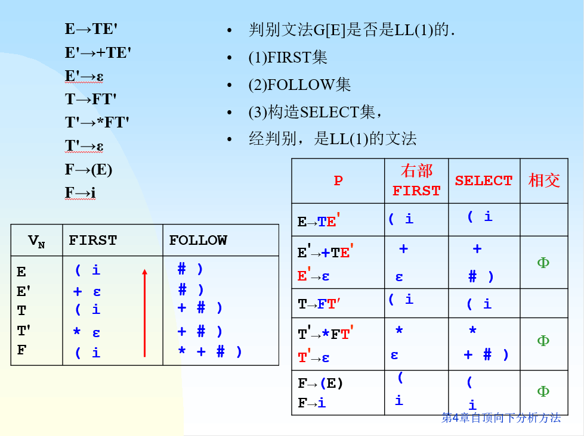
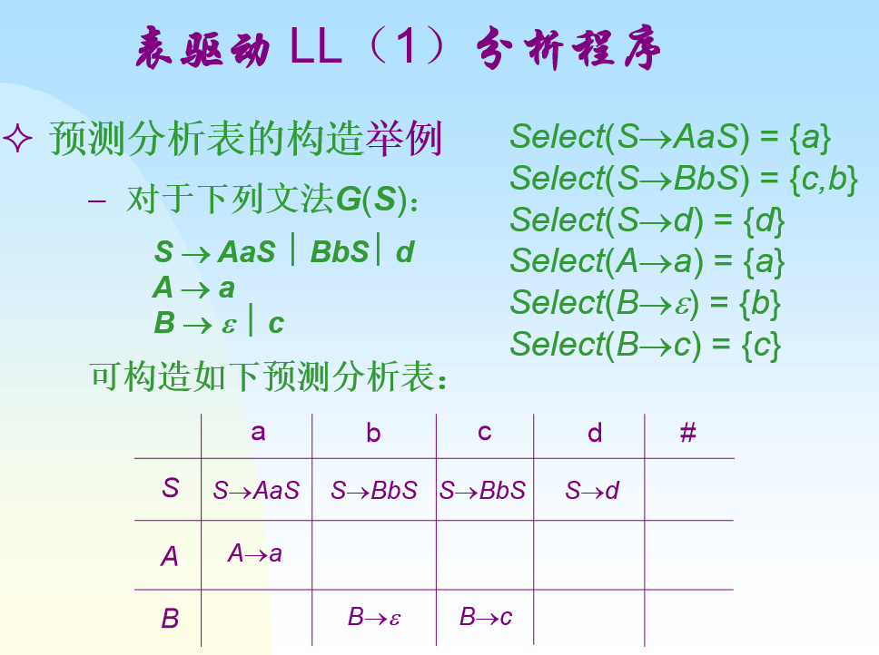

+++
date = '2025-05-20T17:18:18+08:00'
draft = false
title = '编译原理-自顶向下语法分析方法'
categories = ['Sub Sections']
math = true
+++

## LL(1)分析方法
一种根据当前读到的一个符号，选择产生式的来生成符号串的分析方法。

## FIRST集
### 定义
要求是上下文无关文法(2型文法)。

FIRST集的输入是符号串。

$ FIRST(\alpha) = \lbrace a \mid \alpha \stackrel{*}{\longrightarrow} a\beta, a \in V_T, \alpha, \beta \in V^* \rbrace $

若 $ \alpha \stackrel{*}{\longrightarrow} \varepsilon $ ，则规定 $ \varepsilon \in FIRST(\alpha) $ 。

若 $\alpha \in V_T, $ 则: $ FIRST(\alpha) = \lbrace \alpha \rbrace $

人话: 对 $ \alpha $ 一路展开，直到第一个符号是终结符或者空串。

### 性质
假设 $ \alpha \to Y_0Y_1Y_2 \cdots Y_k, \; Y_0, Y_1, Y_2, \cdots Y_k \in V_N $ (由多个非终结符相连)，

如果 $ \varepsilon \notin FIRST(Y_0) $ ，那么 $ FIRST(\alpha) = FIRST(Y_0) $ ；

否则如果 $ \varepsilon \notin FIRST(Y_1) $ ，那么 $ FIRST(\alpha) = (FIRST(Y_0) - \lbrace \varepsilon \rbrace) \bigcup FIRST(Y_1) $ ，

否则如果 $ \varepsilon \notin FIRST(Y_2) $ ，那么 $ FIRST(\alpha) = (FIRST(Y_0) \bigcup FIRST(Y_1) - \lbrace \varepsilon \rbrace) \bigcup FIRST(Y_2) $

...

直到 $ \varepsilon \in FIRST(Y_k) $ ，才有 $ \varepsilon \in FIRST(\alpha) $ 。

### 例
文法 $ G_2[S]: S \to Ap \mid Bq, A \to a \mid cA, B \to b \mid dB $

$ FIRST(Ap) = \lbrace a, c \rbrace $

$ FIRST(Bq) = \lbrace b, d \rbrace $

## FOLLOW集
### 定义
要求是上下文无关文法(2型文法)。 $ A \in V_N, S $ 是开始符号。

FOLLOW集的输入是非终结符。

$ FOLLOW(A) = \lbrace a \mid S \stackrel{*}{\longrightarrow} \mu A \beta, a \in FIRST(\beta), \mu \in V^*, \beta \in V^+ \rbrace $

若 $ S \stackrel{*}{\longrightarrow} \mu A \beta $ ，且 $ \beta \stackrel{*}{\longrightarrow} \varepsilon $ ，则 $ FOLLOW(S) \subseteq FOLLOW(A) $

使用 $ \# $ 作为输入串的结束符。则 $ \# \in FOLLOW(S) $

### 求法
1. 对于文法开始符号 $ S $ ， $ \# \in FOLLOW(S) $ 。
2. 对于产生式 $ A \to \alpha B \beta $ ， $ FIRST(\beta) \subseteq FOLLOW(B) $ 。
3. 对于产生式 $ A \to \alpha B $ ， 或者 $ A \to \alpha B \beta $ 产生式中 $ \beta \stackrel{*}{\longrightarrow} \varepsilon $ ，即 $ \varepsilon \in FIRST(\beta) $ ，则 $ FOLLOW(A) \subseteq FOLLOW(B), \; FIRST(\beta) - \lbrace \varepsilon \rbrace \subseteq FOLLOW(B) $ ；也就是说， $FOLLOW(B) = FOLLOW(A) \bigcup (FIRST(\beta) - \lbrace \varepsilon \rbrace) \bigcup others$

## SELECT集
### 定义
要求是上下文无关文法(2型文法)。产生式 $ A \to \alpha, A \in V_N, \alpha \in V^* $ 。

SELECT集的输入是产生式。

如果 $ \alpha \stackrel{*}{\longrightarrow} \varepsilon $ 不成立，则 $ SELECT(A \to \alpha) = FIRST(\alpha) $

如果 $ \alpha \stackrel{*}{\longrightarrow} \varepsilon $ 成立，则 $ SELECT(A \to \alpha) = (FIRST(\alpha) - \lbrace \varepsilon \rbrace) \bigcup FOLLOW(A) $

## 判断LL(1)文法
一个上下文无关文法 $G$ 是LL(1)文法的充分必要条件是，对每一个非终结符 $ A $ 的任何两个不同产生式 $A \to \alpha \mid \beta $ ，满足：

$SELECT(A \to \alpha) \bigcap SELECT(A \to \beta) = \emptyset $

1. 对于 $G$ 的每一个非终结符 $X$ 计算 $FIRST(X)$ 。
2. 对于 $G$ 的每一个非终结符 $X$ 计算 $FOLLOW(X)$ 。
   1. 找出产生式右部出现 $X$ 的地方。
   2. 根据[FOLLOW集求法](#求法)，求出FOLLOW集在这个产生式的部分。
   3. 把所有FOLLOW集部分并起来( $\bigcup $ )。
3. 对于 $G$ 的每一个产生式 $A \to \alpha$ 计算 $SELECT(A \to \alpha)$ 。
4. 根据定义判断。

例子:

## LL(1)文法的分析表构造
有文法 $G'$ ，一个非终结符对应分析表的一行，一个终结符对应分析表的一列。

对于 $G'$ 的所有产生式，求SELECT集；根据SELECT集中的元素，把产生式的右部填入表格中。

例:

## LL(1)文法分析过程
有分析表 $\alpha = T[A, a], A \in V_N, a \in V_T, \alpha \in V^*$

分析过程利用一个符号栈进行。

1. 符号栈初始状态: $[\#, S]$ 。
2. 如果符号栈的栈顶元素 $A \in V_N$ ，那么根据读头下的一个符号 $a$ ，得到 $\alpha = T[A, a]$ ，把符号栈顶元素推出，把 $\alpha$ 倒序进入符号栈。
3. 如果符号栈的栈顶元素 $a \in V_T$ ，那么把 $a$ 与输入串的第一个符号作比较，如果相等，把符号栈顶元素推出，读头移向输入串的下一个符号。否则报错。
4. 反复进行2，3步，直到符号栈顶元素和输入串第一个符号都是 $\#$ 。

## 某些非LL(1)文法转换为LL(1)文法
若文法中含有:
* 左公共因子
* 直接或间接左递归

肯定不是LL(1)文法。

### 提取左公共因子
对文法中形如 $A \to \alpha \beta \mid \alpha \gamma $ 的产生式，变换为 $A \to \alpha A', A' \to \beta \mid \gamma $ 。

某些文法即使提取了左公共因子，也仍不是LL(1)文法。

某些文法不能在有限步骤内提取完左公共因子。

### 消除左递归
对文法中形如 $A \to A \alpha \mid \beta $ 的产生式，变换为 $A \to \beta A', A' \to \alpha A' \mid \varepsilon $ 。

某些文法即使消除了左递归，也仍不是LL(1)文法。
