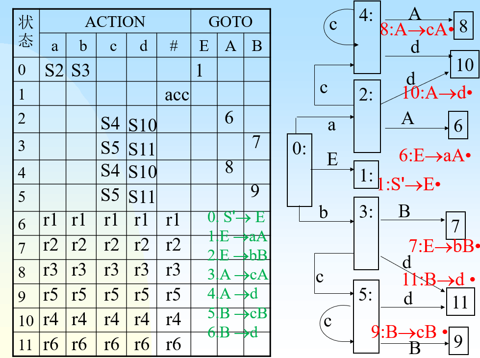
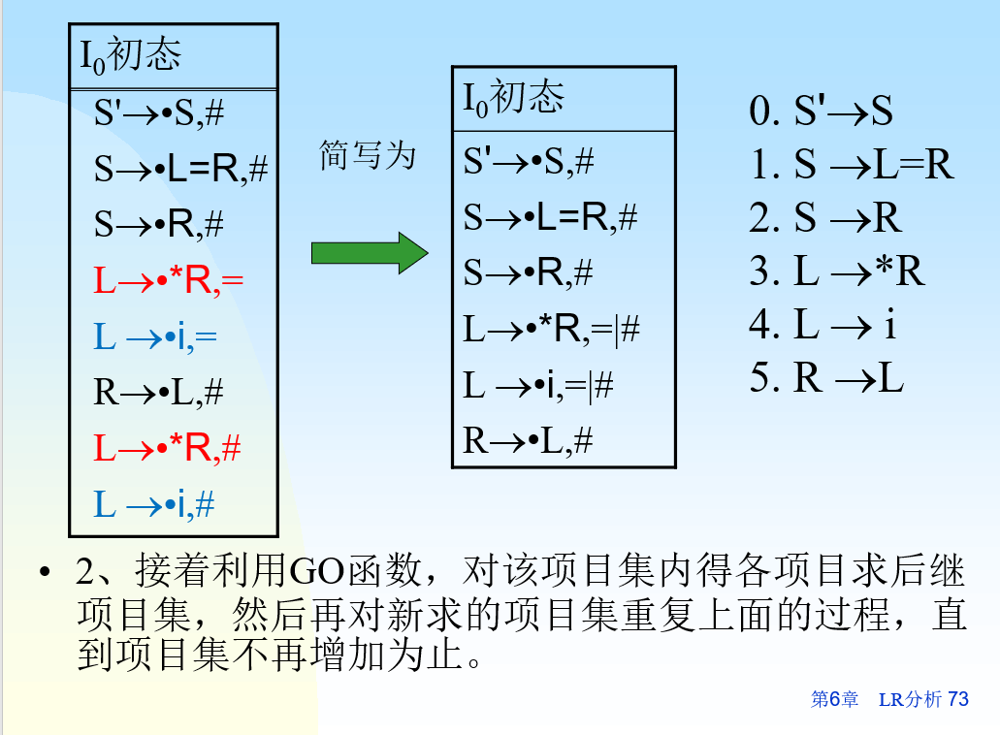
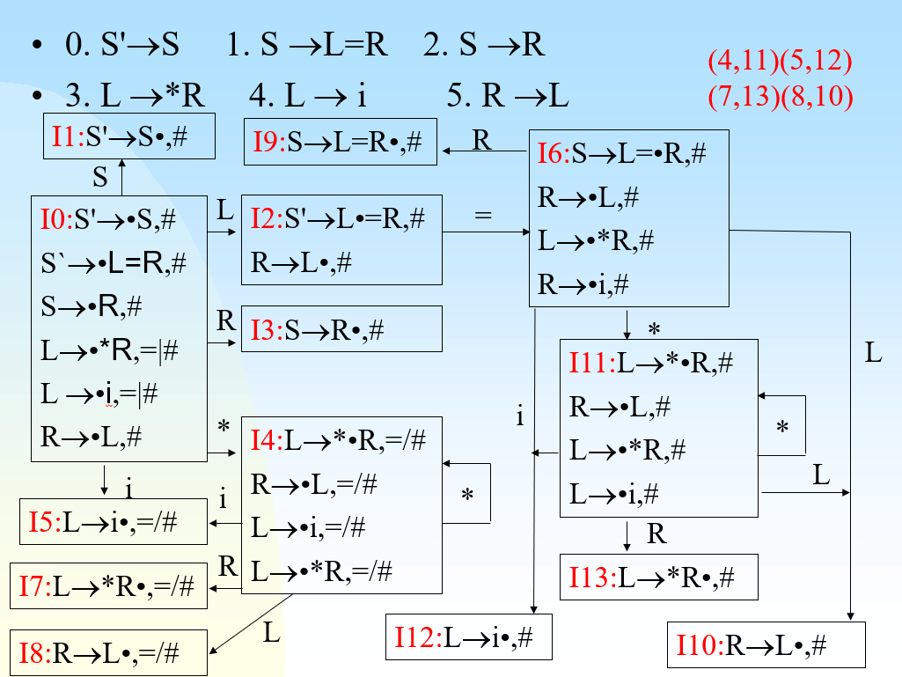
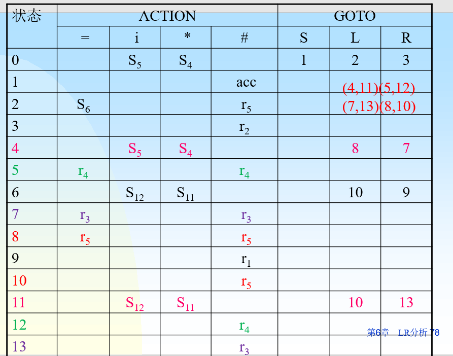
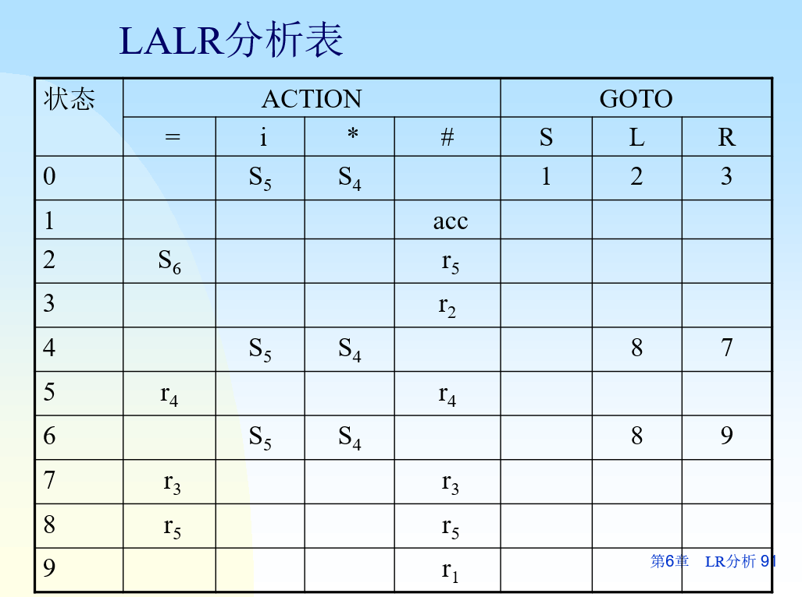

+++
date = '2025-05-20T17:19:49+08:00'
draft = false
title = '编译原理-LR分析'
categories = ['Sub Sections']
math = true
+++

LR分析方法是自下而上的分析法。

自左至右扫描，当分析栈顶符号串形成句柄就规约。

LR分析方法的核心是一张分析表，该表分为动作表和转向表。动作表中有四个动作: 移进、规约、接受、报错。如果一个文法构造的表中的每一个元素都只有一种动作，那么该文法被称为LR文法。

## 活前缀
最右推导常称为规范推导。规范推导所得到的句型称为规范句型。

活前缀指规范句型的一个前缀，这种前缀不含句柄之后的任何符号。

例子: 有某规范句型的规范推导: $S \to aAc \underline{B} e \to a \underline{A} cde \to a \underline{A} bcde \to abbcde $ ，该句型的句柄是第一个 $b $ ，那么在 $b $ 及其之前的符号串是 $ab $ ，所以该句型的活前缀有 $\lbrace \varepsilon, a, ab \rbrace $ ；其中， $ab $ 是归态活前缀，其他的是非归态活前缀。

## LR(0)项目
在文法 $G $ 的每个产生式右部添加一个圆点，就成为 $G $ 的一个LR项目(简称项目)。圆点在产生式中的位置不同则是不同项目。

产生式 $A \to \varepsilon $ 只有一个项目 $A \to \cdot $ 。

## LR(0)NFA构造
1. 将文法 $G $ 进行拓广，保证文法开始符号不出现在任何产生式右部，从而保证有唯一的接受项目。即增加产生式 $S' \to S $ ，并令 $S' \to \cdot S $ 作为初态项目；而 $S' \to S \cdot $ 称为接受项目。
2. 为所有 $G $ 的产生式构造项目。
3. 设某项目 $a $ 为 $X \to X_1 \cdots X_{i - 1} \cdot X_i \cdots X_n $ ，某项目 $b $ 为 $X \to X_1 \cdots X_i \cdot X_{i + 1} \cdots X_n $ ，则从项目 $i $ 画一弧线射向 $j $ ，弧的标记为 $X_i $ ，若 $X_i $是终结符则称项目 $i $ 为移进项目，若 $X_i $ 是非终结符则称项目 $i $ 为待约项目。
4. 若项目 $i $ 为 $X \to \alpha \cdot A \beta, A \in V_N $ ，则从项目 $i $ 画 $\varepsilon $ 弧射向所有的 $A \to \cdot \gamma, \gamma \in V^* $ 项目。

## LR(0)项目集规范族构造(DFA构造)
设 $I$ 是拓广后的文法 $G' $ 的一个项目集，那么 $I$ 的项目集规范族 $CLOSER(I)$ 构造方法如下:
1. $I \subseteq CLOSER(I)$
2. 若 $A \to \alpha \cdot B \beta \in CLOSER(I), B \in V_N$ ，那么任何形如 $B \to \gamma$ 的产生式，项目 $B \to \cdot \gamma \in CLOSER(I)$ 。
3. 重复第2步，直到 $CLOSER(I)$ 不再扩大为止。

实际上， $CLOSER(I)$ 构造其实就是[LR(0)NFA构造](#lr0nfa构造)的第4步，只不过一步到位变成DFA罢了。

项目集规范族构造:
1. 从 $I = \lbrace S' \to \cdot S \rbrace$ 开始，构造 $CLOSER(I)$ 。
2. 根据[LR(0)NFA构造](#lr0nfa构造)的第3步，连上弧，构造状态转移函数集，构造出DFA。
3. 对新出现的项目集 $I'$ 求 $CLOSER(I')$ ，执行第2步，连上弧，直到没有新的新项目集出现为止。

## LR(0)分析表构造
1. 每一个项目集规范族对应一个状态。以 $S' \to \cdot S$ 作为开始状态。
2. 对于每一个状态，每一个终结符对应一个ACTION，再加上 $\#$ 对应一个ACTION；每一个非终结符对应一个GOTO。
3. 如果状态 $x$ 中的所有项目是移进项目，则对于状态 $x$ 的每个射出弧，射出弧标记为 $X$ ，在表中 $(x, X)$ 的位置填写射出弧所指向的状态。如果 $X = \#$ ，则填写 $acc$ 。
4. 如果状态 $x$ 中的所有项目是待约项目，则**所有**ACTION填写对应归约的产生式。

例子:

## LR(0)的冲突
如果状态 $x$ 中的所有项目中既有移进项目，又有待约项目，那么一个格子就要填两种动作，此乃**移进-归约冲突**。

如果状态 $x$ 中的所有项目中的待约项目分别使用了多个不同的产生式归约，那么一个格子就要填多种动作，此乃**归约-归约冲突**。

有以上两种冲突的文法不是LR(0)文法。

例如: $I = \lbrace X \to \delta \cdot b \beta,A \to \alpha, B \to \alpha \rbrace$ ，既有移进-归约冲突，又有归约-归约冲突。

## SLR(1)
SLR(1)是LR(0)的一种改进。SLR(1)尝试根据读头下的一个符号，消除LR(0)冲突。

对于 $I = \lbrace X \to \delta \cdot b \beta, A \to \alpha \cdot, B \to \alpha \cdot \rbrace$ :
* 如果当前输入符号为 $b$ ，做移进；
* 如果当前输入符号 $a \in FOLLOW(A)$ ，则按 $A \to \alpha$ 做归约；
* 如果当前输入符号 $a \in FOLLOW(B)$ ，则按 $B \to \alpha$ 做归约；
* 其他，报错。

若前三点的当前输入符号有相同的，就不能消除冲突，该文法不是SLR(1)文法。

## SLR(1)分析表构造
在[LR(0)分析表构造](#lr0分析表构造)的基础上，第4点改变为:

$\forall a \in FOLLOW(A), ACTION[k, a] = r_j; \; A \to \alpha \cdot \in I_k, j$ 是产生式 $A \to \alpha \cdot$ 的编号。

## LR(1)项目
LR(1)项目是在[LR(0)项目](#lr0项目)的基础上，再添加一个终结符。形如: $(A \to \alpha \cdot \beta, a)$ ，其中， $A \to \alpha \beta$ 是文法的一个产生式， $a$ 是终结符，也称搜索符。

* LR(1)项目是对LR(0)项目的分裂，若文法中终结符的数目为n，则每个LR(0)项目可以分裂成n个LR(1)项目。
* $(A \to \alpha \cdot \beta, a)$ 的含义：预期当栈顶句柄 $\alpha \beta$ 形成后，在读头下读到 $a$ 。此时， $\alpha$ 在栈内， $\beta$ 还未入栈，即它查看了句柄后的一个符号 $a$ 。

## LR(1)有效项目
设规范推导 $S' \to \delta A \omega \to \delta \alpha \beta \omega$ ，那么 $\delta \alpha$ 是规范句型 $\delta \alpha \beta \omega$ 的其中一个[活前缀](#活前缀) $\gamma$ ；如果 $a \in FIRST(\omega)$ ，则LR(1)项目 $(A \to \alpha \cdot \beta, a)$ 对于[活前缀](#活前缀)  $\gamma$ 来说是有效的；如果 $a \notin FIRST(\omega)$ ，即使 $a \in FOLLOW(A)$ ，LR(1)项目 $(A \to \alpha \cdot \beta, a)$ 是无效的。

## LR(1)项目集规范族构造
和[LR(0)项目集规范族构造](#lr0项目集规范族构造dfa构造)差不多，只不过是从 $I = \lbrace (S' \to \cdot S, \#) \rbrace$ 开始，求 $CLOSER(I)$ 。

例子:

如何求得 $L$ 的搜索符: 关键找产生式的右部， $L$ 出现的地方， $L$ 后面那对东西的FIRST集。

如上图标红的两个有效项目， $L$ 有两个搜索符: $=,\#$ ，分别由1号产生式和5号产生式得出。

## LR(1)分析表构建
根据LR(1)项目集规范族，构造LR(1)分析表。

每一个LR(1)项目集，对应一个状态。

* 射出弧标记是终结符，在ACTINON表填写对应的状态。
* 射出弧标记是非终结符，在GOTO表填写对应的状态。
* 如果有待约项目，在ACTINON表的搜索符位置，填写对应用于归约的产生式编号。
* 若项目 $(S' \to S \cdot, \#) \in I_k, ACTION[k, \#] = acc$ 。

例子:

## LALR(1)
一个SLR文法的规范LR分析表比其SLR分析表含有更多的状态。在严重的情况下，状态数可能成几倍增长。因此需要简化。

LALR(1)是在LR(1)基础上构造出来的。构造方法的基本思想是合并同心。

同心: 若文法 $G'$ 的LR(1)的两个项目集 $I_i$ 和 $I_j$ 在去掉各项目中搜索符之后是相同的，则称这两项目集为同心。

例子:

LR(1)

在上图的右上角，写了所有同心集的分组。也就是说，要变为LALR(1)，就要删除10，11，12，13号状态(11号状态替换为4号状态，其余类推)。删除后的效果如下:

可以看出，分析表表项减少了。

## 通过分析表识别符号串
主要数据结构有: 状态栈(初始 $0$ )、符号栈(初始 $\#$ )和输入串。

读头下的符号: 输入串的第一个符号。

移进: 把对应转移的状态推入状态栈中，把输入串的首个符号推入符号栈中。

归约: 根据产生式 $A \to \alpha$ ，从符号栈中移出 $\alpha$ 的全部符号，状态栈也移出对应数量的元素。根据目前状态栈顶的状态 $x$ ，得到状态下标 $y = GOTO[x, A]$ 。把 $y$ 推入状态栈中，把 $A$ 推入符号栈中。

## 总结
分析能力(报错的位置、经过几步报错等能力): LR(0) < SLR(1) < LALR(1) < LR(1)

如果一个文法是LR(0)文法，那么它一定是SLR(1)文法；反之不成立。
