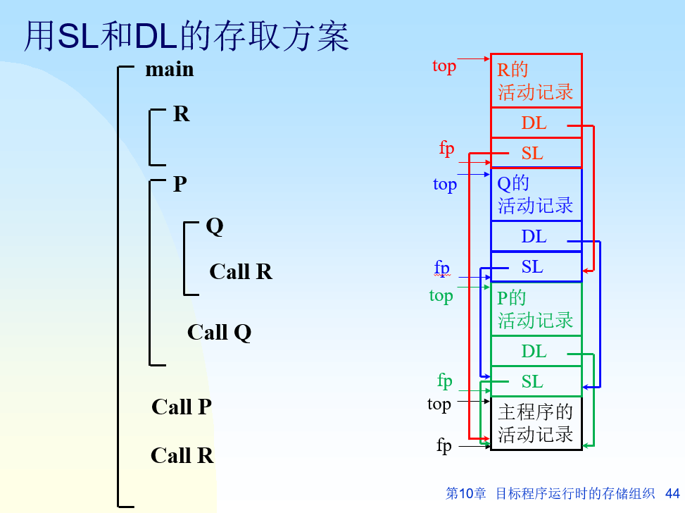

+++
date = '2025-05-20T17:21:22+08:00'
draft = false
title = '编译原理-运行时存储组织'
categories = ['Sub Sections']
math = true
+++

## 程序运行时存储空间的布局
* 保留地址区。专门为目标机体系结构和操作系统保留的内存地址区。
* 代码区。静态存放编译程序产生的目标代码。
* 静态数据区。静态存放全局数据。
* 共享库。
* 动态数据区。运行时动态变化的堆区和栈区。

存储单元分配策略有: 静态存储分配、栈式存储分配和堆式存储分配。

## 运行栈与活动记录的基本介绍
* 在过程/函数的实现中，参与栈式存储分配的存储单元是活动记录(activation record)。
* 运行时每当进入一个过程/函数，就在栈顶为该过程/函数分配存放活动记录的数据空间。
* 当一个过程/函数工作完毕返回时，它在栈顶的活动记录数据空间也随即释放。

运行栈由多个活动记录组成。

对运行栈中的数据对象的寻址: 活动记录基址 + 偏移量。

## 活动记录的结构
| 栈顶 |
| :--: |
| 临时工作单元 |
| 动态数据区 |
| 局部变量区 |
| 函数实参 |
| 控制信息 |

根据对非局部变量的访问采取的方案不同，控制信息的内容也不同。

返回地址记录调用该过程时目标程序的断点。

## 对非局部变量的访问
### display表
每进入一个过程，在建立其活动记录区的同时，为它建立一张层次显示表，以登记它所有直系外层**最新**活动记录的基址和本过程活动记录的基址。

display表记录的是静态代码的函数的层次结构，不是运行栈的结构。或者说，display表记录了全部的静态链。

对于这种方案，控制信息有: 上一个活动记录基址、返回地址、全局display表地址。

全局display表地址是指调用者的display表地址。

不能隔层调用。

### 静态链与动态链
静态链，指向定义该过程的直接外过程运行时**最新**的活动记录的基址。

动态链，指向调用该过程的活动记录的基址。

对于这种方案，控制信息有返回地址、动态链、静态链。

例子:

