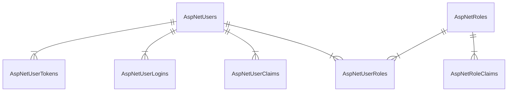

+++
date = '2025-07-31T19:45:58+08:00'
draft = false
title = '定制 ASP.NET Identity'
categories = ['Main Sections']
mermaid = true
+++

> 前置知识：
> 
> * [Entity Framework Core](https://learn.microsoft.com/zh-cn/ef/core/) 的简单使用
> * [ASP.NET Web API](https://learn.microsoft.com/zh-cn/aspnet/web-api/) 的简单使用

## ASP\.NET Identity 介绍
ASP\.NET Identity 是一个用于 ASP\.NET 应用程序的身份认证系统，提供了用户管理、角色管理、声明、令牌等功能。它支持用户注册、登录、注销以及外部登录提供程序。

[官方文档](https://learn.microsoft.com/zh-cn/aspnet/core/security/authentication/identity)

默认情况下， ASP\.NET Identity 会自动创建 7 个有关身份认证的表，表的 ER 图如下（不显示字段）：

以下是各个表的字段的介绍。

> * Type 一栏，不是准确的数据库的类型，在不同的数据库会有所不同。
> * "NN" 指 "NOT NULL"

### AspNetUsers 表
| Type | Name | PK | FK | NN | Remark |
| :--: | :--: | :--: | :--: | :--: | :--: |
| string | Id | &#10004; |  | &#10004; | 格式为 UUID |
| string | UserName |  |  |  |  |
| string | NormalizedUserName |  |  |  | UserName 字段的全大写形式 |
| string | Email |  |  |  |  |
| string | NormalizedEmail |  |  |  | Email 字段的全大写形式 |
| boolean | EmailConfirmed |  |  | &#10004; |  |
| string | PasswordHash |  |  |  |  |
| string | SecurityStamp |  |  |  | 格式为 UUID |
| string | ConcurrencyStamp |  |  |  | 格式为 UUID |
| string | PhoneNumber |  |  |  |  |
| boolean | PhoneNumberConfirmed |  |  | &#10004; |  |
| boolean | TwoFactorEnabled |  |  | &#10004; |  |
| timestamp | LockoutEnd |  |  |  |  |
| boolean | LockoutEnabled |  |  | &#10004; |  |
| integer | AccessFailedCount |  |  | &#10004; |  |

### AspNetRoles 表
| Type | Name | PK | FK | NN | Remark |
| :--: | :--: | :--: | :--: | :--: | :--: |
| string | Id | &#10004; |  | &#10004; | 格式为 UUID |
| string | Name |  |  |  |  |
| string | NormalizedName |  |  |  |  |
| string | ConcurrencyStamp |  |  |  | 格式为 UUID |

### AspNetUserClaims 表
| Type | Name | PK | FK | NN | Remark |
| :--: | :--: | :--: | :--: | :--: | :--: |
| integer | Id | &#10004; |  | &#10004; | 自增 Id |
| string | UserId |  | &#10004; | &#10004; | 格式为 UUID |
| string | ClaimType |  |  |  |  |
| string | ClaimValue |  |  |  |  |

### AspNetRoleClaims 表
| Type | Name | PK | FK | NN | Remark |
| :--: | :--: | :--: | :--: | :--: | :--: |
| integer | Id | &#10004; |  | &#10004; | 自增 Id |
| string | RoleId |  | &#10004; | &#10004; | 格式为 UUID |
| string | ClaimType |  |  |  |  |
| string | ClaimValue |  |  |  |  |

### AspNetUserLogins 表
| Type | Name | PK | FK | NN | Remark |
| :--: | :--: | :--: | :--: | :--: | :--: |
| string | LoginProvider | &#10004; |  | &#10004; |  |
| string | ProviderKey | &#10004; |  | &#10004; |  |
| string | ProviderKey |  | &#10004; | &#10004; | 格式为 UUID |
| string | ProviderDisplayName |  |  |  |  |

### AspNetUserTokens 表
| Type | Name | PK | FK | NN | Remark |
| :--: | :--: | :--: | :--: | :--: | :--: |
| string | UserId | &#10004; | &#10004; | &#10004; | 格式为 UUID |
| string | LoginProvider | &#10004; |  | &#10004; |  |
| string | Name | &#10004; |  | &#10004; |  |
| string | Value |  |  |  |  |

### AspNetUserRoles 表
| Type | Name | PK | FK | NN | Remark |
| :--: | :--: | :--: | :--: | :--: | :--: |
| string | UserId | &#10004; | &#10004; | &#10004; | 格式为 UUID |
| string | RoleId | &#10004; | &#10004; | &#10004; | 格式为 UUID |