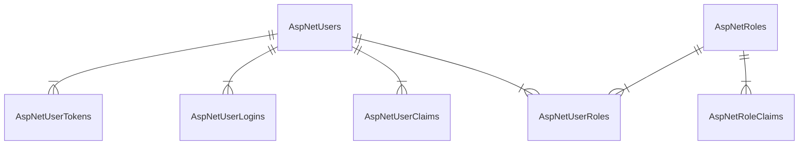

+++
date = '2025-07-31T19:45:58+08:00'
draft = false
title = '定制 ASP.NET Identity'
categories = ['Main Sections']
mermaid = true
+++

> 前置知识：
> 
> * [Entity Framework Core](https://learn.microsoft.com/zh-cn/ef/core/) 的简单使用
> * [ASP.NET Web API](https://learn.microsoft.com/zh-cn/aspnet/web-api/) 的简单使用

## ASP\.NET Identity 介绍
ASP\.NET Identity 是一个用于 ASP\.NET 应用程序的身份认证系统，提供了用户管理、角色管理、声明、令牌等功能。它支持用户注册、登录、注销以及外部登录提供程序。

[官方文档](https://learn.microsoft.com/zh-cn/aspnet/core/security/authentication/identity)

默认情况下， ASP\.NET Identity 会自动创建 7 个有关身份认证的表，表的 ER 图如下（不显示字段）：



以下是各个表的字段的介绍。

> * Type 一栏，不是准确的数据库的类型，在不同的数据库会有所不同。
> * "NN" 指 "NOT NULL"

### AspNetUsers 表
| Type | Name | PK | FK | NN | Remark |
| :--: | :--: | :--: | :--: | :--: | :--: |
| string | Id | &#10004; |  | &#10004; | 格式为 UUID |
| string | UserName |  |  |  |  |
| string | NormalizedUserName |  |  |  | UserName 字段的全大写形式 |
| string | Email |  |  |  |  |
| string | NormalizedEmail |  |  |  | Email 字段的全大写形式 |
| boolean | EmailConfirmed |  |  | &#10004; | 邮箱是否有效（比如通过邮箱验证码认证） |
| string | PasswordHash |  |  |  |  |
| string | SecurityStamp |  |  |  | 格式为 UUID |
| string | ConcurrencyStamp |  |  |  | 格式为 UUID |
| string | PhoneNumber |  |  |  |  |
| boolean | PhoneNumberConfirmed |  |  | &#10004; |  |
| boolean | TwoFactorEnabled |  |  | &#10004; |  |
| timestamp | LockoutEnd |  |  |  | 账户​​锁定的结束时间 |
| boolean | LockoutEnabled |  |  | &#10004; |  |
| integer | AccessFailedCount |  |  | &#10004; | 记录用户​​连续登录失败的次数​​，成功的登录会重置该计数器为 0 |

#### PasswordHash 字段
具体作用，请查看"[根据用户名和口令进行身份验证-加盐](./Basic-Computer-Theory/Introduction-to-Information-Security/Authentication-based-on-username-and-password/index.md#加盐)"，这里把口令的哈希值和盐值存储在同一字段中。

#### SecurityStamp 字段
当用户的关键安全信息发生变化​​（如更改密码、锁定用户等），此值​​会被更新，以吊销凭证，使该用户在​​其他所有设备或浏览器​​上的现有会话失效。

在基于令牌认证（[JWT](./Basic-Computer-Theory/Introduction-to-Information-Security/Session-state-management/index.md#jwt)）的场景中， SecurityStamp 可以映射到 JWT 的 jti (JWT ID) 声明，并在令牌验证时检查有效性。更新 SecurityStamp 等价于撤销之前颁发的所有 JWT 。

#### ConcurrencyStamp 字段
用于实现​​数据库层面的乐观并发控制 (Optimistic Concurrency)​​。

乐观并发是指，允许多个进程或用户尝试同时更新同一条用户记录，而不锁定记录。它假设冲突不常发生。

记录在读取时会获取当前的 ConcurrencyStamp 值。当尝试更新记录时， ED Core (或底层的存储提供程序) 会将传入记录的 ConcurrencyStamp 值​​与数据库中当前该记录的 ConcurrencyStamp 值进行比较​​。

* 如果值​​匹配​​：说明记录自上次读取后​​没有被其他操作修改过​​，更新允许进行，并在更新​​后会自动生成一个新的 ConcurrencyStamp​​（通常是新的 GUID）存入数据库。
* 如果值​​不匹配​​：说明记录自上次读取后​​已经被其他操作修改过​​（例如，管理员同时在后台修改了该用户）。此时 EF Core 会抛出 DbUpdateConcurrencyException 异常，开发者需要捕获此异常并决定如何处理冲突（如提示用户、重试操作、合并变更等）。

### AspNetRoles 表
| Type | Name | PK | FK | NN | Remark |
| :--: | :--: | :--: | :--: | :--: | :--: |
| string | Id | &#10004; |  | &#10004; | 格式为 UUID |
| string | Name |  |  |  |  |
| string | NormalizedName |  |  |  |  |
| string | ConcurrencyStamp |  |  |  | 格式为 UUID |

### AspNetUserClaims 表
| Type | Name | PK | FK | NN | Remark |
| :--: | :--: | :--: | :--: | :--: | :--: |
| integer | Id | &#10004; |  | &#10004; | 自增 Id |
| string | UserId |  | &#10004; | &#10004; | 格式为 UUID |
| string | ClaimType |  |  |  |  |
| string | ClaimValue |  |  |  |  |

### AspNetRoleClaims 表
| Type | Name | PK | FK | NN | Remark |
| :--: | :--: | :--: | :--: | :--: | :--: |
| integer | Id | &#10004; |  | &#10004; | 自增 Id |
| string | RoleId |  | &#10004; | &#10004; | 格式为 UUID |
| string | ClaimType |  |  |  |  |
| string | ClaimValue |  |  |  |  |

### AspNetUserLogins 表
| Type | Name | PK | FK | NN | Remark |
| :--: | :--: | :--: | :--: | :--: | :--: |
| string | LoginProvider | &#10004; |  | &#10004; |  |
| string | ProviderKey | &#10004; |  | &#10004; |  |
| string | ProviderKey |  | &#10004; | &#10004; | 格式为 UUID |
| string | ProviderDisplayName |  |  |  |  |

### AspNetUserTokens 表
| Type | Name | PK | FK | NN | Remark |
| :--: | :--: | :--: | :--: | :--: | :--: |
| string | UserId | &#10004; | &#10004; | &#10004; | 格式为 UUID |
| string | LoginProvider | &#10004; |  | &#10004; |  |
| string | Name | &#10004; |  | &#10004; |  |
| string | Value |  |  |  |  |


### AspNetUserRoles 表
| Type | Name | PK | FK | NN | Remark |
| :--: | :--: | :--: | :--: | :--: | :--: |
| string | UserId | &#10004; | &#10004; | &#10004; | 格式为 UUID |
| string | RoleId | &#10004; | &#10004; | &#10004; | 格式为 UUID |

## 为 ASP\.NET Web API 配置 ASP\.NET Identity + JWT
目前， ASP\.NET Identity 只有在 Blazor Web App, Razor Pages, MVC 应用中有模板。如果我们需要为 ASP\.NET Web API 配置 ASP\.NET Identity ，只能自己动手了。

创建一个 ASP\.NET Web API 项目，不要选择任何身份验证方式。

安装 NuGet 包：

```shell
dotnet add package Microsoft.AspNetCore.Identity.EntityFrameworkCore
dotnet add package Microsoft.AspNetCore.Authentication.JwtBearer
dotnet add package System.IdentityModel.Tokens.Jwt
dotnet add package Microsoft.EntityFrameworkCore.Tools
```

还有你喜欢的 Entity Framework Core 数据库驱动。

### 项目结构
