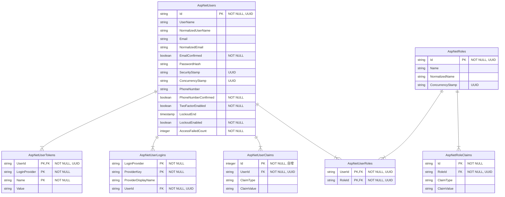

+++
date = '2025-07-31T19:45:58+08:00'
draft = false
title = '定制 ASP.NET Identity'
categories = ['Main Sections']
mermaid = true
+++

> 前置知识：
> 
> * [Entity Framework Core](https://learn.microsoft.com/zh-cn/ef/core/) 的简单使用
> * [ASP.NET Web API](https://learn.microsoft.com/zh-cn/aspnet/web-api/) 的简单使用

## ASP\.NET Identity 介绍
ASP\.NET Identity 是一个用于 ASP\.NET 应用程序的身份认证系统，提供了用户管理、角色管理、声明、令牌等功能。它支持用户注册、登录、注销以及外部登录提供程序。

[官方文档](https://learn.microsoft.com/zh-cn/aspnet/core/security/authentication/identity)

默认情况下， ASP\.NET Identity 会自动创建 7 个有关身份认证的表，表的 ER 图如下：

