+++
date = '2025-05-13T14:15:00+08:00'
lastmod = '2026-01-18T19:31:27+08:00'
draft = false
title = '测试 Markdown 基本元素'
categories = ['Main Sections']
tags = ['markdown', 'test']
math = true
mermaid = true
+++

## Markdown 基本元素

### 标题

# H1

## H2

### H3

#### H4

##### H5

###### H6

### 强调

Emphasis, aka italics, with _asterisks_ or _underscores_.

Strong emphasis, aka bold, with **asterisks** or **underscores**.

Combined emphasis with **asterisks and _underscores_**.

Strikethrough uses two tildes. ~~Scratch this.~~

### 列表

#### Definition List (dl)

<dl><dt>Definition List Title</dt><dd>This is a definition list division.</dd></dl>

#### Ordered List (ol)

1. List Item 1
2. List Item 2
3. List Item 3

#### Unordered List (ul)

- List Item 1
- List Item 2
- List Item 3

### 段落

Lorem ipsum dolor sit amet, [test link]() consectetur adipiscing elit. **Strong text** pellentesque ligula commodo viverra vehicula. _Italic text_ at ullamcorper enim. Morbi a euismod nibh. <u>Underline text</u> non elit nisl. ~~Deleted text~~ tristique, sem id condimentum tempus, metus lectus venenatis mauris, sit amet semper lorem felis a eros. Fusce egestas nibh at sagittis auctor. Sed ultricies ac arcu quis molestie. Donec dapibus nunc in nibh egestas, vitae volutpat sem iaculis. Curabitur sem tellus, elementum nec quam id, fermentum laoreet mi. Ut mollis ullamcorper turpis, vitae facilisis velit ultricies sit amet. Etiam laoreet dui odio, id tempus justo tincidunt id. Phasellus scelerisque nunc sed nunc ultricies accumsan.

Interdum et malesuada fames ac ante ipsum primis in faucibus. `Sed erat diam`, blandit eget felis aliquam, rhoncus varius urna. Donec tellus sapien, sodales eget ante vitae, feugiat ullamcorper urna. Praesent auctor dui vitae dapibus eleifend. Proin viverra mollis neque, ut ullamcorper elit posuere eget.

> This is a very long line that will still be quoted properly when it wraps. Oh boy let's keep writing to make sure this is long enough to actually wrap for everyone. Oh, you can _put_ **Markdown** into a blockquote.

Maecenas ornare arcu at mi suscipit, non molestie tortor ultrices. Aenean convallis, diam et congue ultricies, erat magna tincidunt orci, pulvinar posuere mi sapien ac magna. Vestibulum ante ipsum primis in faucibus orci luctus et ultrices posuere cubilia Curae; Praesent vitae placerat mauris. Nullam laoreet ante posuere tortor blandit auctor. Sed id ligula volutpat leo consequat placerat. Mauris fermentum dolor sed augue malesuada sollicitudin. Vivamus ultrices nunc felis, quis viverra orci eleifend ut. Donec et quam id urna cursus posuere. Donec elementum scelerisque laoreet.

### 表格

| Table Header 1 | Table Header 2 | Table Header 3 |
| -------------- | -------------- | -------------- |
| Division 1     | Division 2     | Division 3     |
| Division 1     | Division 2     | Division 3     |
| Division 1     | Division 2     | Division 3     |

| Markdown | Less      | Pretty     |
| -------- | --------- | ---------- |
| _Still_  | `renders` | **nicely** |
| 1        | 2         | 3          |

### 其他元素 - abbr, acronym, sub, sup, kbd, etc

Lorem <sup>superscript</sup> dolor <sub>subscript</sub> amet, consectetuer adipiscing elit. Nullam dignissim convallis est. Quisque aliquam. <cite>cite</cite>. Nunc iaculis suscipit dui. Nam sit amet sem. Aliquam libero nisi, imperdiet at, tincidunt nec, gravida vehicula, nisl. Praesent mattis, massa quis luctus fermentum, turpis mi volutpat justo, eu volutpat enim diam eget metus. Maecenas ornare tortor. Donec sed tellus eget sapien fringilla nonummy. <acronym title="National Basketball Association">NBA</acronym> Mauris a ante. Suspendisse quam sem, consequat at, commodo vitae, feugiat in, nunc. Morbi imperdiet augue quis tellus. <abbr title="Avenue">AVE</abbr>. Use <kbd>Crtl</kbd> + <kbd>C</kbd> to stop.

### Github风格的Alert块引用（需要 Hugo v0.132.0 或更高版本）

> [!NOTE]
> Useful information that users should know, even when skimming content.

> [!TIP]
> Helpful advice for doing things better or more easily.

> [!IMPORTANT]
> Key information users need to know to achieve their goal.

> [!WARNING]
> Urgent info that needs immediate user attention to avoid problems.

> [!CAUTION]
> Advises about risks or negative outcomes of certain actions.

### 图片


### 分隔线

---

## 代码块

```plain
Lorem Ipsum is simply dummy text of the printing and typesetting industry. Lorem Ipsum has been the industry's standard dummy text ever since the 1500s, when an unknown printer took a galley of type and scrambled it to make a type specimen book.
```

```rust {linenos=table,hl_lines=[8,"15-17"],linenostart=199}
#[derive(Debug)]
pub enum State {
    Start,
    Transient,
    Closed,
}

impl From<&'a str> for State {
    fn from(s: &'a str) -> Self {
        match s {
            "start" => State::Start,
            "closed" => State::Closed,
            _ => unreachable!(),
        }
    }
}
```

```rust
#[derive(Debug)]
pub enum State {
    Start,
    Transient,
    Closed,
}

impl From<&'a str> for State {
    fn from(s: &'a str) -> Self {
        match s {
            "start" => State::Start,
            "closed" => State::Closed,
            _ => unreachable!(),
        }
    }
}
```

```json
[
  {
    "title": "apples",
    "count": [12000, 20000],
    "description": { "text": "...", "sensitive": false }
  },
  {
    "title": "oranges",
    "count": [17500, null],
    "description": { "text": "...", "sensitive": false }
  }
]
```

```python
@requires_authorization
def somefunc(param1='', param2=0):
    r'''A docstring'''
    if param1 > param2: # interesting
        print 'Gre\'ater'
    return (param2 - param1 + 1 + 0b10l) or None

class SomeClass:
    pass

>>> message = '''interpreter
... prompt'''
```

```html
<!DOCTYPE html>
<title>Title</title>

<style>
  body {
    width: 500px;
  }
</style>

<script type="application/javascript">
  function $init() {
    return true;
  }
</script>

<body>
  <p checked class="title" id="title">Title</p>
  <!-- here goes the rest of the page -->
</body>
```

```javascript
function $initHighlight(block, cls) {
  try {
    if (cls.search(/\bno\-highlight\b/) != -1)
      return process(block, true, 0x0F) +
             ` class="${cls}"`;
  } catch (e) {
    /* handle exception */
  }
  for (var i = 0 / 2; i < classes.length; i++) {
    if (checkCondition(classes[i]) === undefined)
      console.log('undefined');
  }

  return (
    <div>
      <web-component>{block}</web-component>
    </div>
  )
}

export $initHighlight;
```

```cpp
#include <iostream>

int main(int argc, char *argv[]) {

  /* An annoying "Hello World" example */
  for (auto i = 0; i < 0xFFFF; i++)
    cout << "Hello, World!" << endl;

  char c = '\n';
  unordered_map <string, vector<string> > m;
  m["key"] = "\\\\"; // this is an error

  return -2e3 + 12l;
}
```

```sql
CREATE TABLE "topic" (
    "id" serial NOT NULL PRIMARY KEY,
    "forum_id" integer NOT NULL,
    "subject" varchar(255) NOT NULL
);
ALTER TABLE "topic"
ADD CONSTRAINT forum_id FOREIGN KEY ("forum_id")
REFERENCES "forum" ("id");

-- Initials
insert into "topic" ("forum_id", "subject")
values (2, 'D''artagnian');
```

```objectivec
#import <UIKit/UIKit.h>
#import "Dependency.h"

@protocol WorldDataSource
@optional
- (NSString*)worldName;
@required
- (BOOL)allowsToLive;
@end

@property (nonatomic, readonly) NSString *title;
- (IBAction) show;
@end
```

```java
/**
 * @author John Smith <john.smith@example.com>
*/
package l2f.gameserver.model;

public abstract class L2Char extends L2Object {
  public static final Short ERROR = 0x0001;

  public void moveTo(int x, int y, int z) {
    _ai = null;
    log("Should not be called");
    if (1 > 5) { // wtf!?
      return;
    }
  }
}
```

```swift
import Foundation

@objc class Person: Entity {
  var name: String!
  var age:  Int!

  init(name: String, age: Int) {
    /* /* ... */ */
  }

  // Return a descriptive string for this person
  func description(offset: Int = 0) -> String {
    return "\(name) is \(age + offset) years old"
  }
}
```

```css
@font-face {
  font-family: Chunkfive;
  src: url("Chunkfive.otf");
}

body,
.usertext {
  color: #f0f0f0;
  background: #600;
  font-family: Chunkfive, sans;
}

@import url(print.css);
@media print {
  a[href^="http"]::after {
    content: attr(href);
  }
}
```

```ruby
# The Greeter class
class Greeter
  def initialize(name)
    @name = name.capitalize
  end

  def salute
    puts "Hello #{@name}!"
  end
end

g = Greeter.new("world")
g.salute
```

```makefile
# Makefile

BUILDDIR      = _build
EXTRAS       ?= $(BUILDDIR)/extras

.PHONY: main clean

main:
 @echo "Building main facility..."
 build_main $(BUILDDIR)

clean:
 rm -rf $(BUILDDIR)/*
```

```go
package main

import "fmt"

func main() {
    ch := make(chan float64)
    ch <- 1.0e10    // magic number
    x, ok := <- ch
    defer fmt.Println(`exitting now\`)
    go println(len("hello world!"))
    return
}
```

```bash
#!/bin/bash

###### CONFIG
ACCEPTED_HOSTS="/root/.hag_accepted.conf"
BE_VERBOSE=false

if [ "$UID" -ne 0 ]
then
  echo "Superuser rights required"
  exit 2
fi

genApacheConf(){
  echo -e "# Host ${HOME_DIR}$1/$2 :"
}
```

```ini
; boilerplate
[package]
name = "some_name"
authors = ["Author"]
description = "This is \
a description"

[[lib]]
name = ${NAME}
default = True
auto = no
counter = 1_000
```

```patch
-   if (i < 0) {
-       return false;
-   }
+   if (i < 0) {
+       return true;
+   }
```

## 数学公式

1. **(10 分)**  
    设三维欧式空间 $V$ 在基 $\alpha_1, \alpha_2, \alpha_3$ 下的度量矩阵为

   $$
   T = \begin{pmatrix}
   1 & 0 & 0 \\
   0 & 2 & 0 \\
   0 & 0 & 3
   \end{pmatrix},
   $$

   求 $V$ 的一组标准正交基（用 $\alpha_1, \alpha_2, \alpha_3$ 的线性组合）。

   **解**:
   对 $(T, I)$ 作合同变换，将 $T$ 化为单位矩阵 $I$:

   $$
    \begin{bmatrix}
    1 & 0 & 0 \\
    0 & 2 & 0 \\
    0 & 0 & 3
    \end{bmatrix} \rightarrow \cdots \rightarrow \begin{bmatrix}
    1 & 0 & 0 \\
    0 & 1 & 0 \\
    0 & 0 & 1
    \end{bmatrix}
   $$

   $f(n) = \Theta(g(n)) \land g(n) = \Theta(h(n)) \rightarrow f(n) = \Theta(h(n))$

$\omega(g(n))=\{f(n):\text{存在正常量}c\text{和}n_0\text{，使得对所有}n \geq n_0\text{，有}0\leq cg(n) < f(n)\}$

$$
f^{(i)}(n) =
\begin{cases}
n \qquad & i = 1 \\
f(f^{(i-1)}(n)) \qquad &  i>1
\end{cases}
$$

$$
A = \begin{bmatrix}
A_{11} & A_{12} \\
A_{21} & A_{22}
\end{bmatrix}
,
B = \begin{bmatrix}
B_{11} & B_{12} \\
B_{21} & B_{22}
\end{bmatrix}
,
C = \begin{bmatrix}
C_{11} & C_{12} \\
C_{21} & C_{22}
\end{bmatrix}
$$

$$\sum^{\lfloor lgn \rfloor}_{h=0} \lceil \frac{n}{2^{h+1}} \rceil O(h) = O(n \sum^{\lfloor lgn \rfloor}_{h=0} \frac{h}{2^h}) =  O(n \sum^{\infty}_{h=0} \frac{h}{2^h}) =O(n)$$

$$
\begin{align}
&\underset{\boldsymbol{w}}{\min}\sum_{i=1}^N{\left( \boldsymbol{p}_i\boldsymbol{w} \right) ^2 },\,\, s.t. \,\left\| \boldsymbol{w} \right\| _2=1 \notag
\\
\Rightarrow &\underset{\boldsymbol{w}}{\min}\,\,\boldsymbol{w}^T\boldsymbol{P}^T\boldsymbol{Pw},\,\, s.t.\, \boldsymbol{w}^T\boldsymbol{w}=1
\end{align}
$$

## 流程图

```mermaid
sequenceDiagram
  participant 客户端
  participant 代理对象
  participant 代理处理器
  participant 目标对象
  客户端 ->> 代理对象:调用方法
  代理对象 ->> 代理处理器:转发代理处理器<br>Invoke()方法
  代理处理器 ->> 目标对象:判断Method<br>调用目标对象的方法
  目标对象 ->> 代理处理器:返回结果
  代理处理器 ->> 代理对象:返回结果
  代理对象 ->> 客户端:返回结果
```

```mermaid
graph LR
  c1[Client1<br>Socket] --客户端发出连接--> ss[ServerSocket]
  c2[Client2<br>Socket] --客户端发出连接--> ss[ServerSocket]
  ss --服务器接受请求并创建新的Socket--> s1[为Client1创<br>建的Socket]
  ss --服务器接受请求并创建新的Socket--> s2[为Client2创<br>建的Socket]
  c1 --两个Socket间建立专线连接--> s1
  c2 --两个Socket间建立专线连接--> s2
```





## 短代码











<!-- tab 文本 -->
Lorem <sup>superscript</sup> dolor <sub>subscript</sub> amet, consectetuer adipiscing elit. Nullam dignissim convallis est. Quisque aliquam. <cite>cite</cite>. Nunc iaculis suscipit dui. Nam sit amet sem. Aliquam libero nisi, imperdiet at, tincidunt nec, gravida vehicula, nisl. Praesent mattis, massa quis luctus fermentum, turpis mi volutpat justo, eu volutpat enim diam eget metus. Maecenas ornare tortor. Donec sed tellus eget sapien fringilla nonummy. <acronym title="National Basketball Association">NBA</acronym> Mauris a ante. Suspendisse quam sem, consequat at, commodo vitae, feugiat in, nunc. Morbi imperdiet augue quis tellus. <abbr title="Avenue">AVE</abbr>. Use <kbd>Crtl</kbd> + <kbd>C</kbd> to stop.

1. List Item 1
2. List Item 2
3. List Item 3

<!-- tab 代码块@e60c -->
```css
@font-face {
  font-family: Chunkfive;
  src: url("Chunkfive.otf");
}

body,
.usertext {
  color: #f0f0f0;
  background: #600;
  font-family: Chunkfive, sans;
}

@import url(print.css);
@media print {
  a[href^="http"]::after {
    content: attr(href);
  }
}
```

<!-- tab 表格 -->
| Table Header 1 | Table Header 2 | Table Header 3 |
| -------------- | -------------- | -------------- |
| Division 1     | Division 2     | Division 3     |
| Division 1     | Division 2     | Division 3     |
| Division 1     | Division 2     | Division 3     |

| Markdown | Less      | Pretty     |
| -------- | --------- | ---------- |
| _Still_  | `renders` | **nicely** |
| 1        | 2         | 3          |

<!-- tab 图片 -->




---






---



<!-- cell -->
这是第一个网格单元，支持 Markdown 语法

- 列表项 1
- 列表项 2


<!-- cell -->
这是第二个网格单元，支持 Markdown 语法

- 列表项 1
- 列表项 2


<!-- cell -->
```javascript
console.log('Hello Grid!');
```



<!-- cell -->
```javascript
console.log('Hello Grid!');
```



<!-- cell -->

| 表头1 | 表头2 |
| ------ | ------ |
| 数据1 | 数据2 |

<!-- cell -->
| 表头1 | 表头2 |
| ------ | ------ |
| 数据1 | 数据2 |



---



This is the details content.

```js
console.log(111)
```

- List Item 1
- List Item 2
- List Item 3


