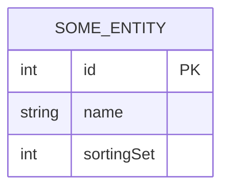
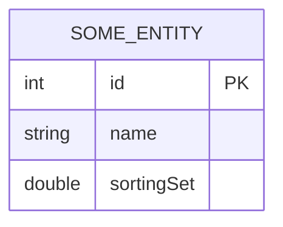
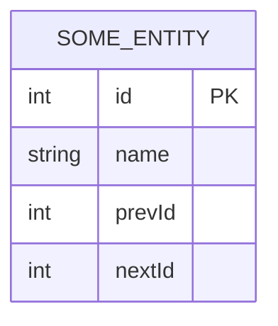

+++
date = '2026-01-21T14:15:04+08:00'
draft = false
title = '对数据库的元组进行自定义排序'
categories = ['Main Sections']
tags = ['数据库设计']
mermaid = true
+++

有时候，我们会遇到“用户自定义排序的需求”。比如，设计一个音乐管理系统，有用户歌单，用户可以自由对歌单中的歌曲排序。在设计数据库对应的表是，实现用户自定义排序的方案，有以下几种。

## 连续整数法

使用整数表示顺序，表结构如下：

假设这个表有十个数据，sortingSet 的值就分别是 1 到 10 。

操作逻辑：用户将第 10 个元组移动到到第 4 个元组和第 5 个元组之间的位置：



<!-- tab 更新后半部分元组的做法 -->

1. 将旧位置 10 的元组拿出来。
1. 将位置 1 到 4 的元组， sortingSet 全部 -1 （变成 0 到 3）。
1. 将拿出来的元组 sortingSet 设为 4。

<!-- tab 更新前半部分元组的做法 -->

1. 将旧位置 10 的元组拿出来。
1. 将位置 5 到 9 的元组， sortingSet 全部 +1 （变成 6 到 10）。
1. 将拿出来的元组 sortingSet 设为 5。



---

优点：逻辑简单，数据干净，肉眼可读性强。

缺点：写放大（Write Amplification）严重。如果是长列表（比如 5000 个元组），移动最后一个元组到最中间，（无论是更新前半部分元组还是后半部分元组都）需要更新大约 2500 行数据，数据库压力大，可能导致锁表。

适用场景： 列表长度限制在较小范围（例如 < 100 项），且排序不频繁的场景。

## 浮点数/稀疏整数法



<!-- tab 浮点数版本 -->

使用浮点数表示顺序，表结构如下：

假设这个表有十个数据，sortingSet 的值就分别是 1.0, 2.0, 3.0 ... 10.0 。

操作逻辑：用户将第 10 个元组移动到到第 4 个元组和第 5 个元组之间的位置：

1. 把第 10 个元组的 sortingSet 改为第 4 个元组和第 5 个元组的 sortingSet 的平均值，也就是 4.5 。
1. 处理精度耗尽的边缘情况，即两个浮点数极为接近，经计算机有限精度的计算后，其平均值等于其中一个浮点数。整理的方法是：当发现前后两个数的差值小于某个阈值时，触发一次重平衡（Rebalance），将所有元组重新按照浮点数（1.0, 2.0， 3.0 ...）刷新一遍。

<!-- tab 稀疏整数版本 -->

使用整数表示顺序，表结构如下：

假设这个表有十个数据，sortingSet 的值就分别是 1000, 2000, 3000 ... 10000 。

操作逻辑：用户将第 10 个元组移动到到第 4 个元组和第 5 个元组之间的位置：

1. 把第 10 个元组的 sortingSet 改为第 4 个元组和第 5 个元组的 sortingSet 的平均值，也就是 4500 。
1. 处理精度耗尽的边缘情况，即出现要插入到两个相邻整数之间的情况（两个相邻整数之间没有整数了）。整理的方法是：当发现前后两个数的差值小于某个阈值时，触发一次重平衡（Rebalance），将所有元组重新按照整数（1000, 2000, 3000 ...）刷新一遍。



---

优点：绝大多数情况下只需要更新 1 行数据，性能极高。

缺点：需要处理精度耗尽的边缘情况，出现这种情况时，数据库压力大，可能导致锁表。

适用场景：一般应用的可用方案。

## 链表法

在元组中设计 prevId 和 nextId 字段。表结构如下：

优点：插入极快，只修改涉及到的 3 行数据（本身、前一个、后一个）。

缺点：

1. 读取复杂度高。 SQL 很难高效地通过 ORDER BY 还原链表顺序，需要递归查询 Recursive CTE 。
1. 即使使用存储过程，在其中使用循环语句，效率也比较低，因为这样数据库是逐行处理的，没有多线程优化。而且这样也不能进行复杂的查询，比如加上 `WHERE` 语句，二阶排序等等。
1. 从设计思想上来说，关系型数据库（RDBMS）的设计是基于集合论（Set Theory）的，它天生擅长处理基于列值（Rank/Score）的排序，极度不擅长处理基于指针（Pointer）的图/链表遍历。

结论：除非数据量极小且必须全量加载，否则不要用。

## LexoRank

LexoRank ，又叫 Fractional Indexing / String Order ，它的核心理念利用了 **字典序（Lexicographical Order）** 的特性，实现了在两个字符串之间“无限”插入新字符串的能力。

假设我们只使用 26 个小写字母 a-z 来排序，有两个元组：

1. "a"
1. "c"

现在要在第 1 个元组和第 2 个元组之间插入一个新元组，找到 "a" 和 "c" 中间的字符串，显然是 "b" ，插入：

1. "a"
1. "b"
1. "c"

---

现在我们讨论另一种情况，有两个元组：

1. "a"
1. "b"

现在要在第 1 个元组和第 2 个元组之间插入一个新元组，找到 "a" 和 "b" 中间的字符串。但是 "a" 和 "b" 中间没有字母了，所以要在后面追加新的字母 "m"，（"m"是 26 个字母的第 13 个字母，位于中间），插入：

1. "a"
1. "am"
1. "b"

> [!TIP]
> "am" 是 "a" 和 "b" 的 **字典序中间值** 。

---

边界情况，要在第 1 个元组前插入一个新元组：

1. "a"
1. "b"

这个时候， "a" 前面没有字母了。可以先把第 1 个元组，改为 "a" 和 "b" 中间的字典序中间值，也就是 "am" ，再把新的元组设置为 "a" 即可。

1. "a"
1. "am"
1. "b"

---

当然了，在实际使用之中，我们可以使用数字加大小写字母（base62）来作为排序字符串，上面是为了简化，才只使用小写字母。

> [!TIP]
> 某些数据库可能是大小写不敏感的，需要注意相关配置。

优点：

1. 更新只需改 1 到 2 行。
1. 能够利用索引加速。
1. 几乎不会像浮点数/稀疏整数那样溢出（字符串可以很长）。

缺点：

1. 实现算法稍复杂（计算两个字符串的“字典序中间值”）。
1. 字符串字段比数字占空间大一点点。

适用场景：大列表、高并发、需要极致性能的系统，一般系统也能使用，是比较完美的解决方案。

### 进阶设计： Bucket（分桶）

虽然排序用的字符串可以无限变长，但数据库字段长度有限（比如 `VARCHAR 255` ），而且字符串太长会影响索引性能。

所以，当某元组的排序用的字符串超过一定长度时，我们需要把全表数据读出来，重新分配均匀的、短的排序值。这个过程称为“ **重平衡（Rebalance）** ”。如果没有额外的设计，这会锁表。

Jira 引入了 Bucket 的概念，来实现异步重平衡。

排序字符串的格式是： `bucket|rank` ，例如 `0|aaa` , `0|aab` , `0|aac`

通常使用三个 Bucket: 0, 1, 2 。

1. 平时所有数据都在 Bucket 0。
1. 当发现 Bucket 0 中某条数据的 rank 字符串太长时，触发后台异步重平衡。
1. 重平衡过程（无锁）：
    1. 系统开始把数据 **由后往前** 逐条从 Bucket 0 移动到 Bucket 1 。
    1. 在移动过程中，重新生成均匀分布的短 rank 。
    1. 用户在移动过程中看到的顺序依然是正确的，因为 Bucket 1 的数据本来就排在 Bucket 0 之后（这也是重平衡第 1 步“ **由后往前** ”的含义）。
1. 当所有数据都搬到 Bucket 1 后，Bucket 0 就清空了，下次要重平衡了再搬回 0 或 2 。

> [!NOTE]
> 当移动 Bucket 2 的数据到 Bucket 0 的时候，就要改为 **由前往后** 的顺序了。
