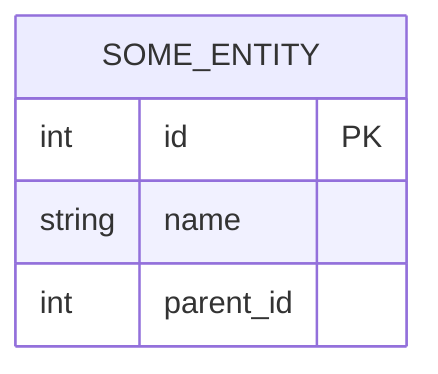
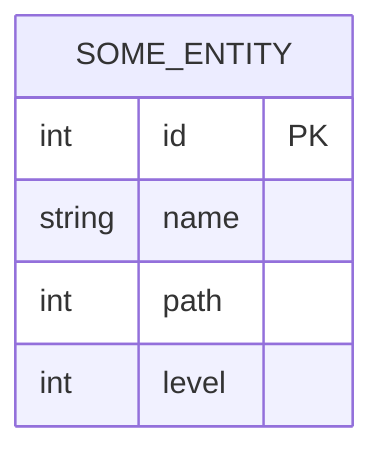
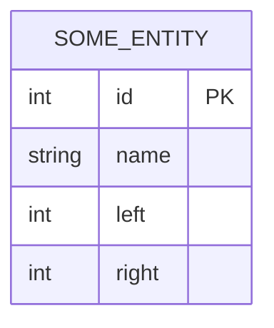
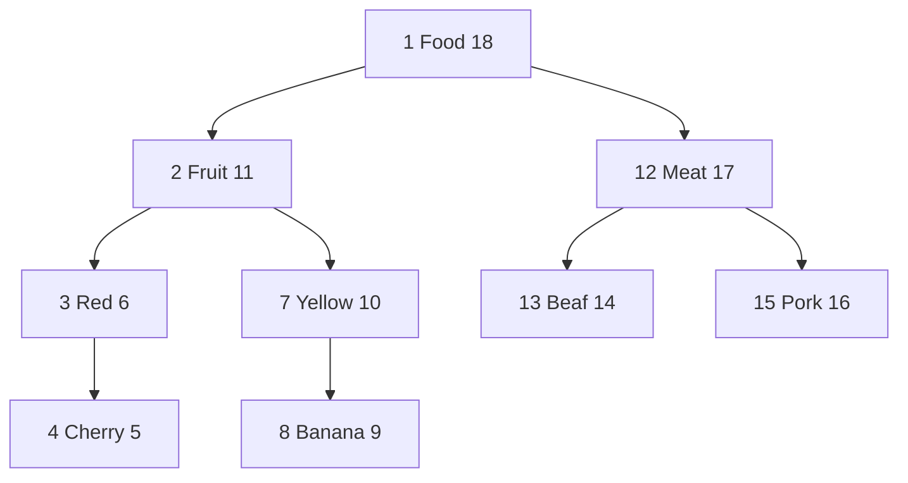
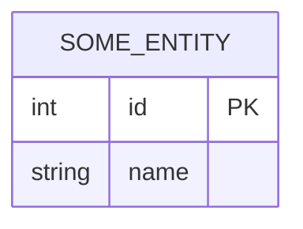
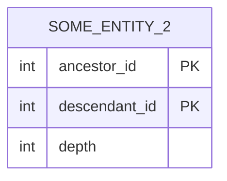

+++
date = '2026-01-21T20:51:38+08:00'
draft = false
title = '在关系型数据库中表示树状结构'
categories = ['Main Sections']
tags = ['数据库设计']
math = true
mermaid = true
+++

有些时候，我们需要在数据库的一个表中表示树状结构。比如地图中的地点，地点之中有一些子地点。

## 邻接表法

这是最直观的方案，在表中增加一个 `parent_id` 字段指向父节点。表结构如下：

如果是根节点， parent_id 是 NULL 。

优点：

1. 简单：易于理解和实现。
1. 修改快：移动一个节点（比如把某个地点归属到另一个区），只需修改一个字段 (parent_id)。

缺点：

1. 查询整棵树麻烦：如果数据库不支持递归查询，想一次性查出“某元组及其所有子元组（即连续查询多个层级）”非常困难，需要多次数据库交互。

现代数据库一般支持 CTE (Common Table Expressions) 递归查询。

适用场景：绝大多数通用场景。

## 路径枚举法

在表中增加一个 `path` 字段，存储从根节点到当前节点的完整路径（通常用 ID 或特定的分隔符拼成字符串）。还可以添加额外的 `level` 字段，表示在第几层。表结构如下：

例如， `path` 的格式是: "/", "/1/", "/1/3/" 。

优点：

1. 查询快：例如查询“北京”下的所有地点，只需 SQL：`SELECT * FROM locations WHERE path LIKE '/1/2/%'` 。前缀匹配能够充分利用索引。
1. 方便展示层级，适合作面包屑导航。如 中国 > 北京 > 海淀区 。

缺点：

1. 层级深度受限: `path` 字段是 `varchar` ，有长度限制（虽然可以设置大一点）。
1. 移动节点较复杂：假设要把“海淀区”移动到“河北省”，需要更新海淀区及其所有子节点的 `path` 字段，不仅涉及大量 Update ，还需要字符串处理。

适用场景：

1. 层级不深，且结构非常稳定（如地理行政区划，很少会把一个省移动到另一个国家去），且需要频繁查询所有子节点（查询节点下所有层级的节点）的场景。

## 嵌套集法

利用“左右值编码”（Left/Right values）来确定层级关系。每个节点被包含在父节点的左右值范围内。表结构如下：

所谓左右值编码，就是按照树进行前序遍历的顺序，生成的数字。例子如下：

优点：

1. 读取子树极快：如读取 "Fruit" 的所有子树： `SELECT * FROM table WHERE left > 2 AND right < 11` 。不需要 JOIN，不需要递归。

缺点：

1. 写入慢：每次插入或删除一个节点，为了保持左右值的连续性，几乎需要更新半个表的左右值索引。并发写入时极易锁表。

适用场景：几乎完全静态的数据（如生物分类学、电商几乎不变的商品分类）。

## 闭包表法

创建一个额外的表，专门用来存储树中所有节点之间的关系（不仅仅是父子，还包括祖孙等等）。

主表：只存基本信息：

关系表：存储所有祖先-后代关系， `depth` 表示距离。

示例数据：

| id | name |
| :--: | :--: |
| 1 | 中国 |
| 2 | 北京 |
| 3 | 海淀区 |

| ancestor_id | descendant_id | depth |
| :--: | :--: | :--: |
| 1 | 2 | 1 |
| 1 | 3 | 2 |
| 2 | 3 | 1 |

优点：

1. 查询快：查找“某个节点的所有子孙”或“某个节点的所有祖先”，只需一次简单的 JOIN 查询，不依赖递归。

缺点：

1. 存储空间大：关系表的数据量会呈平方级增长（ $ O(n^2) $ ），如果节点非常多，这张表会很大。
1. 维护复杂：插入和删除节点时，需要复杂的逻辑去维护关系表。

适用场景：数据量不是特别巨大，但查询极其频繁，且层级特别深的场景。
